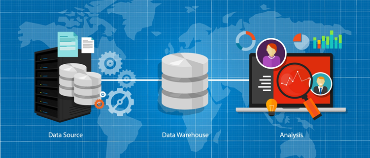
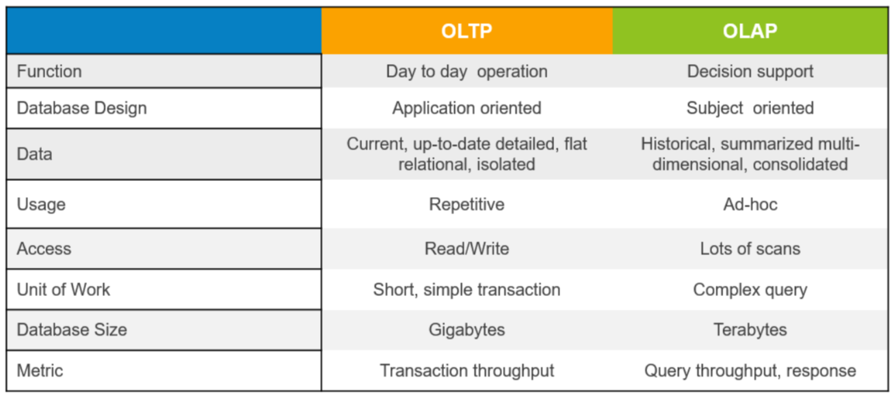
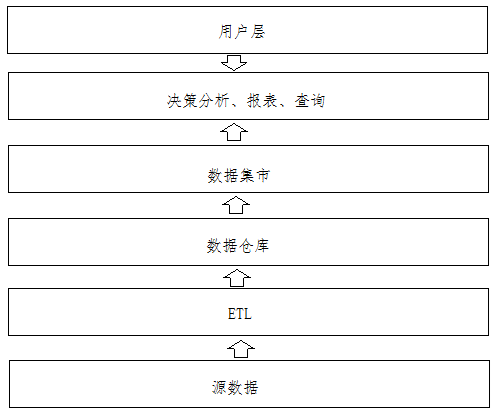
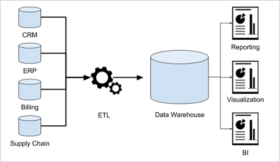
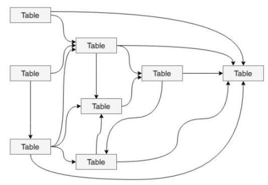

# 数据仓库

## I. 数据仓库基础知识

### 1. 数据仓库概念, 由来, 特点

- 数据仓库概念

  > 数据仓库，中文简称==数仓==。英文叫做Data WareHouse,简称==DW==。
  >
  > 数据仓库是==**面向分析**==的==集成化==数据平台，分析的结果给企业提供==**决策支持**==。
  >
  > 应用场景：**满足企业中所有数据的统一化存储，通过规范化的数据处理来实现企业的数据分析应用。**

  

- 数仓的由来

  > 为了更好的==分析数据而来==。正确的废话。

  ```shell
  1、公司建立、开展业务
  2、业务数据存储（事务支持）---->数据库DB
  3、经营发展中想赚更多的钱
  4、分析业务数据
  5、DB直接分析影响读性能，干扰业务开展，得不偿失
  6、其他系统、类型的数据也需要一起分析  彼此异构
  7、搭建统一、集成化数据分析平台
  8、建立模型和规范 愉快的进行各种分析
  ```

- 数仓的4大核心特点

  - ==**面向主题性**==

    > 主题(Subject) 是在较高层次上将企业信息系统中某一分析对象（重点是分析的对象）的数据进行整合、归类并分析的一种范围，属于一个抽象概念。

    ```properties
    1、数据库:面向业务划分数据  以业务流程为导向组织数据
    	财务部门：ERP财务管理系统  https://www.kingdee.com/role/finance  金蝶
    		-现金流量数据表
    		-汇率调整表
    		-凭证事务表
    		
        客户部门：CRM客户关系管理系统 https://www.salesforce.com/cn/crm/?bc=OTH
        	-客户基本信息表
        	-市场营销计划表
        	-投诉信息表
    
    2、数据仓库:面向主题划分数据  以分析需要为导向组织数据
    	 商品主题
    	 供应商主题
    	 顾客主题
         订单主题
    ```

  - ==**集成性**==

    > 数据仓库不产生数据也不使用数据
    >
    > 只会实现存储和加工

    ```
    	因为同一个主题的数据可能来自不同的数据源，它们之间会存在着差异（异构数据）：字段同名不同意、单位不统一、编码不统一；
    	因此在集成的过程中需要进行ETL(Extract抽取  Transform转换 load加载)
    ```

  - ==**非易失性**==（不可更新性）

    > 数仓上面的数据几乎没有修改操作，都是查询分析的操作。
    >
    > 数仓是分析数据规律的平台 不是创造数据规律的平台。
    >
    > 注意：改指的数据之间的规律不能修改。

  - ==**时变性**==

    > 数仓是一个持续维护建设的东西。
    > 站在==时间的角度，数仓的数据成批次变化更新==。一天一分析（T+1） 一周一分析（T+7）

### 2. OLTP和OLAP的区别

- OL==T==P（On-Line ==**Transaction**== Processing）
  - 概念：联机事务处理系统
  - 核心：事务支持
  - 特点
    - 数据安全
    - 数据完整
    - 操作响应效率、时间
    - 并发支持
    - CRUD操作
  - 应用场景
    - 用户注册，注册信息保存在哪里？
    - 用户下单，订单数据保存在哪里？很多人同时下单，能不能快速、安全、稳定的保存？
    - .......各种业务背后的数据存储。
  - 用户：业务操作人员
  - 典型代表
    - RDBMS关系型数据库管理系统，比如MySQL、ORACLE。
    - 注意：Nosql不满足OLTP系统的某些要求。
- OL==A==P（On-Line ==**Analytical**== Processing）
  - 概念：联机分析处理系统
  - 核心：分析支持
  - 特点
    - 数据量大
    - 事务性要求不高
    - 支撑满足不同程度分析需求
    - 查询操作
  - 用户：数据分析人员
  - 典型代表
    - 数据仓库、数据集市、面向分析的数据库系统



## II. 数仓系统的架构与核心流程

> 数据仓库提供企业决策分析的数据环境，数据从哪里获取？数据如何存储到数据仓库？决策分析系统如何从数据仓库获取数据进行分析？
>
> 把==数据从获取、存储到数据仓库、数据分析的所有部分==称为一个==数据仓库系统==



- 核心1：==ETL(Extra, Transfer, Load)==

  ```shell
  #1、抽取
  	数据抽取是从各个业务系统、外部系统等源数据处采集源数据。
  	
  #2、转换
  	采集过来的源数据如果要存储到数据仓库需要按照一定的数据格式对源数据进行转换。
  	常见的转换方式有数据类型转换、格式转换、缺失值补充、数据综合等。
  	
  #3、装载
  	转换后的数据就可以存储到数据仓库中，这个过程叫装载。
  	数据装载通常是按一定的频率进行的，比如每天装载前一天的订单数据、每星期装载客户信息等。
  
  ```

  

- 核心2：==数仓分层==

  - 将各种数据的处理流程进行规范化。

    

    

  - 分层的实现

    ```
    当使用Hive作为数据仓库工具的时候，分层是在Hive中逻辑划分实现的。
    常见的做法是：
       1、不同的分层创建不同的database（推荐）
    		ods.t_order
    		ods.t_user
    		dw.t_order_detail
    	2、同一个库中使用不同的前缀来区分不同的分层
        	jd.ods_t_order
        	jd.dw_t_user_detail
    ```

- 核心3：==数仓建模==

  - 决定了数据存储的方式，表的设计。
  - 比如：有哪些表，表中有哪些字段？表之间有什么关系等等。
  - 当下数仓建模理论有两个
    - 一个是基于数据库的范式建模理论   ER模型
    - 一个是基于分析方便的==维度建模理论== 这是当下的主流

## III. 数据分析方式 -- 维度分析

### 1. 指标设计

### 2. 维度设计

### 

## IV. 数仓建模

### 1. 数据库建模 -- ER模型

### 2. 维度建模

### 3. 事实表

### 4. 维度表

### 5. 常见模型

### 6. 渐变维SCD(Slowly Changing Dimention)

## V. 数仓分层

### 1. 数仓分层设计

### 2. DW层细化

### 3. 案例

### 4. 新零售项目数仓分层