# 项目主题, ODS, DWD层建设实战

## I. 项目业务结构梳理

### 1. 业务系统表结构

- 表结构图

  

- 订单相关

  ```properties
  t_shop_order:  订单主表 
  	记录订单基础信息(买家、卖家、订单来源、订单状态、订单评价状态、取货方式、是否需要备货)
  t_shop_order_address_detail:  订单副表 
  	记录订单额外信息 与订单主表是1对1关系 (订单金额、优化金额、是否配送、支付接单配送到达完成各时间) 
  t_shop_order_group:  订单组表 
  	多笔订单构成一个订单组 (含orderID)
  t_order_pay:    订单组支付表
  	记录订单组支付信息 (订单组ID、订单总金额)
  t_order_settle:  订单结算表
  	记录一笔订单中配送员、圈主、平台、商家的分成 (含orderID)
  t_order_delievery_item:  订单配送表
  	记录配送员信息、收货人信息、商品信息(含orderID)
  t_refund_order:  订单退款表
  	记录退款相关信息(含orderID)
  t_goods_evaluation:  订单评价表
  	记录订单综合评分,送货速度评分等(含orderID)
  t_goods_evaluation_detail:  订单中商品评价信息表
  	记录订单中对所购买商品的评价信息(含orderID)
  t_shop_order_goods_details:  订单和商品的中间表
  	记录订单中商品的相关信息，如商品ID、数量、价格、总价、名称、规格、分类(含orderID)
  t_trade_record:  交易记录表
  	记录所有交易记录信息，比如支付、结算、退款
  ```

- 店铺相关

  ```properties
  t_store:  店铺详情表
  	记录一家店铺的详细信息
  t_trade_area:  商圈表
  	记录商圈相关信息，店铺需要归属商圈中
  t_location:  地址表
  	记录了地址信息以及地址的所属类别，如是商圈地址还是店铺地址，还是买家地址
  t_district:  区域字典表
  	记录了省市县区域的名称、别名、编码、父级区域ID
  ```

- 商品相关

  ```properties
  t_goods:  商品表
  	记录了商品相关信息
  t_goods_class:  商品分类表
  t_brand:  品牌表
  	记录了品牌的相关信息
  t_goods_collect:  商品收藏表
  ```

- 用户相关

  ```properties
  t_user_login:  登陆日志表
  	记录登陆日志信息，如登陆用户、类型、客户端标识、登陆时间、登陆ip、登出时间等
  t_store_collect:  店铺收藏表
  	记录用户收藏的店铺ID
  t_shop_cart:  购物车表
  	记录用户添加购物车的商品id、商品数量、卖家店铺ID
  ```

- 系统配置相关

  ```properties
  t_date:  时间日期维度表
  	记录了年月日周、农历等相关信息
  ```

### 2. 项目分析主题梳理

> 主题是数据综合体，抽象的。一个分析主题的数据可能横跨多个数据源（多个表）。
>
> 1、所谓指标指的是该主题需要计算出哪些数据值，来衡量比较大小、好坏、高低、涨跌情况。
>
> 2、所谓维度指的是从哪些角度或者多个角度组合起来去计算指标

- ==销售主题==

  - 指标

    ```properties
    销售收入、平台收入
    配送成交额、小程序成交额、安卓APP成交额、苹果APP成交额、PC商城成交额
    订单量、参评单量、差评单量、配送单量、退款单量、小程序订单量、安卓APP订单量、苹果APP订单量、PC商城订单量
    
    16个指标
    ```

  - 维度

    ```properties
    日期、城市、商圈、店铺、品牌、大类、中类、小类
    
    8个维度
    ```

  > 所有维度的理论组合情况：2^8=256个
  >
  > 最终需要计算的指标个数：256*16=4096

- ==商品主题==

  - 指标

    ```properties
    下单次数、下单件数、下单金额
    被支付次数、被支付金额、被退款次数、被退款件数、被退款金额、被加入购物车次数、被加入购物车件数、被收藏次数
    好评数、中评数、差评数
    ```

  - 维度

    ```properties
    商品、日期
    ```

- 用户主题

  - 指标

    ```properties
    登录次数、收藏店铺数、收藏商品数、加入购物车次数、加入购物车金额
    下单次数、下单金额、支付次数、支付金额
    ```

  - 维度

    ```properties
    用户、日期
    ```

## II. DataGrip工具的使用

### 1. 业务数据导入

- step1：windows创建工程文件夹

  > 要求无中文，无空格环境
  >
  > 把项目资料中的脚本文件添加至工程文件夹中

  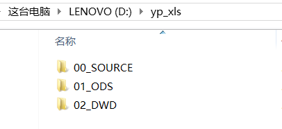

- step2：DataGrip创建Project

  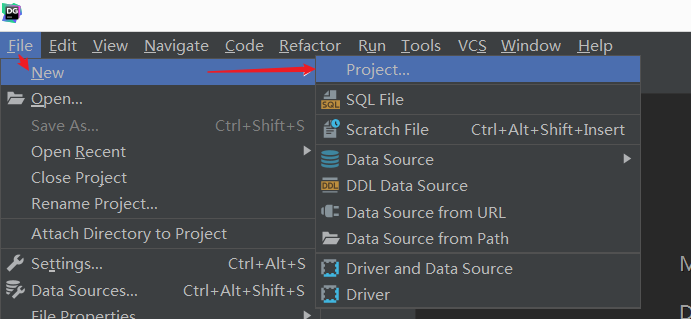

  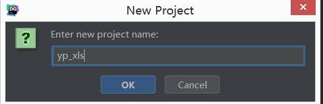

  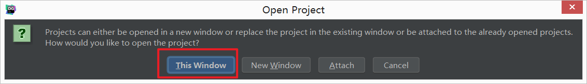

- step3：关联本地工程文件夹

  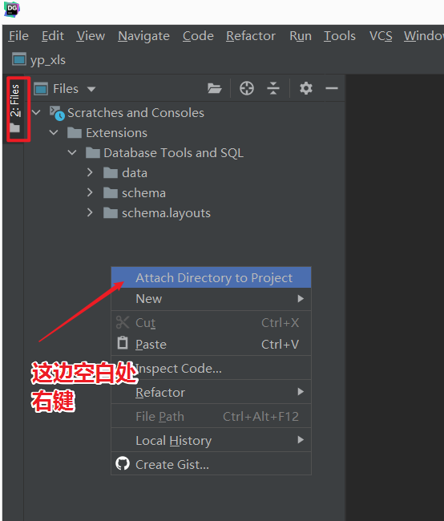

  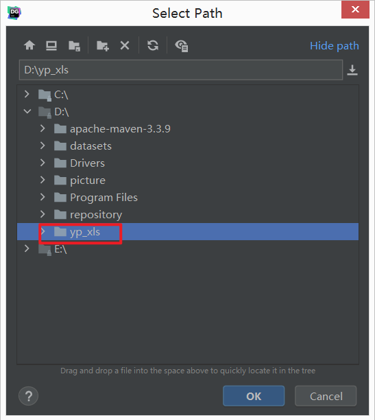

  

- step4：DataGrip连接MySQL 

  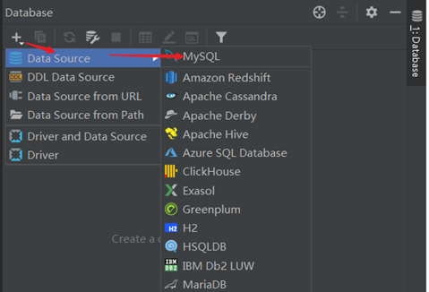

  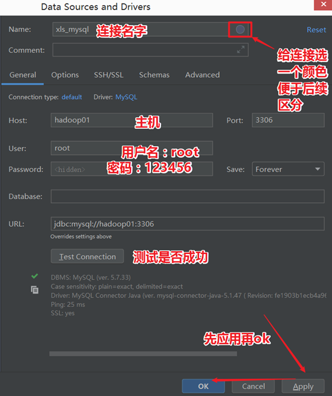

  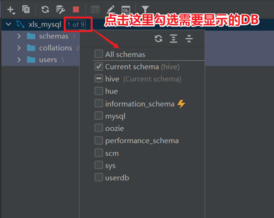

- step5：导入业务数据

  > 学会如何使用DataGrip工具执行sql文件

  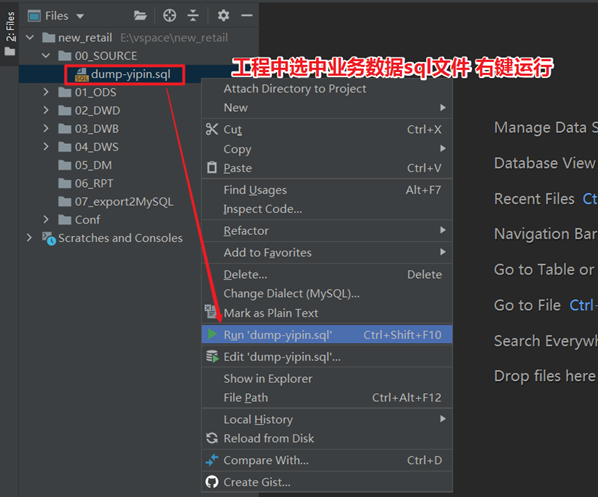

  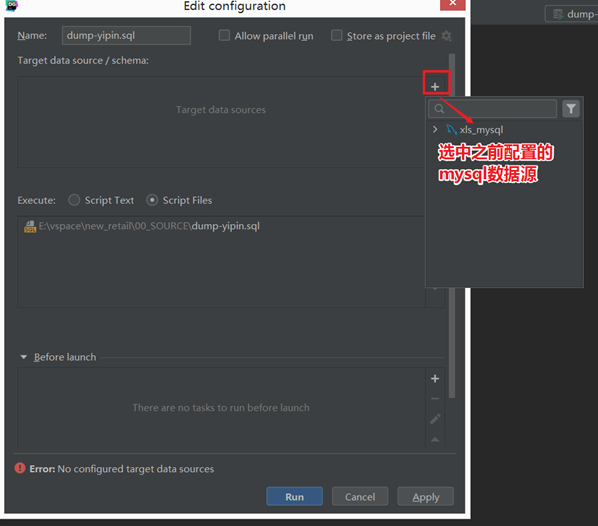

  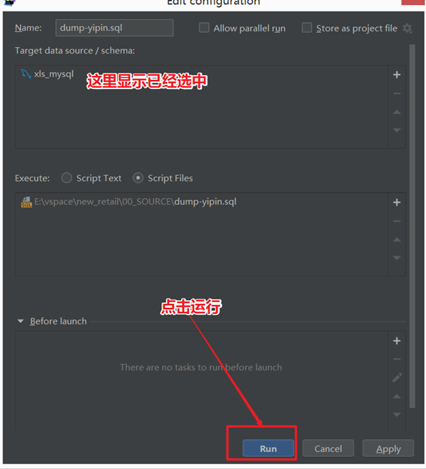

  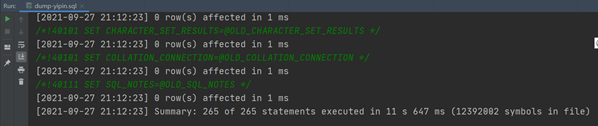

- step6：选中yipin数据库，刷新，查看数据是否正常

  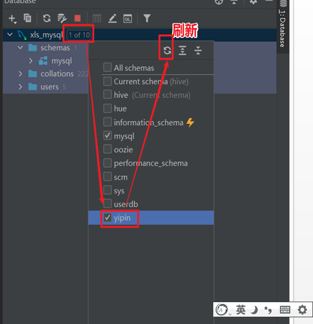

  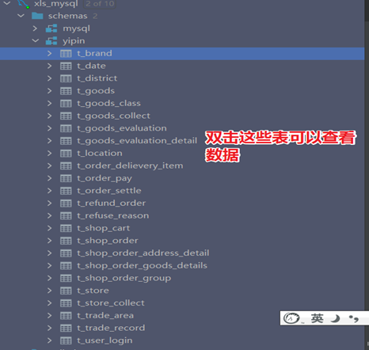

  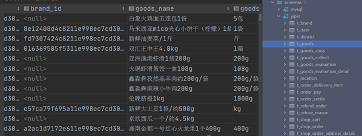

### 2. Hive中文注释乱码的问题

- 现象

  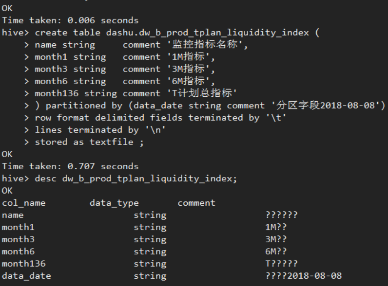

- 原因

  > Hive元数据信息存储在MySQL中。
  >
  > Hive要求数据库级别的字符集必须是latin1。但是对于具体表中字段的字符集则没做要求。
  >
  > 默认情况下，==字段字符集也是latin1，但是latin1不支持中文==。

  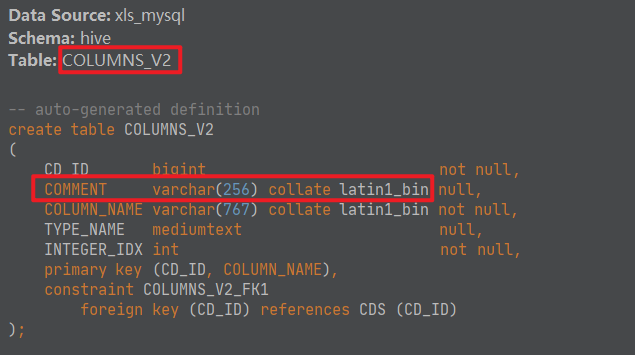

- 解决

  > 在mysql中，对于记录注释comment信息的几个表字段字符集进行修改。

  - step1：DataGrip打开MySQL console控制台

    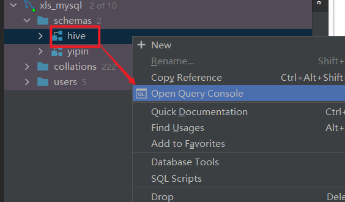

    

  - step2：执行下述sql语句修改字符集

    ```sql
    alter table hive.COLUMNS_V2 modify column COMMENT varchar(256) character set utf8;
    alter table hive.TABLE_PARAMS modify column PARAM_VALUE varchar(4000) character set utf8;
    alter table hive.PARTITION_PARAMS modify column PARAM_VALUE varchar(4000) character set utf8 ;
    alter table hive.PARTITION_KEYS modify column PKEY_COMMENT varchar(4000) character set utf8;
    alter table hive.INDEX_PARAMS modify column PARAM_VALUE varchar(4000) character set utf8;
    ```

  - step3：查看验证是否修改成功

    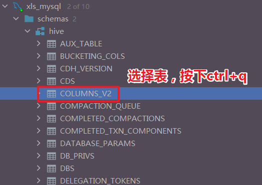

    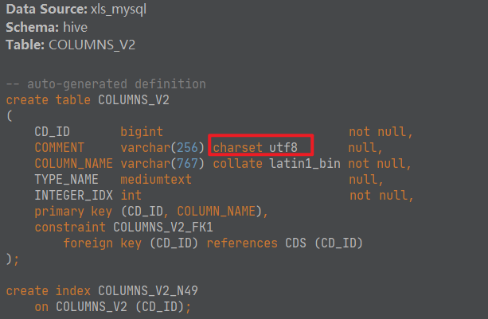

  - step4：删除之前hive中创建的表，重新建表

## III. ODS层构建

### 1. 数据导入同步的方式

- 方式1：==全量同步==

  > - **每天新增一个日期分区，同步并存储当天的全量数据**，历史数据定期删除。
  > - 适用于数据会有新增和更新，但是数据量较少，且历史快照不用保存很久的情况。

  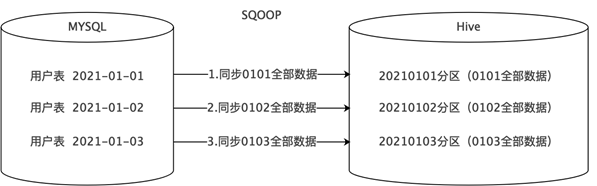

- 方式2：==全量覆盖==

  > - **不需要分区，每次同步都是先删后写，直接覆盖**。
  > - 适用于数据不会有任何新增和变化的情况。
  > - 比如地区、时间、性别等维度数据，不会变更或很少会有变更，可以只保留最新值。

  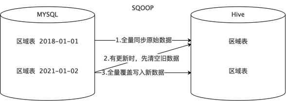

- 方式3：==仅新增同步==

  > - **每天新增一个日期分区，同步并存储当天的新增数据**。
  > - 比如登录记录表、访问日志表、交易记录表、商品评价表等。

  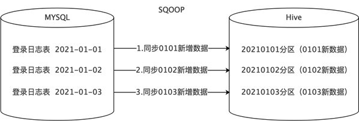

- 方式4：==新增及更新同步==

  > - **每天新增一个日期分区，同步并存储当天的新增和更新数据**。
  > - 适用于既有新增又有更新的数据，比如用户表、订单表、商品表等。

  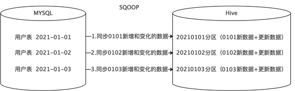

- 首次执行与循环执行

  > - ==首次==建库时，需要对OLTP应用中的表全量数据进行采集，因此==所有表都使用全量同步==。
  > - 历史数据量可能会非常大，远远超出了增量过程。在执行时需要进行针对性的优化配置并采用分批执行。
  > - ==后续==的循环执行大多采用的是==T+1==模式。

  ```properties
  =什么是T+1，这种说法来源于股票交易
  T+0，是国际上普遍使用的一种证劵度（或期货）交易制度。凡在证劵（或期货）成交日当天办理好证劵（或期货）和价款清算交割手续的交易制度，就称为T+0交易。通俗说，就是当天买入的证道劵（或期货）在当天就可以卖出。
  
  T+1是一种股票交易制度，即当日买进的股票，要到下一个交易日才能卖出。“T”指交易登记日，“T+1”指登记日的次日。
  ```

### 2. DataGrip链接Hive, 建库ODS

- DataGrip连接Hive

  > 注意，本项目环境中使用的==Hive版本是2.1.1-cdh6.2.1==，因此需要使用Hive2版本的驱动。

  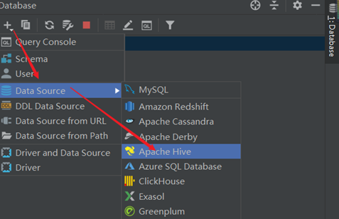

  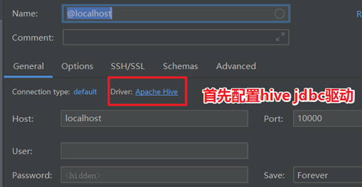

  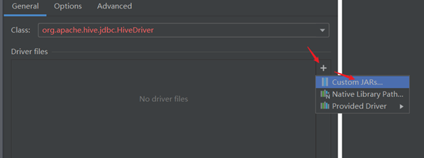

  

  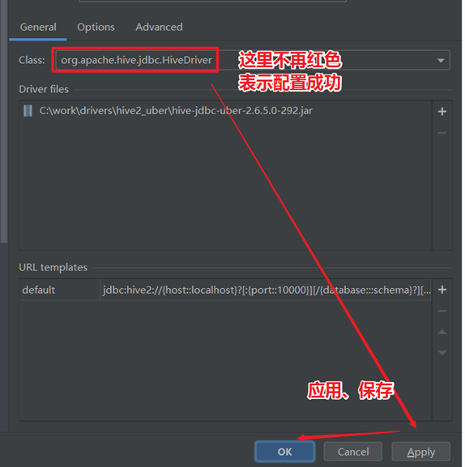

  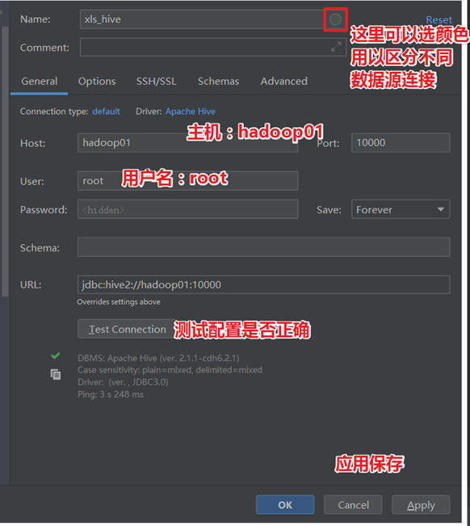

- 建库ODS

  > 库命名规范：==业务简拼_ods==，亿品新零售业务的ods层，可以命名为yp_ods。
  >
  > 表命名规范：ods层数据保持与原始数据一致，因此表名可以和原始表名一致。
  >
  > 比如t_shop_order表，可以命名为yp_ods.t_shop_order。

  - step1：DataGrip中打开Hive console控制台

    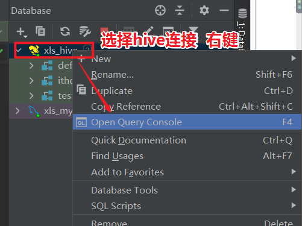

  - step2：执行建库语句

    ```sql
    create database if not exists yp_ods;
    ```

    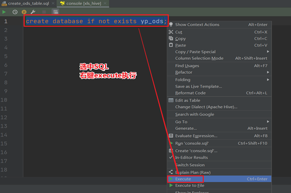

  - step3：选中创建好的数据库，刷新

    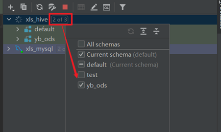

### 3. 全量覆盖

> 不需要分区，每次同步都是先删后写，直接覆盖。
>
> 适用于数据不会有任何新增和变化的情况。
>
> 比如区域字典表、时间、性别等维度数据，不会变更或很少会有变更，可以只保留最新值。
>
> 这里==以t_district区域字典表为例，进行讲解==。

- step1：ods层建表

  > 提示：可以直接使用项目提供的sql脚本。

  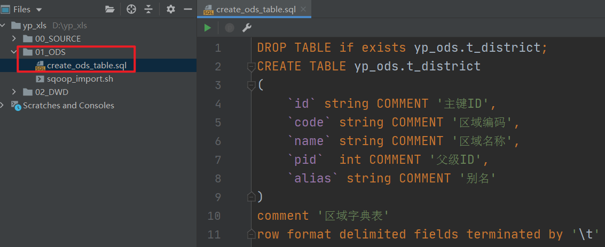

  ```sql
  DROP TABLE if exists yp_ods.t_district;
  CREATE TABLE yp_ods.t_district
  (
      `id` string COMMENT '主键ID',
      `code` string COMMENT '区域编码',
      `name` string COMMENT '区域名称',
      `pid`  int COMMENT '父级ID',
      `alias` string COMMENT '别名'
  )
  comment '区域字典表'
  row format delimited fields terminated by '\t' stored as orc tblproperties ('orc.compress'='ZLIB');
  ```

- step2：sqoop数据同步

  > - 因为表采用了==ORC格式==存储，因此使用sqoop导入数据的时候需要==使用HCatalog API==。
  > - 在sqoop并行导入的时候，需要--split-by xxx 这个参数指定数值类型字段进行切分。如果这个字段是一个文本格式，需要在命令中加入选项-Dorg.apache.sqoop.splitter.allow_text_splitter=true

  ```shell
  /usr/bin/sqoop import "-Dorg.apache.sqoop.splitter.allow_text_splitter=true" \
  --connect 'jdbc:mysql://192.168.88.80:3306/yipin?useUnicode=true&characterEncoding=UTF-8&autoReconnect=true' \
  --username root \
  --password 123456 \
  --query "select * from t_district where 1=1 and  \$CONDITIONS" \
  --hcatalog-database yp_ods \
  --hcatalog-table t_district \
  -m 1
  ```

### 4. 数据导入 -- 增量同步(仅新增)

> 每天新增一个日期分区==，同步并存储当天的新增数据。
>
> 比如登录日志表、访问日志表、交易记录表、商品评价表，订单评价表等。
>
> 这里以==t_user_login登录日志表为例，进行讲解==。

- step1：ods层建表

  ```sql
  DROP TABLE if exists yp_ods.t_user_login;
  CREATE TABLE yp_ods.t_user_login(
     id string,
     login_user string,
     login_type string COMMENT '登录类型（登陆时使用）',
     client_id string COMMENT '推送标示id(登录、第三方登录、注册、支付回调、给用户推送消息时使用)',
     login_time string,
     login_ip string,
     logout_time string
  ) 
  COMMENT '用户登录记录表'
  partitioned by (dt string)
  row format delimited fields terminated by '\t'
  stored as orc tblproperties ('orc.compress' = 'ZLIB');
  
  ---- dayinfo  daystr  dt   常见的表示天分区的字段
  ```

- step2：sqoop数据同步

  - 首次(全量)

    > 1、不管什么模式，首次都是全量同步；再次循环同步的时候，可以自己通过where条件来控制同步数据的范围；
    >
    > 2、==${TD_DATE}表示分区日期，正常来说应该是今天的前一天==，因为正常情况下，都是过夜里12点，干前一天活，那么数据的分区字段应该属于前一天。
    >
    > 3、这里为了演示，${TD_DATE}先写死，最后我们讲自动化调度方案的时候来学习如何编写shell脚本，动态获取时间。 
    >
    > TD_DATE=`date -d '1 days ago' "+%Y-%m-%d"`

    ```shell
    #下面这是自动化调度方案脚本  需要配合shell执行
    /usr/bin/sqoop import "-Dorg.apache.sqoop.splitter.allow_text_splitter=true" \
    --connect 'jdbc:mysql://192.168.88.80:3306/yipin?useUnicode=true&characterEncoding=UTF-8&autoReconnect=true' \
    --username root \
    --password 123456 \
    --query "select *, '${TD_DATE}' as dt from t_user_login where 1=1 and  \$CONDITIONS" \
    --hcatalog-database yp_ods \
    --hcatalog-table t_user_login \
    -m 1
    
    #下面这里用于课堂演示
    /usr/bin/sqoop import "-Dorg.apache.sqoop.splitter.allow_text_splitter=true" \
    --connect 'jdbc:mysql://192.168.88.80:3306/yipin?useUnicode=true&characterEncoding=UTF-8&autoReconnect=true' \
    --username root \
    --password 123456 \
    --query "select *, '2021-11-29' as dt from t_user_login where 1=1 and  \$CONDITIONS" \
    --hcatalog-database yp_ods \
    --hcatalog-table t_user_login \
    -m 1
    ```

  - 循环（增量同步）

    > 自己通过where条件来控制同步数据的范围；
    >
    > 比如对于t_user_login表，可以通过login_time登录时间这个字段来确定增量数据的范围。

    ```shell
    /usr/bin/sqoop import "-Dorg.apache.sqoop.splitter.allow_text_splitter=true" \
    --connect 'jdbc:mysql://192.168.88.80:3306/yipin?useUnicode=true&characterEncoding=UTF-8&autoReconnect=true' \
    --username root \
    --password 123456 \
    --query "select *, '${TD_DATE}' as dt from t_user_login where 1=1 and (login_time between '${TD_DATE} 00:00:00' and '${TD_DATE} 23:59:59') and  \$CONDITIONS" \
    --hcatalog-database yp_ods \
    --hcatalog-table t_user_login \
    -m 1
    
    
    ```

### 5. 数据导入 -- 增量同步(新增和更新)

> 每天新增一个日期分区，同步并存储当天的新增和更新数据。
>
> 适用于既有新增又有更新的数据，比如用户表、订单表、商品表等。
>
> 这里==以t_store店铺表为例，进行讲解==。

- step1：ods层建表

  ```sql
  CREATE TABLE yp_ods.t_store
  (
      `id`                 string COMMENT '主键',
      `user_id`            string,
      `store_avatar`       string COMMENT '店铺头像',
      `address_info`       string COMMENT '店铺详细地址',
      `name`               string COMMENT '店铺名称',
      `store_phone`        string COMMENT '联系电话',
      `province_id`        INT COMMENT '店铺所在省份ID',
      `city_id`            INT COMMENT '店铺所在城市ID',
      `area_id`            INT COMMENT '店铺所在县ID',
      `mb_title_img`       string COMMENT '手机店铺 页头背景图',
      `store_description` string COMMENT '店铺描述',
      `notice`             string COMMENT '店铺公告',
      `is_pay_bond`        TINYINT COMMENT '是否有交过保证金 1：是0：否',
      `trade_area_id`      string COMMENT '归属商圈ID',
      `delivery_method`    TINYINT COMMENT '配送方式  1 ：自提 ；3 ：自提加配送均可; 2 : 商家配送',
      `origin_price`       DECIMAL,
      `free_price`         DECIMAL,
      `store_type`         INT COMMENT '店铺类型 22天街网店 23实体店 24直营店铺 33会员专区店',
      `store_label`        string COMMENT '店铺logo',
      `search_key`         string COMMENT '店铺搜索关键字',
      `end_time`           string COMMENT '营业结束时间',
      `start_time`         string COMMENT '营业开始时间',
      `operating_status`   TINYINT COMMENT '营业状态  0 ：未营业 ；1 ：正在营业',
      `create_user`        string,
      `create_time`        string,
      `update_user`        string,
      `update_time`        string,
      `is_valid`           TINYINT COMMENT '0关闭，1开启，3店铺申请中',
      `state`              string COMMENT '可使用的支付类型:MONEY金钱支付;CASHCOUPON现金券支付',
      `idCard`             string COMMENT '身份证',
      `deposit_amount`     DECIMAL(11,2) COMMENT '商圈认购费用总额',
      `delivery_config_id` string COMMENT '配送配置表关联ID',
      `aip_user_id`        string COMMENT '通联支付标识ID',
      `search_name`        string COMMENT '模糊搜索名称字段:名称_+真实名称',
      `automatic_order`    TINYINT COMMENT '是否开启自动接单功能 1：是  0 ：否',
      `is_primary`         TINYINT COMMENT '是否是总店 1: 是 2: 不是',
      `parent_store_id`    string COMMENT '父级店铺的id，只有当is_primary类型为2时有效'
  )
  comment '店铺表'
  partitioned by (dt string) row format delimited fields terminated by '\t' stored as orc tblproperties ('orc.compress'='ZLIB');
  
  ```

- step2：sqoop数据同步

  > 实现新增及更新同步的关键是，表中有两个跟时间相关的字段：
  >
  > ==create_time==  创建时间 一旦生成 不再修改
  >
  > ==update_time== 更新时间  数据变化时间修改
  >
  > 自己通过where条件来控制同步数据的范围。

  - 首次

    ```shell
    #下面这是自动化调度方案脚本  需要配合shell执行
    /usr/bin/sqoop import "-Dorg.apache.sqoop.splitter.allow_text_splitter=true" \
    --connect 'jdbc:mysql://192.168.88.80:3306/yipin?useUnicode=true&characterEncoding=UTF-8&autoReconnect=true' \
    --username root \
    --password 123456 \
    --query "select *, '${TD_DATE}' as dt from t_store where 1=1 and \$CONDITIONS" \
    --hcatalog-database yp_ods \
    --hcatalog-table t_store \
    -m 1
    ```

- 循环

  > 注意了，如果这里将时间范围控制在公元前5000年到today，那么不出意外，这应该是全量数据，
  >
  > 其效果和上面的首次导入一样。
  >
  > ==今天是哪一天，日期值就应该是今天的前一天==。

  ```shell
    #下面这里用于课堂演示
    /usr/bin/sqoop import "-Dorg.apache.sqoop.splitter.allow_text_splitter=true" \
    --connect 'jdbc:mysql://192.168.88.80:3306/yipin?useUnicode=true&characterEncoding=UTF-8&autoReconnect=true' \
    --username root \
    --password 123456 \
    --query "select *, '2021-11-29' as dt from t_store where 1=1 and (create_time between '2010-01-01 00:00:00' and '2021-11-29 23:59:59') or (update_time between '2010-01-01 00:00:00' and '2021-11-29 23:59:59') and  \$CONDITIONS" \
    --hcatalog-database yp_ods \
    --hcatalog-table t_store \
    -m 1
    
    
    #下面这是自动化调度方案脚本  需要配合shell执行
    /usr/bin/sqoop import "-Dorg.apache.sqoop.splitter.allow_text_splitter=true" \
    --connect 'jdbc:mysql://192.168.88.80:3306/yipin?useUnicode=true&characterEncoding=UTF-8&autoReconnect=true' \
    --username root \
    --password 123456 \
    --query "select *, '${TD_DATE}' as dt from t_store where 1=1 and ((create_time between '${TD_DATE} 00:00:00' and '${TD_DATE} 23:59:59') or (update_time between '${TD_DATE} 00:00:00' and '${TD_DATE} 23:59:59')) and  \$CONDITIONS" \
    --hcatalog-database yp_ods \
    --hcatalog-table t_store \
    -m 1
  ```

### 6. 数据导入 -- 完整

- 掌握完全量覆盖、增量同步、新增和更新同步如何实现之后，对于ODS的表其他操作类比进行。

- 可以使用课程中提供的脚本批量执行，提高效率。

- ==**注意脚本中的时间，是写死的还是动态获取的。如果有需要进行修改**==。

- 注意数据同步之后，最好和mysql数据源表做一次校验比对，同时也验证一下同步数据是否成功、正确。

  

- step1：关于ODS层建表语句sql文件的执行

  - Datagrip中选中sql文件执行

    

    

    

    

- step2：关于ODS层sqoop数据同步的shell脚本执行

  - ==执行之前，把脚本中的写死的日期根据当前操作的实际情况修改一下==。

  - 可以选择复制shell脚本中的sqoop导入命令  一个一个一次执行

  - 也可以选择上传shell脚本到hadoop01服务器上，执行如下命令

    ```shell
    chmod u+x sqoop_import.sh
    sh sqoop_import.sh
    ```

  - 这样shell脚本就会依次执行每一个sqoop任务了。

## IV. DWD(detail)层构建

### 1. 功能职责, 事实表维度表识别

### 2. 渐变维: 拉链表 -- 设计

### 3. 渐变维: 拉链表 -- 实现

### 4. 3种导入方式

### 5. 订单事实表 -- 建表与首次导入

### 6. 订单事实表 -- 循环与拉链导入

### 7. 时间维度表 -- 全量覆盖导入

### 8. 订单评价表 -- 增量导入

### 9. 完整

### 附: hive相关配置参数