# DWB层建设实战、Presto计算引擎

## I. DWB层构建

### 1. DWB功能职责

- 新零售数仓分层图

  

- DWB

  - 名称：基础数据层、中间数据层
  - 功能：==退化维度（降维）==形成大宽表

### 2. 维度退化(降维)概念与意义

- 百科定义

  > 退化维度（Degenerate Dimension,DD），就是那些看起来像是事实表的一个维度关键字，但实际上并没有对应的维度表。
  >
  > ==退化维度技术可以减少维度的数量（降维操作）==，简化维度数据仓库的模式。简单的模式比复杂的更容易理解，也有更好的查询性能。

  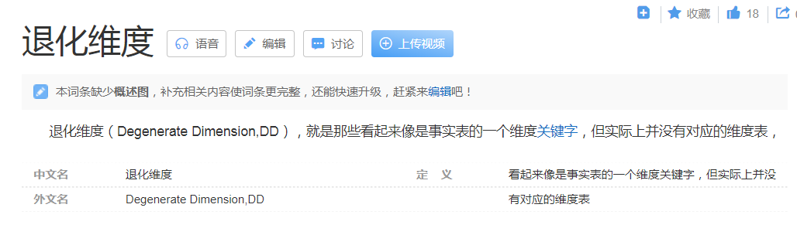

- 常见操作

  > 1、将==各个维度表的核心字段数据汇总到事实表==中；
  >
  > 2、如果一个业务模块有多个事实表，也可以将==多个事实表的核心字段汇总到一个事实表==。

- 功能

  - 通过退化维度操作之后，带来的显著效果是
    - 整个数仓中**表的个数减少**了；
    - 业务==相关联的数据==（跟你分析相关的）数据字段聚在一起了，==形成一张宽表==。
    - 分析==查询时的效率显著提高==了：多表查询和==单表查询==的差异。
  - 带来的坏处是
    - 数据大量冗余、宽表的概念已经不符合3范式设计要求了。
    - 但是数仓建模的核心追求是，只要有利于分析，能够加快数据分析，都可以做。

- 新零售项目--DWB层明细宽表

  > 根据业务形式和后续分析需求，划分了3大模块，对应着3张明细宽表。
  >
  > 用户业务模块没有进行退化维度操作，原因是后面的指标单表可以操作技术。

  - 订单明细宽表 **==dwb_order_detail==**
  - 店铺明细宽表 **==dwb_shop_detail==**
  - 商品明细宽表 **==dwb_goods_detail==**

- 使用DataGrip在Hive中创建dwb层

  ```sql
  create database if not exists yp_dwb;
  ```

  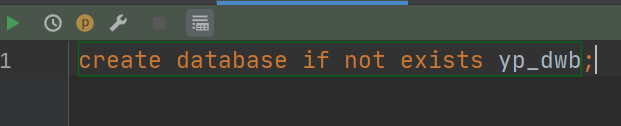

### 3. 订单明细宽表构建

#### 3.1. 建表

- 表梳理

  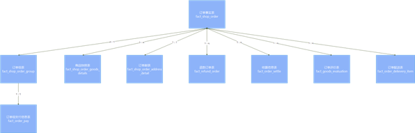

  ```properties
  核心表: yp_dwd.fact_shop_order订单主表
  		(也就说，其他表将围绕着订单主表拼接成为一张宽表)
  退化维度表:
  	fact_shop_order_address_detail:  订单副表 
  		记录订单额外信息 与订单主表是1对1关系 (id与orderID一一对应) 
  	fact_shop_order_group:  订单组表 
  		多笔订单构成一个订单组 (含orderID)
  	fact_order_pay:    订单组支付表
  		记录订单组支付信息，跟订单组是1对1关系 (含group_id)
  	fact_refund_order:  订单退款信息表
  		记录退款相关信息(含orderID)		
  	fact_order_settle:  订单结算表
  		记录一笔订单中配送员、圈主、平台、商家的分成 (含orderID)
  	fact_shop_order_goods_details:  订单和商品的中间表
  		记录订单中商品的相关信息，如商品ID、数量、价格、总价、名称、规格、分类(含orderID)
  	fact_goods_evaluation:  订单评价表
  		记录订单综合评分,送货速度评分等(含orderID)        
  	fact_order_delievery_item:  订单配送表
  		记录配送员信息、收货人信息、商品信息(含orderID)
  ```

- 建表：订单明细宽表 dwb_order_detail

  > 在进行维度退化的时候，需要将各个表的核心字段退化到事实表中形成宽表，究竟哪些是核心字段呢？
  >
  > 答案是：明显不需要的可以不退化  另外拿捏不住  “==宁滥勿缺==”。

  ```sql
  CREATE TABLE yp_dwb.dwb_order_detail(
  --订单主表
    order_id string COMMENT '根据一定规则生成的订单编号', 
    order_num string COMMENT '订单序号', 
    buyer_id string COMMENT '买家的userId', 
    store_id string COMMENT '店铺的id', 
    order_from string COMMENT '渠道类型：android、ios、miniapp、pcweb、other', 
    order_state int COMMENT '订单状态:1.已下单\; 2.已付款, 3. 已确认 \;4.配送\; 5.已完成\; 6.退款\;7.已取消', 
    create_date string COMMENT '下单时间', 
    finnshed_time timestamp COMMENT '订单完成时间,当配送员点击确认送达时,进行更新订单完成时间,后期需要根据订单完成时间,进行自动收货以及自动评价', 
    is_settlement tinyint COMMENT '是否结算\;0.待结算订单\; 1.已结算订单\;', 
    is_delete tinyint COMMENT '订单评价的状态:0.未删除\;  1.已删除\;(默认0)', 
    evaluation_state tinyint COMMENT '订单评价的状态:0.未评价\;  1.已评价\;(默认0)', 
    way string COMMENT '取货方式:SELF自提\;SHOP店铺负责配送', 
    is_stock_up int COMMENT '是否需要备货 0：不需要    1：需要    2:平台确认备货  3:已完成备货 4平台已经将货物送至店铺 ', 
  --  订单副表
    order_amount decimal(36,2) COMMENT '订单总金额:购买总金额-优惠金额', 
    discount_amount decimal(36,2) COMMENT '优惠金额', 
    goods_amount decimal(36,2) COMMENT '用户购买的商品的总金额+运费', 
    is_delivery string COMMENT '0.自提；1.配送', 
    buyer_notes string COMMENT '买家备注留言', 
    pay_time string, 
    receive_time string, 
    delivery_begin_time string, 
    arrive_store_time string, 
    arrive_time string COMMENT '订单完成时间,当配送员点击确认送达时,进行更新订单完成时间,后期需要根据订单完成时间,进行自动收货以及自动评价', 
    create_user string, 
    create_time string, 
    update_user string, 
    update_time string, 
    is_valid tinyint COMMENT '是否有效  0: false\; 1: true\;   订单是否有效的标志',
  --  订单组
    group_id string COMMENT '订单分组id', 
    is_pay tinyint COMMENT '订单组是否已支付,0未支付,1已支付', 
  --  订单组支付
    group_pay_amount decimal(36,2) COMMENT '订单总金额\;', 
  --  退款单
    refund_id string COMMENT '退款单号', 
    apply_date string COMMENT '用户申请退款的时间', 
    refund_reason string COMMENT '买家退款原因', 
    refund_amount decimal(36,2) COMMENT '订单退款的金额', 
    refund_state tinyint COMMENT '1.申请退款\;2.拒绝退款\; 3.同意退款,配送员配送\; 4:商家同意退款,用户亲自送货 \;5.退款完成', 
  --  结算
    settle_id string COMMENT '结算单号',
    settlement_amount decimal(36,2) COMMENT '如果发生退款,则结算的金额 = 订单的总金额 - 退款的金额', 
    dispatcher_user_id string COMMENT '配送员id', 
    dispatcher_money decimal(36,2) COMMENT '配送员的配送费(配送员的运费(如果退货方式为1:则买家支付配送费))', 
    circle_master_user_id string COMMENT '圈主id', 
    circle_master_money decimal(36,2) COMMENT '圈主分润的金额', 
    plat_fee decimal(36,2) COMMENT '平台应得的分润', 
    store_money decimal(36,2) COMMENT '商家应得的订单金额', 
    status tinyint COMMENT '0.待结算；1.待审核 \; 2.完成结算；3.拒绝结算', 
    settle_time string COMMENT ' 结算时间', 
  -- 订单评价
    evaluation_id string,
    evaluation_user_id string COMMENT '评论人id',
    geval_scores int COMMENT '综合评分',
    geval_scores_speed int COMMENT '送货速度评分0-5分(配送评分)',
    geval_scores_service int COMMENT '服务评分0-5分',
    geval_isanony tinyint COMMENT '0-匿名评价，1-非匿名',
    evaluation_time string,
  -- 订单配送
    delievery_id string COMMENT '主键id',
    dispatcher_order_state tinyint COMMENT '配送订单状态:0.待接单.1.已接单,2.已到店.3.配送中 4.商家普通提货码完成订单.5.商家万能提货码完成订单。6，买家完成订单',
    delivery_fee decimal(36,2) COMMENT '配送员的运费',
    distance int COMMENT '配送距离',
    dispatcher_code string COMMENT '收货码',
    receiver_name string COMMENT '收货人姓名',
    receiver_phone string COMMENT '收货人电话',
    sender_name string COMMENT '发货人姓名',
    sender_phone string COMMENT '发货人电话',
    delievery_create_time string,
  -- 商品快照
    order_goods_id string COMMENT '--商品快照id', 
    goods_id string COMMENT '购买商品的id', 
    buy_num int COMMENT '购买商品的数量', 
    goods_price decimal(36,2) COMMENT '购买商品的价格', 
    total_price decimal(36,2) COMMENT '购买商品的价格 = 商品的数量 * 商品的单价 ', 
    goods_name string COMMENT '商品的名称', 
    goods_specification string COMMENT '商品规格', 
    goods_type string COMMENT '商品分类     ytgj:进口商品    ytsc:普通商品     hots爆品', 
    goods_brokerage decimal(36,2) COMMENT '商家设置的商品分润的金额',
    is_goods_refund tinyint COMMENT '0.不退款\; 1.退款'  
  )
  COMMENT '订单明细表'
  PARTITIONED BY(dt STRING)
  row format delimited fields terminated by '\t' 
  stored as orc 
  tblproperties ('orc.compress' = 'SNAPPY');
  ```

#### 3.2. join操作

- join方式的选择

  - left左连接

    > 以yp_dwd.fact_shop_order为左表，其他表进行left join

- 注意事项

  - 除fact_order_pay订单组表之外，其他表都是通过order_id与订单主表进行连接
  - fact_order_pay与fact_shop_order_group通过group_id连接，间接与订单主表连接
  - ==如果表是一张拉链表，注意加上过滤条件 end_date='9999-99-99',把当前有效的数据查询出来==
  - 对于fact_shop_order的end_date='9999-99-99'过滤，应该放在where条件中完成，先过滤，后join

- join模板

  ```sql
  select
  xxxxx
  xxx
  xxxxx
  FROM yp_dwd.fact_shop_order o
  --订单副表
  LEFT JOIN yp_dwd.fact_shop_order_address_detail od on o.id=od.id and od.end_date='9999-99-99'
  --订单组
  LEFT JOIN yp_dwd.fact_shop_order_group og on og.order_id = o.id and og.end_date='9999-99-99'
  --and og.is_pay=1  是否支付的过滤 0未支付 1 已支付
  --订单组支付信息
  LEFT JOIN yp_dwd.fact_order_pay op ON op.group_id = og.group_id and op.end_date='9999-99-99'
  --退款信息
  LEFT JOIN yp_dwd.fact_refund_order refund on refund.order_id=o.id and refund.end_date='9999-99-99'
  --and refund.refund_state=5  退款状态 5表示退款已经完成
  --结算信息
  LEFT JOIN yp_dwd.fact_order_settle os on os.order_id = o.id and os.end_date='9999-99-99'
  --商品快照
  LEFT JOIN yp_dwd.fact_shop_order_goods_details ogoods on ogoods.order_id = o.id and ogoods.end_date='9999-99-99'
  --订单评价表
  LEFT JOIN yp_dwd.fact_goods_evaluation e on e.order_id=o.id and e.is_valid=1
  --订单配送表
  LEFT JOIN yp_dwd.fact_order_delievery_item d on d.shop_order_id=o.id and d.dispatcher_order_type=1 and d.is_valid=1
  where o.end_date='9999-99-99';
  ```

#### 3.3. 最终SQL实现

```sql
INSERT into yp_dwb.dwb_order_detail
select
	o.id as order_id,
	o.order_num,
	o.buyer_id,
	o.store_id,
	o.order_from,
	o.order_state,
	o.create_date,
	o.finnshed_time,
	o.is_settlement,
	o.is_delete,
	o.evaluation_state,
	o.way,
	o.is_stock_up,
	od.order_amount,
	od.discount_amount,
	od.goods_amount,
	od.is_delivery,
	od.buyer_notes,
	od.pay_time,
	od.receive_time,
	od.delivery_begin_time,
	od.arrive_store_time,
	od.arrive_time,
	od.create_user,
	od.create_time,
	od.update_user,
	od.update_time,
	od.is_valid,
	og.group_id,
	og.is_pay,
	op.order_pay_amount as group_pay_amount,
	refund.id as refund_id,
	refund.apply_date,
	refund.refund_reason,
	refund.refund_amount,
	refund.refund_state,
	os.id as settle_id,
	os.settlement_amount,
	os.dispatcher_user_id,
	os.dispatcher_money,
	os.circle_master_user_id,
	os.circle_master_money,
	os.plat_fee,
	os.store_money,
	os.status,
	os.settle_time,
    e.id,
    e.user_id,
    e.geval_scores,
    e.geval_scores_speed,
    e.geval_scores_service,
    e.geval_isanony,
    e.create_time,
    d.id,
    d.dispatcher_order_state,
    d.delivery_fee,
    d.distance,
    d.dispatcher_code,
    d.receiver_name,
    d.receiver_phone,
    d.sender_name,
    d.sender_phone,
    d.create_time,
	ogoods.id as order_goods_id,
	ogoods.goods_id,
	ogoods.buy_num,
	ogoods.goods_price,
	ogoods.total_price,
	ogoods.goods_name,
	ogoods.goods_specification,
	ogoods.goods_type,
    ogoods.goods_brokerage,
	ogoods.is_refund as is_goods_refund,
	SUBSTRING(o.create_date,1,10) as dt --动态分区值
FROM yp_dwd.fact_shop_order o
--订单副表
left join yp_dwd.fact_shop_order_address_detail od on o.id=od.id and od.end_date='9999-99-99'
--订单组
left join yp_dwd.fact_shop_order_group og on og.order_id = o.id and og.end_date='9999-99-99'
--and og.is_pay=1
--订单组支付信息
left JOIN yp_dwd.fact_order_pay op ON op.group_id = og.group_id and op.end_date='9999-99-99'
--退款信息
left join yp_dwd.fact_refund_order refund on refund.order_id=o.id and refund.end_date='9999-99-99'
--and refund.refund_state=5
--结算信息
LEFT JOIN yp_dwd.fact_order_settle os on os.order_id = o.id and os.end_date='9999-99-99'
--商品快照
LEFT JOIN yp_dwd.fact_shop_order_goods_details ogoods on ogoods.order_id = o.id and ogoods.end_date='9999-99-99'
--订单评价表
left join yp_dwd.fact_goods_evaluation e on e.order_id=o.id and e.is_valid=1
--订单配送表
left join yp_dwd.fact_order_delievery_item d on d.shop_order_id=o.id and d.dispatcher_order_type=1 and d.is_valid=1
where o.end_date='9999-99-99';
```

- Hive执行动态分区配置参数

  ```shell
  --分区
  SET hive.exec.dynamic.partition=true;
  SET hive.exec.dynamic.partition.mode=nonstrict;
  set hive.exec.max.dynamic.partitions.pernode=10000;
  set hive.exec.max.dynamic.partitions=100000;
  set hive.exec.max.created.files=150000;
  --hive压缩
  set hive.exec.compress.intermediate=true;
  set hive.exec.compress.output=true;
  --写入时压缩生效
  set hive.exec.orc.compression.strategy=COMPRESSION;
  ```

### 4. 店铺明细宽表构建

#### 4.1. 建表

- 表梳理

  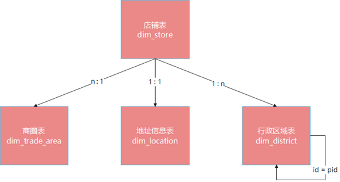

  ```properties
  核心表: yp_dwd.dim_store 店铺表
  退化维度表:
  	dim_trade_area 商圈表
  		记录商圈相关信息，店铺需要归属商圈中(ID主键是店铺表中的外键，trade_area_id)
  	dim_location 地址信息表
  		记录了店铺地址
  	dim_district 区域字典表
  		记录了省市县区域的名称、别名、编码、父级区域ID
  ```

- 建表语句

  ```sql
  CREATE TABLE yp_dwb.dwb_shop_detail(
  --  店铺
    id string, 
    address_info string COMMENT '店铺详细地址', 
    store_name string COMMENT '店铺名称', 
    is_pay_bond tinyint COMMENT '是否有交过保证金 1：是0：否', 
    trade_area_id string COMMENT '归属商圈ID', 
    delivery_method tinyint COMMENT '配送方式  1 ：自提 ；3 ：自提加配送均可\; 2 : 商家配送', 
    store_type int COMMENT '店铺类型 22天街网店 23实体店 24直营店铺 33会员专区店', 
    is_primary tinyint COMMENT '是否是总店 1: 是 2: 不是', 
    parent_store_id string COMMENT '父级店铺的id，只有当is_primary类型为2时有效', 
  --  商圈
    trade_area_name string COMMENT '商圈名称',
  --  区域-店铺
    province_id string COMMENT '店铺所在省份ID', 
    city_id string COMMENT '店铺所在城市ID', 
    area_id string COMMENT '店铺所在县ID', 
    province_name string COMMENT '省份名称', 
    city_name string COMMENT '城市名称', 
    area_name string COMMENT '县名称'
    )
  COMMENT '店铺明细表'
  row format delimited fields terminated by '\t' 
  stored as orc 
  tblproperties ('orc.compress' = 'SNAPPY');
  ```

#### 4.2. 省市县3级查询思路与实现

- 业务梳理

  > 业务系统在设计地址信息类数据存储时，采用的方法如下。

  ```shell
  #a、所有地址类信息统一存储在dim_location地址表中，通过type来表名属于什么地址。比如我们需要店铺地址时，需要在查询是添加条件where type=2来找出店铺地址信息。
  	1：商圈地址；2：店铺地址；3.用户地址管理;4.订单买家地址信息;5.订单卖家地址信息
  
  #b、而地址详细信息比如我们业务需要的省、市、县名称及其ID共6个字段，却又是存储在dim_district区域字典表中的。
  
  
  #c、然而比较可惜的是，区域字典表中的数据，不是所谓的帮省市区信息存储在一行种，而是通过父ID这样的方式形成关联。具体数据样式见下图。
  ```

  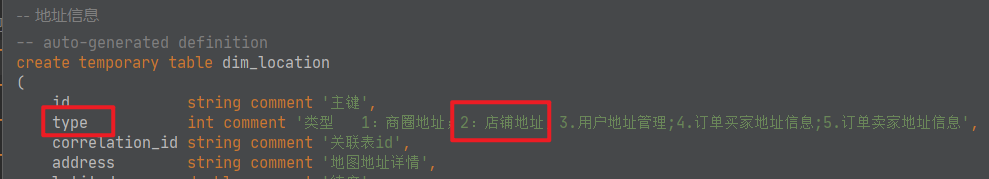

  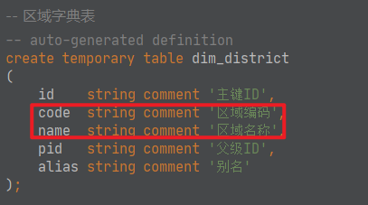

  

- 实现思路

  - 见画图。

  - sql伪代码实现

    ```sql
    --店铺先和地址连接 得到店铺的adcode
    yp_dwd.dim_store s
    LEFT JOIN yp_dwd.dim_location lc on lc.correlation_id = s.id and lc.type=2
    --在根据adcode去区域字典表中进行查询，先查出县
    LEFT JOIN yp_dwd.dim_district d1 ON d1.code = lc.adcode
    --根据县的pid再去区域字典表中查询出市
    LEFT JOIN yp_dwd.dim_district d2 ON d2.id = d1.pid
    --根据市的pid再去区域字典表中查询出省
    LEFT JOIN yp_dwd.dim_district d3 ON d3.id = d2.pid
    ```

#### 4.3. 最终SQL实现

```sql
INSERT into yp_dwb.dwb_shop_detail
SELECT 
	s.id,
	s.address_info,
	s.name as store_name,
	s.is_pay_bond,
	s.trade_area_id,
	s.delivery_method,
	s.store_type,
	s.is_primary,
	s.parent_store_id,
	ta.name as trade_area_name,
	d3.code as province_id,
	d2.code as city_id,
	d1.code as area_id,
	d3.name as province_name,
	d2.name as city_name,
	d1.name as area_name
--店铺
FROM yp_dwd.dim_store s
--商圈
LEFT JOIN yp_dwd.dim_trade_area ta ON ta.id = s.trade_area_id and ta.end_date='9999-99-99'
--地区  注意type=2才表示地址是店铺地址
LEFT JOIN yp_dwd.dim_location lc on lc.correlation_id = s.id and lc.type=2 and lc.end_date='9999-99-99'
LEFT JOIN yp_dwd.dim_district d1 ON d1.code = lc.adcode
LEFT JOIN yp_dwd.dim_district d2 ON d2.id = d1.pid
LEFT JOIN yp_dwd.dim_district d3 ON d3.id = d2.pid
WHERE s.end_date='9999-99-99'
;
```

### 5. 商品明细宽表构建

#### 5.1. 建表

- 表梳理

  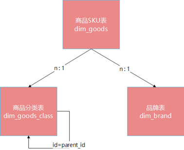

  ```properties
  核心表: dim_goods 商品SKU表
  		记录了商品相关信息
  退化维度表:
  	dim_goods_class 商品分类表
  		记录了商品所属的分类信息：商品大类、商品中类、商品小类
  	dim_brand 品牌信息表	
  		记录了品牌信息		
  ```

- 建表语句

  ```sql
  CREATE TABLE yp_dwb.dwb_goods_detail(
    id string, 
    store_id string COMMENT '所属商店ID', 
    class_id string COMMENT '分类id:只保存最后一层分类id', 
    store_class_id string COMMENT '店铺分类id', 
    brand_id string COMMENT '品牌id', 
    goods_name string COMMENT '商品名称', 
    goods_specification string COMMENT '商品规格', 
    search_name string COMMENT '模糊搜索名称字段:名称_+真实名称', 
    goods_sort int COMMENT '商品排序', 
    goods_market_price decimal(36,2) COMMENT '商品市场价', 
    goods_price decimal(36,2) COMMENT '商品销售价格(原价)', 
    goods_promotion_price decimal(36,2) COMMENT '商品促销价格(售价)', 
    goods_storage int COMMENT '商品库存', 
    goods_limit_num int COMMENT '购买限制数量', 
    goods_unit string COMMENT '计量单位', 
    goods_state tinyint COMMENT '商品状态 1正常，2下架,3违规（禁售）', 
    goods_verify tinyint COMMENT '商品审核状态: 1通过，2未通过，3审核中', 
    activity_type tinyint COMMENT '活动类型:0无活动1促销2秒杀3折扣', 
    discount int COMMENT '商品折扣(%)', 
    seckill_begin_time string COMMENT '秒杀开始时间', 
    seckill_end_time string COMMENT '秒杀结束时间', 
    seckill_total_pay_num int COMMENT '已秒杀数量', 
    seckill_total_num int COMMENT '秒杀总数限制', 
    seckill_price decimal(36,2) COMMENT '秒杀价格', 
    top_it tinyint COMMENT '商品置顶：1-是，0-否', 
    create_user string, 
    create_time string, 
    update_user string, 
    update_time string, 
    is_valid tinyint COMMENT '0 ：失效，1 ：开启', 
  --  商品小类
    min_class_id string COMMENT '分类id:只保存最后一层分类id', 
    min_class_name string COMMENT '店铺内分类名字', 
  --  商品中类
    mid_class_id string COMMENT '分类id:只保存最后一层分类id', 
    mid_class_name string COMMENT '店铺内分类名字', 
  --  商品大类
    max_class_id string COMMENT '分类id:只保存最后一层分类id', 
    max_class_name string COMMENT '店铺内分类名字', 
  --  品牌
    brand_name string COMMENT '品牌名称'
    )
  COMMENT '商品明细表'
  row format delimited fields terminated by '\t' 
  stored as orc 
  tblproperties ('orc.compress' = 'SNAPPY');
  ```

#### 5.2. 商品分类实现剖析

- 背景

  ```shell
  # 1、业务系统在设计商品分类表dim_goods_class时，准备采用的是3级存储。通过level值来表示。
      1	 大类
      2	 中类
      3	 小类
      
  # 2、但是dim_goods_class数据集中实际等级效果只有两类，level=3的只有1个分类。  
  ```

  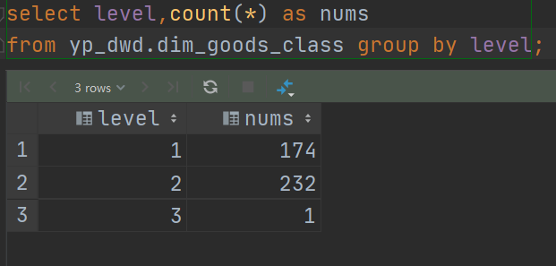

- 问题

  > 上述现象也就意味着==很多商品在存储的时候采用的是两类存储==，这点通过简单的sql得到了验证；

  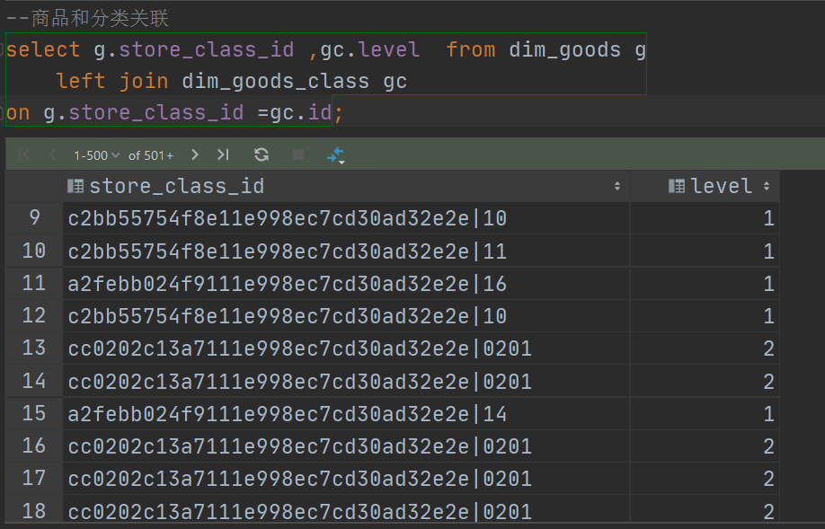

  > 构建商品明细表时候，我们需要的是3类结果：商品小类、商品中类、商品大类。
  >
  > 因此在编写join的时候，我们需要关联3次，实际中的join情况因为分为下面3种：
  >
  > ==如果level=3，才会关联到level=2 ，再去关联level=1==
  >
  > ==如果level=2，关联到level=1,结束==
  >
  > ==如果level=1，结束==
  >
  > 结束指的是，已经到大类级别了，没有parent_id了。就是执行join，结果也是为空。

  ```
  1、先根据dim_goods.store_class_id = dim_goods_class.id查出商品小类
  
  2、然后根据小类.parent_id=dim_goods_class.id查出商品中类
  
  3、最后根据中类.parent_id=dim_goods_class.id查出商品大类
  ```

  > 这样导致的结果是：查询出来的3级分类会形成==错位==。如:
  >
  > 一个商品level=2，只能查询出来中类、大类，但是根据上述join的方式，却把
  >
  > 中类当成了小类，大类当成了中类，把null当成了大类。
  >
  > 那么==在查询结果取值返回的时候，一定要进行条件判断了，使用case when语句==。避免错误。

- 解决

  ```sql
  --商品小类 如果class1.level=3,说明这个商品第一级就是小类
  	CASE class1.level WHEN 3
  		THEN class1.id
  		ELSE NULL
  		END as min_class_id,
  	CASE class1.level WHEN 3
  		THEN class1.name
  		ELSE NULL
  		END as min_class_name,
  	--商品中类	如果class1.level=2，说明这个商品第一级就是中类
  	CASE WHEN class1.level=2
  		THEN class1.id
  		WHEN class2.level=2
  		THEN class2.id
  		ELSE NULL
  		END as mid_class_id,
  	CASE WHEN class1.level=2
  		THEN class1.name
  		WHEN class2.level=2
  		THEN class2.name
  		ELSE NULL
  		END as mid_class_name,
  	--商品大类	如果class1.level=1，说明这个商品第一级就是大类
  	CASE WHEN class1.level=1
  		THEN class1.id
  		WHEN class2.level=1
  		THEN class2.id
  		WHEN class3.level=1
  		THEN class3.id
  		ELSE NULL
  		END as max_class_id,
  	CASE WHEN class1.level=1
  		THEN class1.name
  		WHEN class2.level=1
  		THEN class2.name
  		WHEN class3.level=1
  		THEN class3.name
  		ELSE NULL
  		END as max_class_name,
  ```

#### 5.3. 最终SQL实现

```sql
INSERT into yp_dwb.dwb_goods_detail
SELECT
	goods.id,
	goods.store_id,
	goods.class_id,
	goods.store_class_id,
	goods.brand_id,
	goods.goods_name,
	goods.goods_specification,
	goods.search_name,
	goods.goods_sort,
	goods.goods_market_price,
	goods.goods_price,
	goods.goods_promotion_price,
	goods.goods_storage,
	goods.goods_limit_num,
	goods.goods_unit,
	goods.goods_state,
	goods.goods_verify,
	goods.activity_type,
	goods.discount,
	goods.seckill_begin_time,
	goods.seckill_end_time,
	goods.seckill_total_pay_num,
	goods.seckill_total_num,
	goods.seckill_price,
	goods.top_it,
	goods.create_user,
	goods.create_time,
	goods.update_user,
	goods.update_time,
	goods.is_valid,
	--商品小类
	CASE class1.level WHEN 3
		THEN class1.id
		ELSE NULL
		END as min_class_id,
	CASE class1.level WHEN 3
		THEN class1.name
		ELSE NULL
		END as min_class_name,
	--商品中类	
	CASE WHEN class1.level=2
		THEN class1.id
		WHEN class2.level=2
		THEN class2.id
		ELSE NULL
		END as mid_class_id,
	CASE WHEN class1.level=2
		THEN class1.name
		WHEN class2.level=2
		THEN class2.name
		ELSE NULL
		END as mid_class_name,
	--商品大类	
	CASE WHEN class1.level=1
		THEN class1.id
		WHEN class2.level=1
		THEN class2.id
		WHEN class3.level=1
		THEN class3.id
		ELSE NULL
		END as max_class_id,
	CASE WHEN class1.level=1
		THEN class1.name
		WHEN class2.level=1
		THEN class2.name
		WHEN class3.level=1
		THEN class3.name
		ELSE NULL
		END as max_class_name,
	brand.brand_name
--SKU
FROM yp_dwd.dim_goods goods
--商品分类
left join yp_dwd.dim_goods_class class1 on goods.store_class_id = class1.id AND class1.end_date='9999-99-99'
left join yp_dwd.dim_goods_class class2 on class1.parent_id = class2.id AND class2.end_date='9999-99-99'
left join yp_dwd.dim_goods_class class3 on class2.parent_id = class3.id AND class3.end_date='9999-99-99'
--品牌
left join yp_dwd.dim_brand brand on goods.brand_id=brand.id AND brand.end_date='9999-99-99'
WHERE goods.end_date='9999-99-99'
;
```

## II. 分布式SQL引擎Presto

### 1. 介绍

- 背景

  > 大数据分析类软件发展历程。

  - Apache Hadoop MapReduce 
    - 优点：统一、通用、简单的编程模型，分而治之思想处理海量数据。
    - 缺点：java学习成本、MR执行慢、内部过程繁琐
  - Apache Hive
    - 优点：==SQL on Hadoop==。sql语言上手方便。学习成本低。
    - 缺点：底层默认还是MapReduce引擎、慢、延迟高
    - hive的后续发展：改变自己的引擎  Tez Spark
  - 各种SQL类计算引擎开始出现，主要追求的就是一个问题：==怎么能计算的更快，延迟低==。
    - Spark On Hive、Spark SQL
    - Impala
    - Presto
    - ClickHouse
    - ........

- 介绍

  > Presto是一个开源的==分布式SQL查询引擎==，适用于==交互式查询==，数据量支持GB到PB字节。
  >
  > Presto的设计和编写完全是为了解决==Facebook==这样规模的商业数据仓库交互式分析和处理速度的问题。

  

  ```properties
  Presto支持在线数据查询，包括Hive、kafka、Cassandra、关系数据库以及专门数据存储;
  
  =一条Presto查询可以将多个数据源进行合并，可以跨越整个组织进行分析;
  
  Presto以分析师的需求作为目标，他们期望相应速度小于1秒到几分钟;
  
  Presto终结了数据分析的两难选择，要么使用速度快的昂贵的商业方案，要么使用消耗大量硬件的慢速的“免费”方案。
  ```

  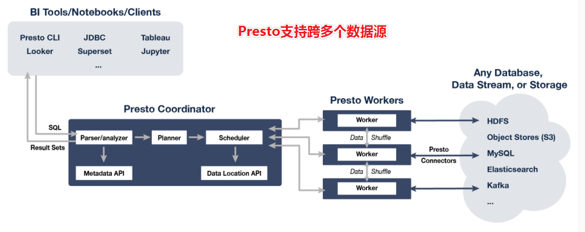

- 优缺点

  ```shell
  #优点
  1）Presto与Hive对比，都能够处理PB级别的海量数据分析，但Presto是基于内存运算，减少没必要的硬盘IO，所以更快。
  
  2）能够连接多个数据源，跨数据源连表查，如从Hive查询大量网站访问记录，然后从Mysql中匹配出设备信息。
  
  3）部署也比Hive简单，因为Hive是基于HDFS的，需要先部署HDFS。
  
  #缺点
  1）虽然能够处理PB级别的海量数据分析，但不是代表Presto把PB级别都放在内存中计算的。而是根据场景，如count，avg等聚合运算，是边读数据边计算，再清内存，再读数据再计算，这种耗的内存并不高。但是连表查，就可能产生大量的临时数据，因此速度会变慢，反而Hive此时会更擅长。
  
  2）为了达到实时查询，可能会想到用它直连MySql来操作查询，这效率并不会提升，瓶颈依然在MySql，此时还引入网络瓶颈，所以会比原本直接操作数据库要慢。
  ```

  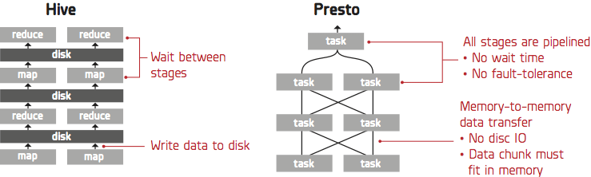

### 2. 架构, 名词术语含义

- 架构图

  > Presto是一个运行在多台服务器上的分布式系统。 完整安装包括==一个coordinator和多个worker==。 
  > 由客户端提交查询，从Presto命令行CLI提交到coordinator; coordinator进行解析，分析并执行查询计划，然后分发处理队列到worker。

  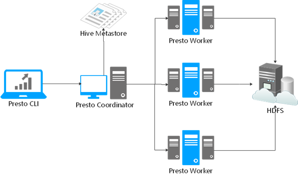

  ```properties
  Presto查询引擎是一个M-S的架构，由一个coordinator节点，一个Discovery Server节点，多个Worker节点组成,注意Discovery Server通常内嵌在Coordinator节点中。
  
  主角色:Coordinator负责SQL的解析，生成执行计划，分发给Worker节点进行执行;
  从角色:Worker节点负责实时查询执行任务。Worker节点启动后向discovery Server服务注册，Coordinator 从discovery server获取可以工作的Worker节点。
  
  如果配置了hive connector，需要配置hive MetaSote服务为Presto提供元信息，worker节点和HDFS进行交互数据。
  ```

  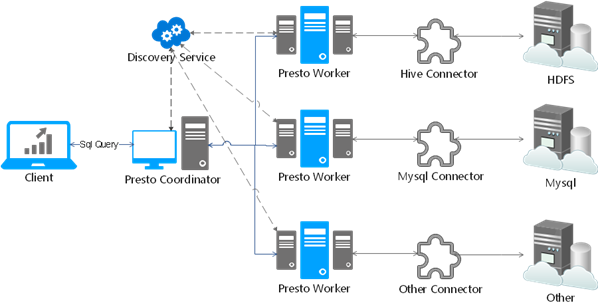

- ==Connector== 连接器

  ```properties
  1、Presto通过Connector连接器来连接访问不同数据源，例如Hive或mysql。连接器功能类似于数据库的驱动程序。允许Presto使用标准API与资源进行交互。
  
  2、Presto包含几个内置连接器：JMX连接器，可访问内置系统表的System连接器，Hive连接器和旨在提供TPC-H基准数据的TPCH连接器。许多第三方开发人员都贡献了连接器，因此Presto可以访问各种数据源中的数据，比如：ES、Kafka、MongoDB、Redis、Postgre、Druid、Cassandra等。
  ```

- ==Catalog== 连接目录

  ```properties
  1、Presto Catalog是数据源schema的上一级，并通过连接器访问数据源。
  
  2、例如，可以配置Hive Catalog以通过Hive Connector连接器提供对Hive信息的访问。
  
  3、在Presto中使用表时，标准表名始终是被支持的。
  例如，hive.test_data.test的标准表名将引用hive catalog中test_data schema中的test table。
  Catalog需要在Presto的配置文件中进行配置。
  
  ```

- ==schema==

  ```properties
  Schema是组织表的一种方式。Catalog和Schema共同定义了一组可以查询的表。
  
  当使用Presto访问Hive或关系数据库（例如MySQL）时，Schema会转换为目标数据库中的对应Schema。
  
  =schema通俗理解就是我们所讲的database.
  =想一下在hive中，下面这两个sql是否相等。
  show databases;
  shwo schemas;
  ```

- ==table==

### 3. 集群安装, 启停

#### 3.1. 集群安装

- step1：集群规划

  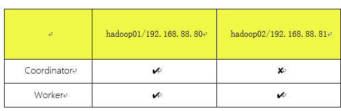

- step2：项目集群环境安装JDK

  ```shell
  #可以手动安装oracle JDK
  
  #也可以使用yum在线安装 openjDK
  yum install java-1.8.0-openjdk* -y
  
  #安装完成后，查看jdk版本：
  java -version
  ```

- step3：上传Presto安装包（==hadoop01==）

  ```shell
  #创建安装目录
  mkdir -p /export/server
  
  #yum安装上传文件插件lrzsz
  yum install -y lrzsz
  
  #上传安装包到hadoop01的/export/server目录
  presto-server-0.245.1.tar.gz
  
  #解压、重命名
  tar -xzvf presto-server-0.245.1.tar.gz
  mv presto-server-0.245.1 presto
  
  #创建配置文件存储目录
  mkdir -p /export/server/presto/etc
  ```

- step4：添加配置文件（==hadoop01==）

  - etc/config.properties

    ```properties
    cd /export/server/presto
    
    vim etc/config.properties
    
    #---------添加如下内容---------------
    coordinator=true
    node-scheduler.include-coordinator=true
    http-server.http.port=8090
    query.max-memory=6GB
    query.max-memory-per-node=2GB
    query.max-total-memory-per-node=2GB
    discovery-server.enabled=true
    discovery.uri=http://192.168.88.80:8090
    #---------end-------------------
    
    #参数说明
    coordinator:是否为coordinator节点，注意worker节点需要写false
    node-scheduler.include-coordinator:coordinator在调度时是否也作为worker
    discovery-server.enabled:Discovery服务开启功能。presto通过该服务来找到集群中所有的节点。每一个Presto实例都会在启动的时候将自己注册到discovery服务；  注意：worker节点不需要配 
    discovery.uri:Discovery server的URI。由于启用了Presto coordinator内嵌的Discovery服务，因此这个uri就是Presto coordinator的uri。
    ```

  - etc/jvm.config

    ```shell
    vim etc/jvm.config
    
    -server
    -Xmx3G
    -XX:+UseG1GC
    -XX:G1HeapRegionSize=32M
    -XX:+UseGCOverheadLimit
    -XX:+ExplicitGCInvokesConcurrent
    -XX:+HeapDumpOnOutOfMemoryError
    -XX:+ExitOnOutOfMemoryError
    ```

  - etc/node.properties

    ```properties
    mkdir -p /export/data/presto
    vim etc/node.properties
    
    node.environment=cdhpresto
    node.id=presto-cdh01
    node.data-dir=/export/data/presto
    ```

  - etc/catalog/hive.properties

    ```properties
    mkdir -p etc/catalog
    vim etc/catalog/hive.properties
    
    connector.name=hive-hadoop2
    hive.metastore.uri=thrift://192.168.88.80:9083
    hive.max-partitions-per-writers=300
    ```

- step4：scp安装包到其他机器

  ```shell
  #在hadoop02创建文件夹
  mkdir -p /export/server
  
  #在hadoop01远程cp安装包
  cd /export/server
  scp -r presto hadoop02:$PWD
  
  #ssh的时候如果没有配置免密登录 需要输入密码scp  密码：123456
  ```

- step5：hadoop02配置修改

  - etc/config.properties

    ```properties
    cd /export/server/presto
    vim etc/config.properties
    
    #----删除之前文件中的全部内容 替换为以下的内容   vim编辑器删除命令 8dd
    coordinator=false
    http-server.http.port=8090
    query.max-memory=6GB
    query.max-memory-per-node=2GB
    query.max-total-memory-per-node=2GB
    discovery.uri=http://192.168.88.80:8090
    ```

  - etc/jvm.config

    > 和hadoop01一样，不变，唯一注意的就是如果机器内存小，需要调整-Xmx参数

    ```properties
    vim etc/jvm.config
    
    -server
    -Xmx3G
    -XX:+UseG1GC
    -XX:G1HeapRegionSize=32M
    -XX:+UseGCOverheadLimit
    -XX:+ExplicitGCInvokesConcurrent
    -XX:+HeapDumpOnOutOfMemoryError
    -XX:+ExitOnOutOfMemoryError
    ```

  - etc/node.properties

    > 修改编号node.id

    ```properties
    mkdir -p /export/data/presto
    vim etc/node.properties
    
    node.environment=cdhpresto
    node.id=presto-cdh02
    node.data-dir=/export/data/presto
    ```

  - etc/catalog/hive.properties

    > 保持不变

    ```properties
    vim etc/catalog/hive.properties
    
    connector.name=hive-hadoop2
    hive.metastore.uri=thrift://192.168.88.80:9083
    hive.max-partitions-per-writers=300
    ```

#### 3.2. 集群启停

> 注意，每台机器都需要启动

- 前台启动

  ```shell
  [root@hadoop01 ~]# cd ~
  [root@hadoop01 ~]# /export/server/presto/bin/launcher run
  
  
  [root@hadoop02 ~]# cd ~
  [root@hadoop02 ~]# /export/server/presto/bin/launcher run
  
  
  #如果出现下面的提示 表示启动成功
  2021-09-15T18:24:21.780+0800    INFO    main    com.facebook.presto.server.PrestoServer ======== SERVER STARTED ========
  
  #前台启动使用ctrl+c进行服务关闭
  ```

- 后台启动

  ```shell
  [root@hadoop01 ~]# cd ~
  [root@hadoop01 ~]# /export/server/presto/bin/launcher start
  Started as 89560
  
  [root@hadoop02 ~]# cd ~
  [root@hadoop02 ~]# /export/server/presto/bin/launcher start
  Started as 92288
  
  
  #查看进程是否启动成功
  PrestoServer
  
  #后台启动使用jps 配合kill -9命令 关闭进程
  ```

- web UI页面

  http://192.168.88.80:8090/ui/

  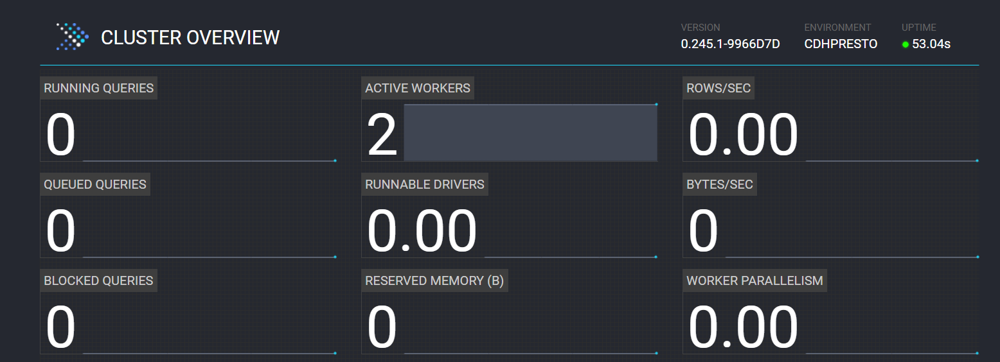

- 启动日志

  ```shell
  #日志路径：/export/data/presto/var/log/
  
  http-request.log
  launcher.log
  server.log
  ```

### 4. 客户端的使用(命令行, DataGrip集成)

#### 4.1. 命令行

- 下载CLI客户端

  ```shell
  presto-cli-0.241-executable.jar
  ```

- 上传客户端到Presto安装包

  ```shell
  #上传presto-cli-0.245.1-executable.jar到/export/server/presto/bin
  
  mv presto-cli-0.245.1-executable.jar presto
  chmod +x presto
  ```

- CLI客户端启动

  ```shell
  /export/server/presto/bin/presto --server localhost:8090 --catalog hive --schema default
  ```

#### 4.2. DataGrip连接使用

> - JDBC 驱动：==presto-jdbc-0.245.1.jar==
> - JDBC 地址：==jdbc:presto://192.168.88.80:8090/hive==

- step1：配置驱动

  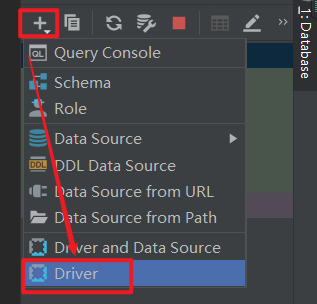

  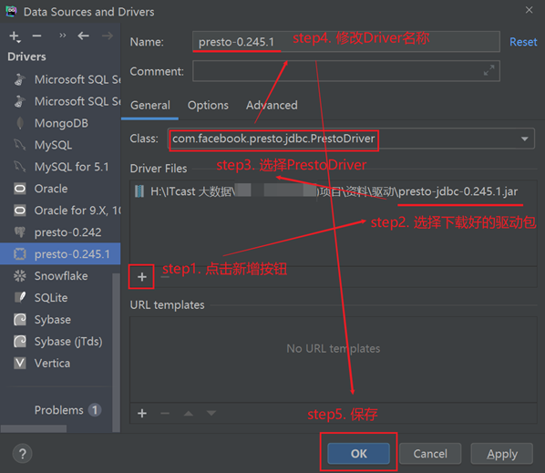

- step2：创建连接

  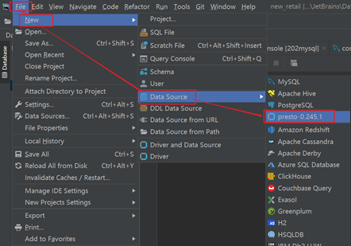

  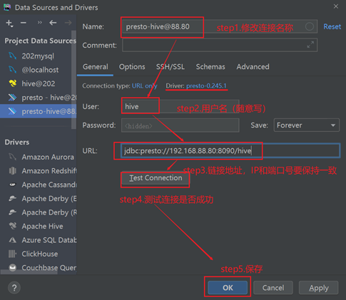

  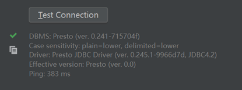

- step3：测试体验

  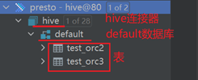

  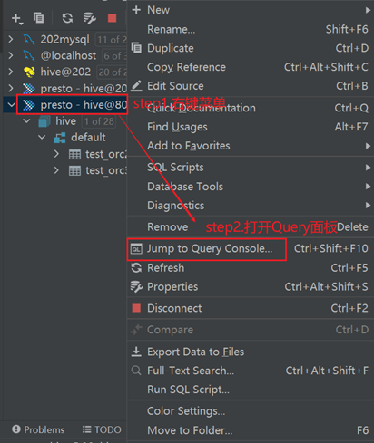

  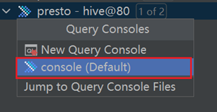

  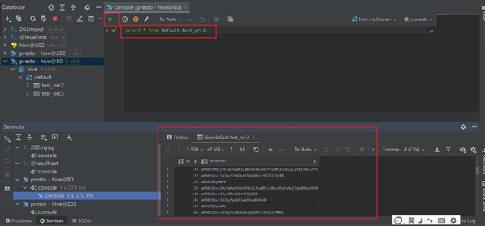

### 5. Presto时间日期类型使用注意事项

- ==date_format==(timestamp, format)  ==> varchar 

  - 作用: 将指定的日期对象转换为字符串操作

- ==date_parse==(string, format) → timestamp 

  - 作用: 用于将字符串的日期数据转换为日期对象

  ```sql
  select date_format( timestamp '2020-10-10 12:50:50' , '%Y/%m/%d %H:%i:%s');
  select date_format( date_parse('2020:10:10 12-50-50','%Y:%m:%d %H-%i-%s') ,'%Y/%m/%d %H:%i:%s');
  
  ----
  注意: 参数一必须是日期对象
  	所以如果传递的是字符串, 必须将先转换为日期对象:  
  		方式一:  标识为日期对象, 但是格式必须为标准日期格式
  			timestamp '2020-10-10 12:50:50'
  			date '2020-10-10'
  		方式二: 如果不标准，先用date_parse解析成为标准
  			date_parse('2020-10-10 12:50:50','%Y-%m-%d %H:%i:%s')  
  
  扩展说明: 日期format格式说明
  	年：%Y
  	月：%m
  	日：%d
  	时：%H
  	分：%i
  	秒：%s
  	周几：%w(0..6)	
  ```

- ==date_add==(unit, value, timestamp) → [same as input]

  - 作用: 用于对日期数据进行 加 减 操作

- ==date_diff==(unit, timestamp1, timestamp2) → bigint

  - 作用: 用于比对两个日期之间差值

  ```sql
  select  date_add('hour',3,timestamp '2021-09-02 15:59:50');
  select  date_add('day',-1,timestamp '2021-09-02 15:59:50');
  select  date_add('month',-1,timestamp '2021-09-02 15:59:50');
  
  
  select date_diff('year',timestamp '2020-09-02 06:30:30',timestamp '2021-09-02 15:59:50')
  select date_diff('month',timestamp '2021-06-02 06:30:30',timestamp '2021-09-02 15:59:50')
  select date_diff('day',timestamp '2021-08-02 06:30:30',timestamp '2021-09-02 15:59:50')
  ```

### 6. Presto优化

#### 6.1. 常规优化

- 数据存储优化

  ```sql
  --1）合理设置分区
  	与Hive类似，Presto会根据元信息读取分区数据，合理的分区能减少Presto数据读取量，提升查询性能。
  
  --2）使用列式存储
  	Presto对ORC文件读取做了特定优化，因此在Hive中创建Presto使用的表时，建议采用ORC格式存储。相对于Parquet，Presto对ORC支持更好。
  	Parquet和ORC一样都支持列式存储，但是Presto对ORC支持更好，而Impala对Parquet支持更好。在数仓设计时，要根据后续可能的查询引擎合理设置数据存储格式。
  
  --3）使用压缩
  	数据压缩可以减少节点间数据传输对IO带宽压力，对于即席查询需要快速解压，建议采用Snappy压缩。
  
  --4）预先排序
  	对于已经排序的数据，在查询的数据过滤阶段，ORC格式支持跳过读取不必要的数据。比如对于经常需要过滤的字段可以预先排序。
  
  INSERT INTO table nation_orc partition(p) SELECT * FROM nation SORT BY n_name;
  如果需要过滤n_name字段，则性能将提升。
  
  SELECT count(*) FROM nation_orc WHERE n_name=’AUSTRALIA’; 
  
  ```

- SQL优化

  - 列裁剪
  - 分区裁剪
  - group by优化
    - 按照数据量大小降序排列
  - order by使用limit
  - 用regexp_like代替多个like语句
  - join时候大表放置在左边

- 替换非ORC格式的Hive表

#### 6.2. 内存调优

- 内存管理机制--内存分类

  > Presto管理的内存分为两大类：==user memory==和==system memory==

  - user memory用户内存

    ```
    跟用户数据相关的，比如读取用户输入数据会占据相应的内存，这种内存的占用量跟用户底层数据量大小是强相关的
    ```

  - system memory系统内存

    ```
    执行过程中衍生出的副产品，比如tablescan表扫描，write buffers写入缓冲区，跟查询输入的数据本身不强相关的内存。
    ```

- 内存管理机制--内存池

  > ==内存池中来实现分配user memory和system memory==。
  >
  > 内存池为常规内存池GENERAL_POOL、预留内存池RESERVED_POOL。

  

  ```properties
  1、GENERAL_POOL:在一般情况下，一个查询执行所需要的user/system内存都是从general pool中分配的，reserved pool在一般情况下是空闲不用的。
  
  2、RESERVED_POOL:大部分时间里是不参与计算的，但是当集群中某个Worker节点的general pool消耗殆尽之后，coordinator会选择集群中内存占用最多的查询，把这个查询分配到reserved pool，这样这个大查询自己可以继续执行，而腾出来的内存也使得其它的查询可以继续执行，从而避免整个系统阻塞。
  
  注意:
  reserved pool到底多大呢？这个是没有直接的配置可以设置的，他的大小上限就是集群允许的最大的查询的大小(query.total-max-memory-per-node)。
  reserved pool也有缺点，一个是在普通模式下这块内存会被浪费掉了，二是大查询可以用Hive来替代。因此也可以禁用掉reserved pool（experimental.reserved-pool-enabled设置为false），那系统内存耗尽的时候没有reserved pool怎么办呢？它有一个OOM Killer的机制，对于超出内存限制的大查询SQL将会被系统Kill掉，从而避免影响整个presto。
  
  ```

- 内存相关参数

  

  ```properties
  1、user memory用户内存参数
  query.max-memory-per-node:单个query操作在单个worker上user memory能用的最大值
  query.max-memory:单个query在整个集群中允许占用的最大user memory
  
  2、user+system总内存参数
  query.max-total-memory-per-node:单个query操作可在单个worker上使用的最大(user + system)内存
  query.max-total-memory:单个query在整个集群中允许占用的最大(user + system) memory
  
  当这些阈值被突破的时候，query会以insufficient memory（内存不足）的错误被终结。
  
  3、协助阻止机制
  在高内存压力下保持系统稳定。当general pool常规内存池已满时，操作会被置为blocked阻塞状态，直到通用池中的内存可用为止。此机制可防止激进的查询填满JVM堆并引起可靠性问题。
  
  4、其他参数
  memory.heap-headroom-per-node:这个内存是JVM堆中预留给第三方库的内存分配，presto无法跟踪统计，默认值是-Xmx * 0.3                                                                                                                                                                                                                                                                                                                                                                                                        
  
  5、结论
  GeneralPool = 服务器总内存 - ReservedPool - memory.heap-headroom-per-node - Linux系统内存
  
  常规内存池内存大小=服务器物理总内存-服务器linux操作系统内存-预留内存池大小-预留给第三方库内存
  ```

- 内存优化建议

  - 常见的报错解决

    > total memory= user memory +system

    ```properties
    1、Query exceeded per-node total memory limit of xx
    适当增加query.max-total-memory-per-node。
    
    2、Query exceeded distributed user memory limit of xx
    适当增加query.max-memory。
    
    3、Could not communicate with the remote task. The node may have crashed or be under too much load
    内存不够，导致节点crash，可以查看/var/log/message。
    ```

  - 建议参数设置

    ```properties
    1、query.max-memory-per-node和query.max-total-memory-per-node是query操作使用的主要内存配置，因此这两个配置可以适当加大。
    memory.heap-headroom-per-node是三方库的内存，默认值是JVM-Xmx * 0.3，可以手动改小一些。
    
    1) 各节点JVM内存推荐大小: 当前节点剩余内存*80%
    
    2) 对于heap-headroom-pre-node第三方库的内存配置: 建议jvm内存的%15左右
    
    3) 在配置的时候, 不要正正好好, 建议预留一点点, 以免出现问题
    
    数据量在35TB , presto节点数量大约在30台左右 (128GB内存 + 8核CPU)   
    
    注意：
    1、query.max-memory-per-node小于query.max-total-memory-per-node。
    2、query.max-memory小于query.max-total-memory。
    3、query.max-total-memory-per-node 与memory.heap-headroom-per-node 之和必须小于 jvm max memory，也就是jvm.config 中配置的-Xmx。
    ```

### Hive Map join优化

- Map Side Join 

  ```shell
  set hive.auto.convert.join=true;
  
  #如果参与连接的N个表(或分区)中的N-1个的总大小小于512MB，则直接将join转为Map端join,默认值为20MB
  set hive.auto.convert.join.noconditionaltask.size=512000000;
  ```

- ==Bucket-Map== Join

  ```shell
  1）	set hive.optimize.bucketmapjoin = true;
  
  2） 一个表的bucket数是另一个表bucket数的整数倍
  
  3） bucket分桶字段 == join的字段
  ```

- Sort Merge Bucket Join（SMB Join）

  > SMB是针对Bucket Map Join的一种优化。条件类似却有些不一样。

  ```shell
  1）
  	set hive.optimize.bucketmapjoin = true;
  	set hive.auto.convert.sortmerge.join=true;
  	set hive.optimize.bucketmapjoin.sortedmerge = true;
  	set hive.auto.convert.sortmerge.join.noconditionaltask=true;
  	
  2）	
  	Bucket 列 == Join 列 == sort 列
  	
  	#hive并不检查两个join的表是否已经做好bucket且sorted，需要用户自己去保证join的表数据sorted， 否则可能数据不正确。
  	
  3）
  	bucket数相等
  	
  
  #注意：
  	a、可以设置参数hive.enforce.sorting 为true，开启强制排序。插数据到表中会进行强制排序。
  	b、表创建时必须是CLUSTERED BY+SORTED BY
  ```