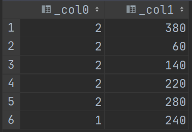
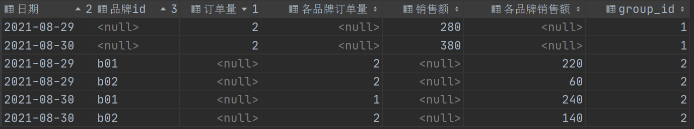
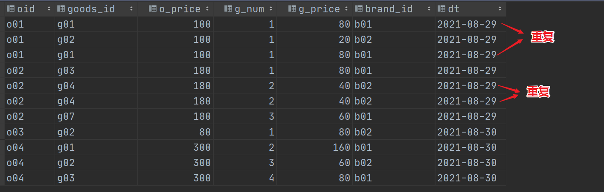
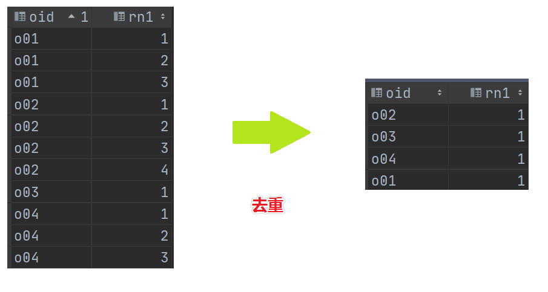
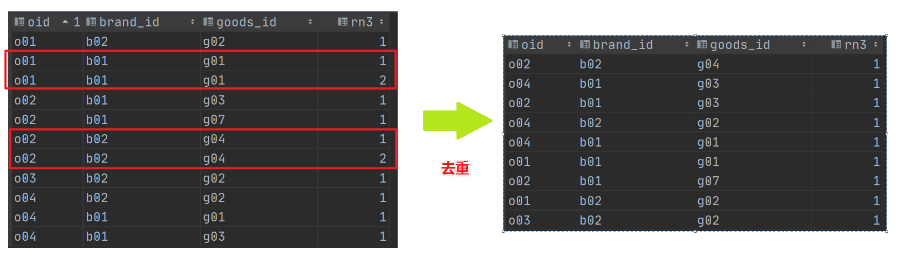
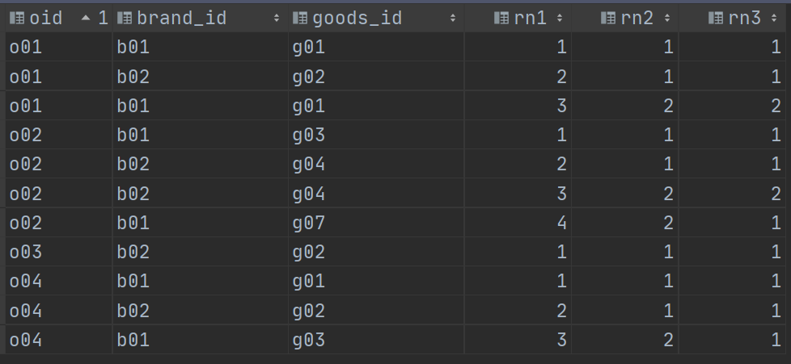

# DWS层建设实战I

## I. 聚合函数增强

### 1. grouping sets

- 背景

  - 数据环境准备

    ```sql
    --在hive中建表操作
    use test;
    
    create table test.t_cookie(
        month string, 
        day string, 
        cookieid string) 
    row format delimited fields terminated by ',';
    
    
    --数据样例
    2015-03,2015-03-10,cookie1
    2015-03,2015-03-10,cookie5
    2015-03,2015-03-12,cookie7
    2015-04,2015-04-12,cookie3
    2015-04,2015-04-13,cookie2
    2015-04,2015-04-13,cookie4
    2015-04,2015-04-16,cookie4
    2015-03,2015-03-10,cookie2
    2015-03,2015-03-10,cookie3
    2015-04,2015-04-12,cookie5
    2015-04,2015-04-13,cookie6
    2015-04,2015-04-15,cookie3
    2015-04,2015-04-15,cookie2
    2015-04,2015-04-16,cookie1
    ```

  - 需求

    > 分别按照==月==（month）、==天==（day）、==月和天==（month,day）统计**来访用户cookieid个数**，并获取三者的结果集（一起插入到目标宽表中）。
    >
    > 目标表：month   day   cnt_nums

    ```sql
    --3个分组统计而已，简单。统计完再使用union all合并结果集。
    --注意union all合并结果集需要各个查询返回字段个数、类型一致，因此需要合理的使用null来填充返回结果。
    select month,
           null,
           count(cookieid)
    from test.t_cookie
    group by month
    
    union all
    
    select null,
           day,
           count(cookieid)
    from test.t_cookie
    group by day
    
    union all
    
    select month,
           day,
           count(cookieid)
    from test.t_cookie
    group by month,day;
    ```

  - 执行结果如下

    > 思考一下，这样有什么不妥的地方吗？
    >
    > 首先感受就是==执行时间很长，很长==；
    >
    > 另外从sql层面分析，会对test.t_cookie==查询扫描3次==，因为是3个查询的结果集合并。
    >
    > 假如这是10个维度的所有组合计算同一个指标呢？？
    >
    > 2^10  * 1    条select查询 union all？？？？？

    

- grouping sets功能

  > ==根据不同的维度组合进行聚合==，等价于将不同维度的GROUP BY结果集进行UNION ALL。

  ```sql
  select 
      month,day,count(cookieid) 
  from test.t_cookie 
      group by month,day 
  grouping sets (month,day,(month,day));
  ```

  

  > 1、使用grouping sets，==执行结果==与使用多个分组查询union合并结果集==一样==；
  >
  > 2、grouping sets==查询速度吊打==分组查询结果union all。大家可以使用explain执行计划查看两条sql的执行逻辑差异。
  >
  > 3、使用grouping sets只==会对表进行一次扫描==。

- hive中grouping sets语法

  > https://cwiki.apache.org/confluence/display/Hive/Enhanced+Aggregation%2C+Cube%2C+Grouping+and+Rollup#EnhancedAggregation,Cube,GroupingandRollup-GROUPINGSETSclause

  

  > 特别注意：==**Presto的grouping sets语法和hive略有差异**==。

  ```sql
  ---下面这个是Hive SQL语法支持
  select 
      month,day,count(cookieid) 
  from test.t_cookie 
      group by month,day 
  grouping sets (month,day,(month,day));
  
  ----下面这个是Presto SQL语法支持
  select 
      month,day,count(cookieid) 
  from test.t_cookie 
      group by
  grouping sets (month,day,(month,day));
  
  --区别就是在presto的语法中，group by后面不要再加上字段了。
  ```

### 2. cube, roll up

- ==**cube**==

  - cube翻译过来叫做立方体，data cubes就是数据立方体。

  - cube的功能：==实现多个任意维度的查询==。也可以理解为所有维度组合。

    > 公式：假如说有==**N个维度，那么所有维度的组合的个数：2^N**==
    >
    > 下面这个图，就显示了4个维度所有组合构成的数据立方体。

    

  - 语法

    ```sql
    select month,day,count(cookieid)
    from test.t_cookie
    group by
    cube (month, day);
    
    --上述sql等价于
    select month,day,count(cookieid)
    from test.t_cookie
    group by
    grouping sets ((month,day), month, day, ());
    ```

    

- ==**rollup**==

  - 语法功能：实现==从右到左递减==多级的统计,显示统计某一层次结构的聚合。

    > 即：rollup((a),(b),(c))等价于grouping sets((a,b,c),(a,b),(a),())。

  ```sql
  select month,day,count(cookieid)
  from test.t_cookie
  group by
  rollup (month,day);
  
  --等价于
  select month,day,count(cookieid)
  from test.t_cookie
  group by
  grouping sets ((month,day), (month), ());
  ```

  

### 3. grouping

- 功能：使用grouping操作来==判断==当前数据==是按照哪个字段来分组的==。

  > 对于给定的分组，如果分组中==包含相应的列，则将位设置为0==，否则将其设置为1。

- 例子

  ```sql
  --为了计算高效 切换至Presto引擎中进行计算
  
  select month,
         day,
         count(cookieid),
         grouping(month)      as m,
         grouping(day)        as d,
         grouping(month, day) as m_d
  from test.t_cookie
  group by
     grouping sets (month, day, (month, day));
  ```

  

- 解释说明

  ```properties
  grouping(month)列为0时，可以看到month列都是有值的，为1时则相反，证明当前行是按照month来进行分组统计的；
  
  grouping(day)同理，为0时day列有值，为1时day为空，证明当前行时按照day来进行分组统计的；
  
  grouping(month, day)是grouping(month)、grouping(day)二进制数值组合后转换得到的数字：
  a. 按照month分组，则month=0，day=1，组合后为01，二进制转换为十进制得到数字1；
  b. 按照day分组，则month=1，day=0，组合后为10，二进制转换为十进制得到数字2；
  c. 同时按照month和day分组，则month=0，day=0，组合后为00，二进制转换为十进制得到数字0。
  
  因此可以使用grouping操作来判断当前数据是按照哪个字段来分组的。
  ```

## II. DWS层搭建

### 1. 目标与需求

- 新零售数仓分层图

  

- DWS

  - 名称：==数据服务层==  service
  - 功能：==按主题划分==，形成日统计的宽表，轻度汇总==提前聚合操作==。
  - 解释：轻度提前聚合说的是先聚合出日的指标，后续可以上卷出周、月、年的指标。

  > dws这里，主题终于出现了~~~ 
  >
  > 一个主题所需要的指标、维度，可能往往需要多个DWB层的宽表共同参与计算才能得出。甚至还需要之前层如dwd等参与计算。

  ```
  轻度、重度 ：描述干活的多少  如果都做 叫做重度  只做某一部分叫做轻度
  细粒度、粗粒度：越往下粒度越细
  	举个栗子：1、计算每年的销售额  2、计算每天的销售额
  	上面这个两个都是根据时间维度计算的 哪个粒度细？ 天的粒度细  年粒度粗
  
  时间维度：年 月 日 时 分 秒
  ```

- 使用DataGrip在Hive中创建dws层

  > 注意，==**对于建库建表操作，需直接使用Hive**==，因为Presto只是一个数据分析的引擎，其语法不一定支持直接在Hive中建库建表。

  ```sql
  create database if not exists yp_dws;
  ```

  

### 2. 销售主题统计宽表 -- 需求与建表

- 主题需求

  - 指标

    ```properties
    销售收入、平台收入、配送成交额、小程序成交额、安卓APP成交额、苹果APP成交额、PC商城成交额、订单量、参评单量、差评单量、配送单量、退款单量、小程序订单量、安卓APP订单量、苹果APP订单量、PC商城订单量
    
    --共计: 16个指标
    ```

  - 维度

    ```properties
    日期、城市、商圈、店铺、品牌、商品大类、商品中类、商品小类
    
    --共计:  8个维度
    --cube所有组合:  2^8=256个
    
    注意，其中日期这个维度很特殊，特殊在我们的表就是根据日期分区的，分区的字段是day天。
    而dws这一层我们需要统计的也是按day统计，日统计宽表嘛
    这也就意味着一个分区就是一天。
    ```

  - 本主题需要维度组合

    > 提示：256个组合都计算还是计算当中的一部分，主动权在于业务、需求，我们做的是技术实现。

    ```properties
    日期
    日期+城市
    日期+城市+商圈
    日期+城市+商圈+店铺
    日期+品牌
    日期+大类
    日期+大类+中类
    日期+大类+中类+小类
    
    #各个维度之间的关系是什么样的？是并列关系还是递进关系？   维度最终落实sql层面就是分组字段。
    #判断上述8个维度组合中，哪个维度是真正起作用的维度？
    #技巧：如何判断是否起作用？在sql中的分组字段 把它去掉 会不会影响分组结果，如果没有影响  不起作用
    
    日期+城市  	     并列关系    城市有没有影响结果吗？  影响大
    日期+城市+商圈    递进关系    城市有没有影响结果吗？  没有影响 真正起决定作用的是 商圈
    
    
    #对应本项目来说 真正起决定作用的维度是
    	
    日期				   日期
    日期+城市  			 日期+城市
    日期+城市+商圈        日期+商圈     
    日期+城市+商圈+店铺    日期+店铺 
    日期+品牌            日期+品牌    
    日期+大类            日期+大类
    日期+大类+中类        日期+中类
    日期+大类+中类+小类    日期+小类
    ```

  - 总计需要计算的指标

    > ==**16*8=128**==
    >
    > 1、如果不加任何限制，只是求出每个指标，那么很简单，128个sql语句进行分组聚合操作。
    >
    > 2、实际中肯定不能那么做，需要==一条sql完成128个指标的计算，并且把结果插入主题统计宽表==中。

- Hive中建表

  > 既然是把一个主题相关的数据统计数据都存储在一张表中，那么意味着这张统计宽表应该要清晰的记录出维度、指标，有的计算，没有的null补上。

  ```sql
  CREATE TABLE yp_dws.dws_sale_daycount(
    --维度  
     city_id string COMMENT '城市id',
     city_name string COMMENT '城市name',
     trade_area_id string COMMENT '商圈id',
     trade_area_name string COMMENT '商圈名称',
     store_id string COMMENT '店铺的id',
     store_name string COMMENT '店铺名称',
     brand_id string COMMENT '品牌id',
     brand_name string COMMENT '品牌名称',
     max_class_id string COMMENT '商品大类id',
     max_class_name string COMMENT '大类名称',
     mid_class_id string COMMENT '中类id',
     mid_class_name string COMMENT '中类名称',
     min_class_id string COMMENT '小类id',
     min_class_name string COMMENT '小类名称',
     group_type string COMMENT '分组类型：store，trade_area，city，brand，min_class，mid_class，max_class，all',
     --   =======日统计=======
     --   销售收入
     sale_amt DECIMAL(38,2) COMMENT '销售收入',
     --   平台收入
     plat_amt DECIMAL(38,2) COMMENT '平台收入',
     -- 配送成交额
     deliver_sale_amt DECIMAL(38,2) COMMENT '配送成交额',
     -- 小程序成交额
     mini_app_sale_amt DECIMAL(38,2) COMMENT '小程序成交额',
     -- 安卓APP成交额
     android_sale_amt DECIMAL(38,2) COMMENT '安卓APP成交额',
     --  苹果APP成交额
     ios_sale_amt DECIMAL(38,2) COMMENT '苹果APP成交额',
     -- PC商城成交额
     pcweb_sale_amt DECIMAL(38,2) COMMENT 'PC商城成交额',
     -- 成交单量
     order_cnt BIGINT COMMENT '成交单量',
     -- 参评单量
     eva_order_cnt BIGINT COMMENT '参评单量comment=>cmt',
     -- 差评单量
     bad_eva_order_cnt BIGINT COMMENT '差评单量negtive-comment=>ncmt',
     -- 配送成交单量
     deliver_order_cnt BIGINT COMMENT '配送单量',
     -- 退款单量
     refund_order_cnt BIGINT COMMENT '退款单量',
     -- 小程序成交单量
     miniapp_order_cnt BIGINT COMMENT '小程序成交单量',
     -- 安卓APP订单量
     android_order_cnt BIGINT COMMENT '安卓APP订单量',
     -- 苹果APP订单量
     ios_order_cnt BIGINT COMMENT '苹果APP订单量',
     -- PC商城成交单量
     pcweb_order_cnt BIGINT COMMENT 'PC商城成交单量'
  )
  COMMENT '销售主题日统计宽表'
  PARTITIONED BY(dt STRING)
  ROW format delimited fields terminated BY '\t'
  stored AS orc tblproperties ('orc.compress' = 'SNAPPY');
  ```

### 3. 销售主题统计宽表 -- 简易模型分析

#### 3.1. 分组聚合union

> 为了更好的实现一条sql计算出所有的指标，这里我们先对数据模型进行简化操作。
>
> 这个模型理解了，销售主题宽表的计算就可以实现了。

- 需求

  - 订单宽表t_order_detail

    ```sql
    --建表（在hive中创建）
    create table test.t_order_detail(
        oid string comment '订单ID',
        goods_id string comment '商品ID',
        o_price int comment '订单总金额',
        g_num int comment '商品数量',
        g_price int comment '商品单价',
        brand_id string comment '品牌ID',
        dt string comment '日期'
    ) comment '订单详情宽表_简易模型'
    row format delimited fields terminated by ',';
    
    --加载数据
    o01,g01,100,1,80,b01,2021-08-29
    o01,g02,100,1,20,b02,2021-08-29
    o02,g03,180,1,80,b01,2021-08-29
    o02,g04,180,2,40,b02,2021-08-29
    o02,g07,180,3,60,b01,2021-08-29
    o03,g02,80,1,80,b02,2021-08-30
    o04,g01,300,2,160,b01,2021-08-30
    o04,g02,300,3,60,b02,2021-08-30
    o04,g03,300,4,80,b01,2021-08-30
    ```

    

  - 需求

    - 指标：订单量、销售额
    - 维度：日期、日期+品牌

  - 计算出结果

    

- 实现思路（在presto中计算）

  > 立马想到：多条sql分组聚合+union合并结果集，没有的字段使用null进行填补。

  - step1:统计每天的订单量、销售额

    ```sql
    select
      dt,
      count(distinct oid) as "订单量",
      sum(g_price) as "销售额"
    from test.t_order_detail
    group by dt;
    ```

    

  - step2:统计每天每个品牌的订单量、销售额

    ```sql
    select
      dt,
      brand_id,
      count(distinct oid) as "各品牌订单量",
      sum(g_price) as "各品牌销售额"
    from test.t_order_detail
    group by dt,brand_id;
    ```

    

  - step3:union all合并两个查询结果集

    ```sql
    select
      dt as "日期",
      null as "品牌id",
      count(distinct oid) as "订单量",
      null as "各品牌订单量",
      sum(g_price) as "销售额",
      null as "各品牌销售额",
      1 as group_id
    from test.t_order_detail
    group by dt
    union all
    select
      dt as "日期",
      brand_id as "品牌id",
      null as "订单量",
      count(distinct oid) as "各品牌订单量",
      null as "销售额",
      sum(g_price) as "各品牌销售额",
      2 as group_id
    from test.t_order_detail
    group by dt,brand_id;
    ```

    > 思考：这么做有什么不妥的地方？

#### 3.2. 增强聚合grouping sets

- > 思路：采用grouping sets增强聚合计算，并且使用==grouping函数判断分组中是否包含字段==。
  >
  > **==0表示有，1表示没有==**。

  - sql实现

    ```sql
    select
    count(distinct oid),
    sum(g_price)
    from test.t_order_detail
    group by grouping sets(dt,(dt,brand_id));
    
    --直接这样写，结果如下显示，不友好，无法区分是哪一个分组聚合的结果
    ```

    

  - sql最终实现

    > 可以考虑使用grouping函数判断分组中是否包含指定的字段，并且配合case when进行转换。
    >
    > 注意：==**grouping函数有为0，没有是1**==。

    ```sql
    select
        dt as "日期",
        case when grouping(brand_id) =0
            then brand_id
        else null end as "品牌id",  --第二列，如果分组中有品牌id,就显示，没有就null
        count(distinct oid) as "订单量",
        sum(g_price)
    from test.t_order_detail
    group by grouping sets(dt,(dt,brand_id));
    
    --执行上面sql，看看效果。
    --下面是最终完整版
    select
        dt as "日期",
        case when grouping(brand_id) =0  --判断是否包含brand_id
            then brand_id
            else null end as "品牌id",
        case when grouping(dt,brand_id) =1 --只包含日期 就是订单量
            then count(distinct oid)
            else null end as "订单量",
        case when grouping(brand_id) =0 --包含品牌 就是各品牌订单量
            then count(distinct oid)
            else null end as "各品牌订单量",
        case when grouping(brand_id) =1 --没有品牌，就是销售额
            then sum(g_price)
            else null end as "销售额",
        case when grouping(brand_id) =0 --包含品牌，就是各个品牌销售额
            then sum(g_price)
            else null end as "各品牌销售额",
        case when grouping(brand_id) = 1 --没有品牌 就是分组1 否则就是2
            then 1
            else 2 end as group_id
    from test.t_order_detail
    group by grouping sets(dt,(dt,brand_id));
    ```

    

### 4. 销售主题统计宽表 -- 复杂模型分析(去重)

- 项目订单宽表梳理

  > 根据上述的简易模型我们去梳理一下项目中的yp_dwb.dwb_order_detail订单明细宽表。
  >
  > 把属于同一笔订单的所有商品信息提取出来，验证一下数据是否匹配模型。

  ```sql
  --根据订单id分组，找出订单商品数最多的
  select
      order_id,
      count (order_id) as nums
  from yp_dwb.dwb_order_detail
  group by order_id
  order by nums desc limit 10;
  
  --查看订单ID为dd190227318021f41f的信息
  select * from yp_dwb.dwb_order_detail where order_id = 'dd190227318021f41f';
  
  --认真比对，可以发现，此订单数据有问题，大量重复。
  ```

- 问题

  > 上述简易模型中，数据是没有重复的，直接grouping sets 统计没有问题；
  >
  > 假如==数据是重复的又该如何处理==呢？如何进行去重？
  >
  > 或者说不管数据有没有重复，会不会重复，能不能设计一种解决方案，不管重复如何，先过滤重复，保证计算一定是正确的？？

  ```sql
  --建表（在hive中创建）
  create table test.t_order_detail_dup(
      oid string comment '订单ID',
      goods_id string comment '商品ID',
      o_price int comment '订单总金额',
      g_num int comment '商品数量',
      g_price int comment '商品单价',
      brand_id string comment '品牌ID',
      dt string comment '日期'
  ) comment '订单详情宽表_复杂模型'
  row format delimited fields terminated by ',';
  
  --加载数据
  o01,g01,100,1,80,b01,2021-08-29
  o01,g02,100,1,20,b02,2021-08-29
  o01,g01,100,1,80,b01,2021-08-29
  o02,g03,180,1,80,b01,2021-08-29
  o02,g04,180,2,40,b02,2021-08-29
  o02,g04,180,2,40,b02,2021-08-29
  o02,g07,180,3,60,b01,2021-08-29
  o03,g02,80,1,80,b02,2021-08-30
  o04,g01,300,2,160,b01,2021-08-30
  o04,g02,300,3,60,b02,2021-08-30
  o04,g03,300,4,80,b01,2021-08-30
  ```

  

- 实现思路

  > 1、==ROW_NUMBER() OVER(PARTITION BY 需要去重字段 )== ，这样相同的就会分到一组；
  >
  > 2、为分组中指定的去重字段标上行号,如果有重复的,选中行号为1的就可以。

  - 比如只以订单oid去重

    ```sql
    select
        oid,
        row_number() over(partition by oid) as rn1
    from test.t_order_detail_dup;
    
    --去重过程
    with tmp as (select
        oid,
        row_number() over(partition by oid) as rn1
    from test.t_order_detail_dup)
    select * from tmp where rn1 = 1;
    ```

    

  - 以订单oid+品牌brand_id去重

    ```sql
    select
        oid,
        brand_id,
        row_number() over(partition by oid,brand_id) as rn2
    from test.t_order_detail_dup;
    
    
    with tmp1 as (select
        oid,
        brand_id,
        row_number() over(partition by oid,brand_id) as rn2
    from test.t_order_detail_dup)
    select * from tmp1 where rn2 = 1;
    ```

    

  - 再比如以订单oid+品牌brand_id+商品goods_id去重

    ```sql
    select
        oid,
        brand_id,
        goods_id,
        row_number() over(partition by oid,brand_id,goods_id) as rn3
    from test.t_order_detail_dup;
    
    
    with tmp2 as (select
        oid,
        brand_id,
        goods_id,
        row_number() over(partition by oid,brand_id,goods_id) as rn3
    from test.t_order_detail_dup)
    select * from tmp2 where rn3 = 1;
    ```

    

  - 整合一起

    > ```sql
    > select
    >  oid,
    >  brand_id,
    >  goods_id,
    >  row_number() over(partition by oid) as rn1,
    >  row_number() over(partition by oid,brand_id) as rn2,
    >  row_number() over(partition by oid,brand_id,goods_id) as rn3
    > from test.t_order_detail_dup;
    > ```

    

- 结论

  > 当我们以不同维度进行组合统计的时候，==**为了避免重复数据对最终结果的影响，可以考虑配合使用row_number去重**==。

### 5. 新零售项目销售主题统计宽表的实现

#### step1. 字段抽取

- 表关系

  > 一切的前提是，先了解原始数据的结构和关系。
  >
  > 对于==销售主题宽表==来说，其当中的==指标和维度字段分别来源==于DWB层：**订单明细宽表**、**店铺明细宽表**、**商品明细宽表**。
  >
  > 比如商圈、店铺等维度来自于店铺明细宽表；大中小分类来自于商品明细宽表；而成交额等指标需要依赖订单明细宽表。

  ```sql
  --以订单为准，以goods_id关联商品，以store_id关联店铺
  select *
  from dwb_order_detail o
      left join dwb_goods_detail g on o.goods_id = g.id
      left join dwb_shop_detail s on o.store_id = s.id;
  ```

- 字段抽取

  > 关联之后，字段非常多，但是并不意味着每一个字段都是销售主题宽表统计需要的；
  >
  > 因此需要==根据销售主题宽表的计算指标和维度，把相关的字段抽取出来==

  ```sql
  select
  --维度
          o.dt as create_date,--日期(注意，分区表的粒度就是按天分区)
  		s.city_id,
  		s.city_name, --城市
  		s.trade_area_id,
  		s.trade_area_name,  --商圈
  		s.id as store_id,
  		s.store_name, --店铺
  		g.brand_id,
  		g.brand_name, --品牌
  		g.max_class_id,
  		g.max_class_name, --商品大类
  		g.mid_class_id,
  		g.mid_class_name,-- 商品中类
  		g.min_class_id,
  		g.min_class_name,--商品小类
  --订单量指标
  		o.order_id, --订单id
  		o.goods_id, --商品id
  --金额指标
  		o.order_amount, --订单金额
          o.total_price, --商品金额(商品数量*商品单价)
  		o.plat_fee,   --平台分润
  		o.dispatcher_money, --配送员的运费
  --判断条件
  		o.order_from, --订单来源渠道：安卓、苹果....
  		o.evaluation_id, --评价单id,不为空表示有评价
  		o.geval_scores,  --综合评分，差评的计算
  		o.delievery_id, --配送单ID(如果不为null，表示是配送单，其他还有可能是自提、商家配送)
  		o.refund_id --退款单id,不为空表示有退款
  
  from dwb_order_detail o
      left join dwb_goods_detail g on o.goods_id = g.id
      left join dwb_shop_detail s on o.store_id = s.id;
  ```

#### step2. row number去重(可选)

> 使用row_number分组去重的时候需要注意：
>
> 1、对于城市、商圈、店铺等维度的成交额计算，根据订单order_amount汇总求和即可；
>
> 2、而对于品牌、大类、中类、小类等维度成交额计算，需要根据goods_id计算。

- 以品牌为例

  

  ```sql
  --上述表的数据中，如果计算不同品牌的成交额，就不能再根据订单金额相加了
  --而是必须根据每个订单中，这个品牌的金额进行计算
  --因为订单中可以有不同的商品品牌。
  ```

- 分组去重

  ```sql
  row_number() over(partition by order_id) as order_rn,
  row_number() over(partition by order_id,g.brand_id) as brand_rn,
  row_number() over(partition by order_id,g.max_class_name) as maxclass_rn,
  row_number() over(partition by order_id,g.max_class_name,g.mid_class_name) as midclass_rn,
  row_number() over(partition by order_id,g.max_class_name,g.mid_class_name,g.min_class_name) as minclass_rn,
  
  --下面分组加入goods_id
  row_number() over(partition by order_id,g.brand_id,o.goods_id) as brand_goods_rn,
  row_number() over(partition by order_id,g.max_class_name,o.goods_id) as maxclass_goods_rn,
  row_number() over(partition by order_id,g.max_class_name,g.mid_class_name,o.goods_id) as midclass_goods_rn,
  row_number() over(partition by order_id,g.max_class_name,g.mid_class_name,g.min_class_name,o.goods_id) as minclass_goods_rn
  ```

#### step3. grouping sets 分组

- 使用CTE表达式针对上面抽取字段、分组去重的结果进行引导

  ```sql
  with  temp as (
      select 抽取字段、row_number去重)   
  ```

  > 注意，到这一步为止，temp表的数据已经和之前的我们创建的简易模型、复杂模型差不多了。
  >
  > 后面的技术主要就是case when+grouoing判断。

- 根据业务需求进行维度组合，使用==grouping sets==进行分组。

  ```properties
  日期
  日期+城市
  日期+城市+商圈
  日期+城市+商圈+店铺
  日期+品牌
  日期+大类
  日期+大类+中类
  日期+大类+中类+小类
  ```

  ```sql
  with  temp as (
      select 抽取字段、row_number去重)
  
  select
  	xxxxx
  from temp
  group by
      grouping sets(
          create_date, --日期
          (create_date,city_id,city_name),--日期+城市
          (create_date,city_id,city_name,trade_area_id,trade_area_name),--日期+城市+商圈
          (create_date,city_id,city_name,trade_area_id,trade_area_name,store_id,store_name), --日期+城市+商圈+店铺
          (create_date,brand_id,brand_name),--日期+品牌
          (create_date,max_class_id,max_class_name),--日期+大类
          (create_date,max_class_id,max_class_name,mid_class_id,mid_class_name),--日期+大类+中类
          (create_date,max_class_id,max_class_name,mid_class_id,mid_class_name,min_class_id,min_class_name)--日期+大类+中类+小类
      );
  ```

#### step4. 维度字段判断

> 提示：可以根据待插入的目标表yp_dws.dws_sale_daycount的字段顺序，把结果返回。


```sql
case when grouping(city_id) = 0   --如果分组中包含city_id 则grouping为0 那么就返回city_id
		then city_id
		else null end as city_id ,
	case when grouping(city_id) = 0
		then city_name
		else null end as city_name ,
	case when grouping(trade_area_id) = 0--商圈
		then trade_area_id
		else null end as trade_area_id ,
	case when grouping(trade_area_id) = 0
		then trade_area_name
		else null end as trade_area_name ,
	case when grouping(store_id) = 0 --店铺
		then store_id
		else null end as store_id ,
	case when grouping(store_id) = 0
		then store_name
		else null end as store_name ,
	case when grouping(brand_id) = 0 --品牌
		then brand_id
		else null end as brand_id ,
	case when grouping(brand_id) = 0
		then brand_name
		else null end as brand_name ,
	case when grouping(max_class_id) = 0 --大类
		then max_class_id
		else null end as max_class_id ,
	case when grouping(max_class_id) = 0
		then max_class_name
		else null end as max_class_name ,
	case when grouping(mid_class_id) = 0 --中类
		then mid_class_id
		else null end as mid_class_id ,
	case when grouping(mid_class_id) = 0
		then mid_class_name
		else null end as mid_class_name ,
	case when grouping(min_class_id) = 0--小类
		then min_class_id
		else null end as min_class_id ,
	case when grouping(min_class_id) = 0
		then min_class_name
		else null end as min_class_name ,

	case when grouping(store_id,store_name) = 0  --分组类型
		then 'store'
		when grouping(trade_area_id ,trade_area_name) = 0
		then 'trade_area'
		when grouping (city_id,city_name) = 0
		then 'city'
		when grouping (brand_id,brand_name) = 0
		then 'brand'
		when grouping (min_class_id,min_class_name) = 0
		then 'min_class'
		when grouping (mid_class_id,mid_class_name) = 0
		then 'mid_class'
		when grouping (max_class_id,max_class_name) = 0
		then 'max_class'
		when grouping (create_date) = 0
		then 'all'
		else 'other' end as group_type,
		
--注意：在使用grouping sets的时候 为了可以快速便捷的区分每条数据是根据谁进行的分组计算，
--可以有意识的在表中添加类似分组ID 或者分组type这样的字段
--使用 1 2 3 4 或者具体的字段类标识 数据属于哪一个分组的 

--如何精准识别啊？
笔记上面的分组判断就不严谨。

--如何严谨 精准的识别8个分组
(dt),
(dt,city_id,city_name),
(dt,city_id,city_name,area_id,area_name),
(dt,city_id,city_name,area_id,area_name,store_id,store_name),
(dt,brand_id,brand_name),
(dt,max_class_id,max_class_name),
(dt,max_class_id,max_class_name,mid_class_id,mid_class_name)
   (dt,max_class_id,max_class_name,mid_class_id,mid_class_name,min_class_id,min_class_name)
   
   
--
grouping(dt,city_id ,area_id,store_id,brand_id,max_class_id,mid_class_id,min_class_id)

--十进制转二进制
https://tool.lu/hexconvert/
```

#### step5. 销售收入统计


#### step6. 金额指标统计


#### step7. 订单量指标统计


#### 总结. 完整SQL实现


