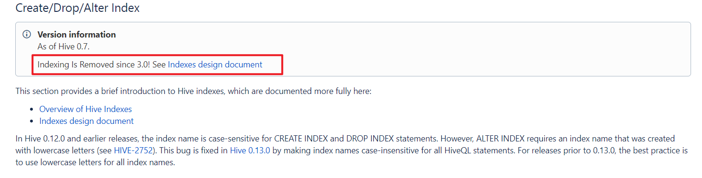
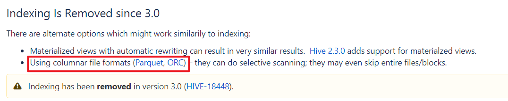
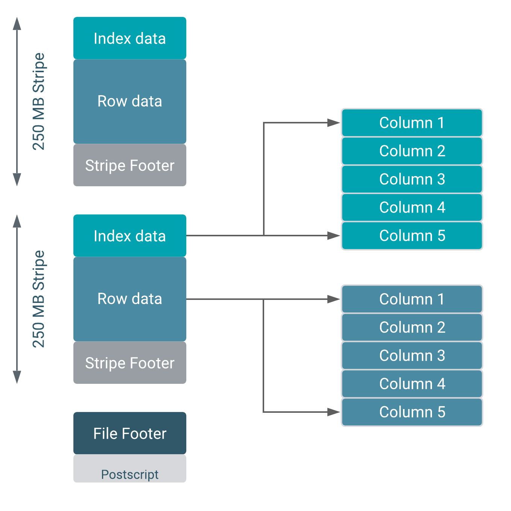

# DWS层建设实战II

## I. DWS层构建

### 1. 商品主题统计宽表的实现

- 主题需求

  - 指标

    ```properties
    下单次数、下单件数、下单金额、被支付次数、被支付件数、被支付金额、被退款次数、被退款件数、被退款金额、被加入购物车次数、被加入购物车件数、被收藏次数、好评数、中评数、差评数
    
    --总共15个指标
    ```

  - 维度

    ```properties
    日期（day）+商品
    ```

- 本主题建表操作

  > 注意：建表操作需要在hive中执行，presto不支持hive的建表语法。

  ```sql
  create table yp_dws.dws_sku_daycount 
  (
      dt STRING,
      sku_id string comment 'sku_id',
      sku_name string comment '商品名称',
      order_count bigint comment '被下单次数',
      order_num bigint comment '被下单件数',
      order_amount decimal(38,2) comment '被下单金额',
      payment_count bigint  comment '被支付次数',
      payment_num bigint comment '被支付件数',
      payment_amount decimal(38,2) comment '被支付金额',
      refund_count bigint  comment '被退款次数',
      refund_num bigint comment '被退款件数',
      refund_amount  decimal(38,2) comment '被退款金额',
      cart_count bigint comment '被加入购物车次数',
      cart_num bigint comment '被加入购物车件数',
      favor_count bigint comment '被收藏次数',
      evaluation_good_count bigint comment '好评数',
      evaluation_mid_count bigint comment '中评数',
      evaluation_bad_count bigint comment '差评数'
  ) COMMENT '每日商品行为'
  --PARTITIONED BY(dt STRING)
  ROW format delimited fields terminated BY '\t'
  stored AS orc tblproperties ('orc.compress' = 'SNAPPY');
  
  ```

- 扩展知识：如何优雅的给变量起名字？

  > https://www.zhihu.com/question/21440067/answer/1277465532
  >
  > https://unbug.github.io/codelf/
  >
  > https://translate.google.cn/  

#### 1.1. 需求分析

- 确定指标字段与表的关系

  > 当需求提出指标和维度之后，我们需要做的就是确定通过哪些表能够提供支撑。
  >
  > 思考：是不是意味着==数仓分层之后，上一层的表只能查询下一层的，能不能跨层？==
  >
  > 答案是不一定的。

```shell
#下单次数、下单件数、下单金额
dwb_order_detail
 	order_id: 下单次数相当于下了多少订单（有多少个包含这个商品的订单）
 	buy_num : 下单件数相当于下了多少商品 
 	total_price  每个商品下单金额指的是订单金额还是商品金额？应该是商品金额(订单中可能会包含其他商品)

#被支付次数、被支付件数、被支付金额
dwb_order_detail
	#支付状态的判断
		order_state: 只要不是1和7  就是已经支付状态的订单
		is_pay: 这个字段也可以 0表示未支付，1表示已支付。#推荐使用这个字段来判断
	#次数 件数 金额
    	order_id
    	buy_num
    	total_price

#被退款次数、被退款件数、被退款金额
dwb_order_detail
	#退款的判断
		refund_id: 退款单号 is not null的就表明有退款
	#次数 件数 金额	
		order_id
    	buy_num
    	total_price

#被加入购物车次数、被加入购物车件数
yp_dwd.fact_shop_cart(能够提供购物车相关信息的只有这张表)
	id: 次数
	buy_num: 件数

#被收藏次数
yp_dwd.fact_goods_collect
	id: 次数

#好评数、中评数、差评数
yp_dwd.fact_goods_evaluation_detail
	geval_scores_goods:商品评分0-10分
	
	#如何判断 好  中  差 （完全业务指定）
		得分: >= 9 	 好
		得分: >6  <9   中
		得分：<= 6  	差

#维度
	时间、商品
```

> 概况起来，计算商品主题宽表，需要参与计算的表有：
>
> ==yp_dwb.dwb_order_detail  订单明细宽表==
>
> ==yp_dwd.fact_shop_cart  购物车表==
>
> ==yp_dwd.fact_goods_collect  商品收藏表==
>
> ==yp_dwd.fact_goods_evaluation_detail  商品评价表==

#### 1.2. 下单, 支付, 退款统计

- 大前提：==**使用row_number对数据进行去重**==

  > 基于dwb_order_detail表根据商品（goods_id）进行统计各个指标的时候；
  >
  > 为了避免同一笔订单下有多个重复的商品出现（正常来说重复的应该合并在一起了）；
  >
  > 应该使用row_number对order_id和goods_id进行去重。

  ```sql
  --订单明细表抽取字段，并且进行去重，作为后续的base基础数据
  with order_base as (select
      dt,
      order_id, --订单id
      goods_id, --商品id
      goods_name,--商品名称
      buy_num,--购买商品数量
      total_price,--商品总金额（数量*单价）
      is_pay,--支付状态（1表示已经支付）
      row_number() over(partition by order_id,goods_id) as rn
  from yp_dwb.dwb_order_detail),
  
  -- 后面跟,表示后面继续使用CTE,语法如下
  with t1 as (select....),
  	 t2 as (select....)
  select * from t1 join t2;	 
  ```

- 下单次数、件数、金额统计

  > 基于上述的order_base进行查询

  ```sql
  --下单次数、件数、金额统计
  order_count as (select
      dt,goods_id as sku_id,goods_name as sku_name,
      count(order_id) order_count,
      sum(buy_num) order_num,
      sum(total_price) order_amount
  from order_base where rn =1
  group by dt,goods_id,goods_name),
  ```

- 支付次数、件数、金额统计

  > 计算支付相关指标之前，可以先使用==is_pay进行订单状态过滤==
  >
  > 然后基于过滤后的数据进行统计
  >
  > 可以继续使用CTE引导

  ```sql
  --订单状态,已支付
  pay_base as(
      select *,
      row_number() over(partition by order_id, goods_id) rn
      from yp_dwb.dwb_order_detail
      where is_pay=1
  ),
  
  --支付次数、件数、金额统计
  payment_count as(
      select dt, goods_id sku_id, goods_name sku_name,
         count(order_id) payment_count,
         sum(buy_num) payment_num,
         sum(total_price) payment_amount
      from pay_base
      where rn=1
      group by dt, goods_id, goods_name
  ),
  ```

- 退款次数、件数、金额统计

  > 可以先使用==refund_id is not null查询出退款订单==，然后进行统计

  ```sql
  --先查询出退款订单
  refund_base as(
      select *,
         row_number() over(partition by order_id, goods_id) rn
      from yp_dwb.dwb_order_detail
      where refund_id is not null
  ),
  -- 退款次数、件数、金额
  refund_count as (
      select dt, goods_id sku_id, goods_name sku_name,
         count(order_id) refund_count,
         sum(buy_num) refund_num,
         sum(total_price) refund_amount
      from refund_base
      where rn=1
      group by dt, goods_id, goods_name
  ),
  ```

#### 1.3. 购物车, 收藏统计

> 思考：==为什么下面这两个查询需要考虑拉链的状态？上面的下单、支付等统计为什么不需要？==

- 购物车次数、件数统计

  ```sql
  -- 购物车次数、件数
  cart_count as (
      select substring(create_time, 1, 10) dt, goods_id sku_id,
             count(id) cart_count,
              sum(buy_num) cart_num
      from yp_dwd.fact_shop_cart
      where end_date = '9999-99-99'
      group by substring(create_time, 1, 10), goods_id
  ),
  ```

- 收藏次数统计

  ```sql
  -- 收藏次数
  favor_count as (
      select substring(c.create_time, 1, 10) dt, goods_id sku_id,
             count(c.id) favor_count
      from yp_dwd.fact_goods_collect c
      where end_date='9999-99-99'
      group by substring(c.create_time, 1, 10), goods_id
  ),
  ```

#### 1.4. 好中差评

- 好评、中评、差评次数

  > 根据评分来判断好评、中评、差评

  ```sql
  -- 好评、中评、差评数量
  evaluation_count as (
      select substring(geval_addtime, 1, 10) dt, e.goods_id sku_id,
             count(if(geval_scores_goods >= 9, 1, null)) evaluation_good_count,
             count(if(geval_scores_goods >6 and geval_scores_goods < 9, 1, null)) evaluation_mid_count,
             count(if(geval_scores_goods <= 6, 1, null)) evaluation_bad_count
      from yp_dwd.fact_goods_evaluation_detail e
      group by substring(geval_addtime, 1, 10), e.goods_id
  ),
  ```

#### 1.5. Union all和full join合并的区别

> 经过前面的计算，并且通过CTE的引导，得到了6个结果表，分别是：
>
> 1、==order_count==  下单次数、件数、金额统计
>
> 2、==payment_count==  支付次数、件数、金额统计
>
> 3、==refund_count==  退款次数、件数、金额统计
>
> 4、==cart_count==  购物车次数、件数
>
> 5、==favor_count== 收藏次数
>
> 6、==evaluation_count== 好中差评数

- 需求：把上述6张表的结果合并在一起

  - 方式1：union all合并
  - 方式2：full join合并

  > 注意：上述两种合并有什么区别？？？面试深水区。行合并？列合并？

------

- **==方式1：union all合并==**

  ```properties
  1):union 通常用于多个结果集行合并、行合并、行合并！合并后列数不变，行数变多;
  2):Union 可以细分为Union all不去重和Union distinct去重;
  3):Union 合并时对于结果集字段个数、类型、顺序有要求。
  
  4)如果想使用union既继续行合并又进行列合并，那么缺失的应该使用0或者null补上，补足。
  
  
  结果集1：
  id   name	
  001	 allen
  002  james
  
  结果集2：
  id   sex
  003  男
  004  女
  
  合并结果集
  id	name	sex
  001	 allen	null
  002  james	null
  003  null	男
  004  null	女
  
  
  --合并sql如下：
  select
      id,
      name,
      null as sex
  from t1
  union all
  select
      id,
      null as name,
      sex
  from t2;
  ```

- **==方式2：full join合并==**

  ```properties
  1):full join  通常用于多个结果集列合并、列合并、列合并！
  
  2)如果想使用full join既继续行合并又进行列合并,注意关联的字段即可，不需要0或者null补全。
  ```

#### 1.6. 完整SQL实现

```sql
- 这里采用union all的方式合并结果集

  > 课程资料中提供了full join的方式合并结果集，可以对比理解。

  ```sql
  --合并结果集
  unionall as (
      select
          dt, sku_id, sku_name,
          order_count,
          order_num,
          order_amount,
          0 as payment_count,
          0 as payment_num,
          0 as payment_amount,
          0 as refund_count,
          0 as refund_num,
          0 as refund_amount,
          0 as cart_count,
          0 as cart_num,
          0 as favor_count,
          0 as evaluation_good_count,
          0 as evaluation_mid_count,
          0 as evaluation_bad_count
      from order_count
      union all
      select
          dt, sku_id, sku_name,
          0 order_count,
          0 order_num,
          0 order_amount,
          payment_count,
          payment_num,
          payment_amount,
          0 as refund_count,
          0 as refund_num,
          0 as refund_amount,
          0 as cart_count,
          0 as cart_num,
          0 as favor_count,
          0 as evaluation_good_count,
          0 as evaluation_mid_count,
          0 as evaluation_bad_count
      from payment_count
      union all
      select
          dt, sku_id, sku_name,
          0 order_count,
          0 order_num,
          0 order_amount,
          0 as payment_count,
          0 as payment_num,
          0 as payment_amount,
          refund_count,
          refund_num,
          refund_amount,
          0 as cart_count,
          0 as cart_num,
          0 as favor_count,
          0 as evaluation_good_count,
          0 as evaluation_mid_count,
          0 as evaluation_bad_count
      from refund_count
      union all
      select
          dt, sku_id, null as sku_name,
          0 order_count,
          0 order_num,
          0 order_amount,
          0 as payment_count,
          0 as payment_num,
          0 as payment_amount,
          0 as refund_count,
          0 as refund_num,
          0 as refund_amount,
          cart_count,
          cart_num,
          0 as favor_count,
          0 as evaluation_good_count,
          0 as evaluation_mid_count,
          0 as evaluation_bad_count
      from cart_count
      union all
      select
          dt, sku_id, null as sku_name,
          0 order_count,
          0 order_num,
          0 order_amount,
          0 as payment_count,
          0 as payment_num,
          0 as payment_amount,
          0 as refund_count,
          0 as refund_num,
          0 as refund_amount,
          0 as cart_count,
          0 as cart_num,
          favor_count,
          0 as evaluation_good_count,
          0 as evaluation_mid_count,
          0 as evaluation_bad_count
      from favor_count
      union all
      select
          dt, sku_id, null as sku_name,
          0 order_count,
          0 order_num,
          0 order_amount,
          0 as payment_count,
          0 as payment_num,
          0 as payment_amount,
          0 as refund_count,
          0 as refund_num,
          0 as refund_amount,
          0 as cart_count,
          0 as cart_num,
          0 as favor_count,
          evaluation_good_count,
          evaluation_mid_count,
          evaluation_bad_count
      from evaluation_count
  )
```

- 最终对union all的结果集根据日期和商品进行分组 sum求和，结果插入目标表中。

  ```sql
  select
      dt, sku_id, max(sku_name),
      sum(order_count),
      sum(order_num),
      sum(order_amount),
      sum(payment_count),
      sum(payment_num),
      sum(payment_amount),
      sum(refund_count),
      sum(refund_num),
      sum(refund_amount),
      sum(cart_count),
      sum(cart_num),
      sum(favor_count),
      sum(evaluation_good_count),
      sum(evaluation_mid_count),
      sum(evaluation_bad_count)
  from unionall
  group by dt, sku_id
  ;
  ```

- 最终完整版sql

  ```sql
  insert into hive.yp_dws.dws_sku_daycount
  --订单明细表抽取字段，并且进行去重，作为后续的base基础数据
  with order_base as (select
      dt,
      order_id, --订单id
      goods_id, --商品id
      goods_name,--商品名称
      buy_num,--购买商品数量
      total_price,--商品总金额（数量*单价）
      is_pay,--支付状态（1表示已经支付）
      row_number() over(partition by order_id,goods_id) as rn
  from yp_dwb.dwb_order_detail),
  
  --下单次数、件数、金额统计
  order_count as (select
      dt,goods_id as sku_id,goods_name as sku_name,
      count(order_id) order_count,
      sum(buy_num) order_num,
      sum(total_price) order_amount
  from order_base where rn =1
  group by dt,goods_id,goods_name),
  
  --订单状态,已支付
  pay_base as(
      select *,
      row_number() over(partition by order_id, goods_id) rn
      from yp_dwb.dwb_order_detail
      where is_pay=1
  ),
  
  --支付次数、件数、金额统计
  payment_count as(
      select dt, goods_id sku_id, goods_name sku_name,
         count(order_id) payment_count,
         sum(buy_num) payment_num,
         sum(total_price) payment_amount
      from pay_base
      where rn=1
      group by dt, goods_id, goods_name
  ),
  
  --退款次数、件数、金额统计
  refund_base as(
      select *,
         row_number() over(partition by order_id, goods_id) rn
      from yp_dwb.dwb_order_detail
      where refund_id is not null
  ),
  -- 退款次数、件数、金额
  refund_count as (
      select dt, goods_id sku_id, goods_name sku_name,
         count(order_id) refund_count,
         sum(buy_num) refund_num,
         sum(total_price) refund_amount
      from refund_base
      where rn=1
      group by dt, goods_id, goods_name
  ),
  
  -- 购物车次数、件数
  cart_count as (
      select substring(create_time, 1, 10) dt, goods_id sku_id,
             count(id) cart_count,
              sum(buy_num) cart_num
      from yp_dwd.fact_shop_cart
      where end_date = '9999-99-99'
      group by substring(create_time, 1, 10), goods_id
  ),
  -- 收藏次数
  favor_count as (
      select substring(c.create_time, 1, 10) dt, goods_id sku_id,
             count(c.id) favor_count
      from yp_dwd.fact_goods_collect c
      where end_date='9999-99-99'
      group by substring(c.create_time, 1, 10), goods_id
  ),
  -- 好评、中评、差评数量
  evaluation_count as (
      select substring(geval_addtime, 1, 10) dt, e.goods_id sku_id,
             count(if(geval_scores_goods >= 9, 1, null)) evaluation_good_count,
             count(if(geval_scores_goods >6 and geval_scores_goods < 9, 1, null)) evaluation_mid_count,
             count(if(geval_scores_goods <= 6, 1, null)) evaluation_bad_count
      from yp_dwd.fact_goods_evaluation_detail e
      group by substring(geval_addtime, 1, 10), e.goods_id
  ),
  
  --合并结果集
  unionall as (
      select
          dt, sku_id, sku_name,
          order_count,
          order_num,
          order_amount,
          0 as payment_count,
          0 as payment_num,
          0 as payment_amount,
          0 as refund_count,
          0 as refund_num,
          0 as refund_amount,
          0 as cart_count,
          0 as cart_num,
          0 as favor_count,
          0 as evaluation_good_count,
          0 as evaluation_mid_count,
          0 as evaluation_bad_count
      from order_count
      union all
      select
          dt, sku_id, sku_name,
          0 order_count,
          0 order_num,
          0 order_amount,
          payment_count,
          payment_num,
          payment_amount,
          0 as refund_count,
          0 as refund_num,
          0 as refund_amount,
          0 as cart_count,
          0 as cart_num,
          0 as favor_count,
          0 as evaluation_good_count,
          0 as evaluation_mid_count,
          0 as evaluation_bad_count
      from payment_count
      union all
      select
          dt, sku_id, sku_name,
          0 order_count,
          0 order_num,
          0 order_amount,
          0 as payment_count,
          0 as payment_num,
          0 as payment_amount,
          refund_count,
          refund_num,
          refund_amount,
          0 as cart_count,
          0 as cart_num,
          0 as favor_count,
          0 as evaluation_good_count,
          0 as evaluation_mid_count,
          0 as evaluation_bad_count
      from refund_count
      union all
      select
          dt, sku_id, null as sku_name,
          0 order_count,
          0 order_num,
          0 order_amount,
          0 as payment_count,
          0 as payment_num,
          0 as payment_amount,
          0 as refund_count,
          0 as refund_num,
          0 as refund_amount,
          cart_count,
          cart_num,
          0 as favor_count,
          0 as evaluation_good_count,
          0 as evaluation_mid_count,
          0 as evaluation_bad_count
      from cart_count
      union all
      select
          dt, sku_id, null as sku_name,
          0 order_count,
          0 order_num,
          0 order_amount,
          0 as payment_count,
          0 as payment_num,
          0 as payment_amount,
          0 as refund_count,
          0 as refund_num,
          0 as refund_amount,
          0 as cart_count,
          0 as cart_num,
          favor_count,
          0 as evaluation_good_count,
          0 as evaluation_mid_count,
          0 as evaluation_bad_count
      from favor_count
      union all
      select
          dt, sku_id, null as sku_name,
          0 order_count,
          0 order_num,
          0 order_amount,
          0 as payment_count,
          0 as payment_num,
          0 as payment_amount,
          0 as refund_count,
          0 as refund_num,
          0 as refund_amount,
          0 as cart_count,
          0 as cart_num,
          0 as favor_count,
          evaluation_good_count,
          evaluation_mid_count,
          evaluation_bad_count
      from evaluation_count
  )
  
  select
      dt, sku_id, max(sku_name),
      sum(order_count),
      sum(order_num),
      sum(order_amount),
      sum(payment_count),
      sum(payment_num),
      sum(payment_amount),
      sum(refund_count),
      sum(refund_num),
      sum(refund_amount),
      sum(cart_count),
      sum(cart_num),
      sum(favor_count),
      sum(evaluation_good_count),
      sum(evaluation_mid_count),
      sum(evaluation_bad_count)
  from unionall
  group by dt, sku_id
  --order by dt, sku_id
  ;
  ```

### 2. 用户主题统计宽表的实现

#### 需求分析

- 主题需求

  - 指标

    ```properties
    登录次数, 收藏店铺数, 收藏商品数, 加入购物车次数, 加入购物车金额, 下单次数, 下单金额, 支付次数, 支付金额
    ```

  - 维度

    ```properties
    用户, 日期
    ```

- 建表操作

  > 注意: 建表操作需要在hive中执行, presto不支持hive的建表语法

  ```sql
  
  ```

  


## II. Hive优化 -- 索引

### 1. index索引问题

- 索引是什么

  - 在数据库中，索引指的是==提供指向存储在表的指定列中的数据值的指针（地址）==，数据库使用索引以找到特定值，然后顺指针找到包含该值的行。
  - 索引的作用相当于==新华字典的目录==，可以根据目录中的页码==快速找到所需的内容==。比如我们可以按拼音、笔画、偏旁部首等排序的目录（索引）快速查找到需要的字。

- mysql中的索引

  > 作为OLTP系统软件的典型代表，mysql也支持索引的使用。

  - 索引的优点

    - ==大大提高查询的效率==

  - 索引的缺点

    - ==降低更新表的速度==，如对表进行INSERT、UPDATE和DELETE。因为更新表时，MySQL不仅要保存数据，还要保存一下索引文件。==MySQL支持自动更新索引==。
    - 建立索引会==占用磁盘空间==的索引文件。

  - 索引使用的注意事项

    - 当创建索引之后，根据具有索引的字段查询，效率才能体现。

  - mysql的索引分类

    - 普通索引

      > 普通索引是最基本的索引，它没有任何限制。

      ```sql
      CREATE INDEX indexName ON table_name (column_name);
      
      --也可以在建表的时候同时指定索引
      CREATE TABLE `table` (
          `id` int(11) NOT NULL AUTO_INCREMENT ,
          `title` char(255) CHARACTER NOT NULL ,
          `content` text CHARACTER NULL ,
          `time` int(10) NULL DEFAULT NULL ,
          PRIMARY KEY (`id`),
          INDEX index_name (title(length))
      )
      
      --length为可选参数，表示索引的长度，只有字符串类型的字段才能指定索引长度
      ```

    - 唯一索引

      > 与普通索引类似，不同的就是：==索引列的值必须唯一==，但允许有空值。

      ```sql
      CREATE UNIQUE INDEX indexName ON table(column(length));
      
      --建表的时候创建索引
      CREATE TABLE `table` (
          `id` int(11) NOT NULL AUTO_INCREMENT ,
          `title` char(255) CHARACTER NOT NULL ,
          `content` text CHARACTER NULL ,
          `time` int(10) NULL DEFAULT NULL ,
          UNIQUE indexName (title(length))
      );
      ```

    - 主键索引

      > 一种特殊的唯一索引，一个表只能有一个主键，不允许有空值。
      >
      > 一般是在建表的时候同时创建主键索引。

      ```sql
      CREATE TABLE `table` (
          `id` int(11) NOT NULL AUTO_INCREMENT ,
          `title` char(255) NOT NULL ,
          PRIMARY KEY (`id`)
      );
      ```

    - 组合索引

      > 指多个字段上创建的索引，只有在查询条件中使用了创建索引时的第一个字段，索引才会被使用。
      >
      > 使用组合索引时==**遵循最左前缀**==集合。

      ```sql
      ALTER TABLE mytable ADD INDEX name_city_age (name(10),city,age);
      
      --建表时，name长度为16，这里用10。这是因为一般情况下名字的长度不会超过10，这样会加速索引查询速度，还会减少索引文件的大小，提高INSERT的更新速度。
      
      --建立这样的组合索引，其实是相当于分别建立了下面三组组合MySQL数据库索引
      name,city,age
      name,city
      name 
      
      --为什么没有 city，age这样的组合索引呢？这是因为MySQL组合索引“最左前缀”的结果。简单的理解就是只从最左面的开始组合。并不是只要包含这三列的查询都会用到该组合索引，下面的几个SQL就会用到这个组合MySQL数据库索引：
      
      SELECT * FROM mytable WHERE name="admin" AND city="郑州"
      
      SELECT * FROM mytable WHERE name="admin"
      
      --而下面几个则不会用到：
      SELECT * FROM mytable WHERE city="郑州" AND name="admin" 
      SELECT * FROM mytable WHERE age=20 AND city="郑州"
      SELECT * FROM mytable WHERE city="郑州"
      ```

      

- Hive中的索引与问题

  > Hive作为OLAP软件，应该说是要支持索引的，因为这样可以提高查询效率。
  >
  > Hive 0.7版本之后，开始支持索引，但是功能很弱。

  ```properties
  1、在hive表指定列上建立索引，会产生一张索引表（Hive的一张物理表），里面的字段包括，索引列的值、该值对应的HDFS文件路径、该值在文件中的偏移量;
  
  2、hive的索引是需要手动进行维护的,索引表不会自动rebuild，如果表有数据新增或删除，那么必须手动rebuild索引表数据;
  
  在执行索引字段查询时候，首先额外生成一个MR job，根据对索引列的过滤条件，从索引表中过滤出索引列的值对应的hdfs文件路径及偏移量，输出到hdfs上的一个文件中。
  
  然后根据生成的临时文件中的hdfs路径和偏移量，筛选原始input文件，生成新的split,作为整个job的split,这样就达到不用全表扫描的目的。
  
  每次查询时候都要先用一个job扫描索引表，如果索引列的值非常稀疏，那么索引表本身也会非常大；
  
  ```

> 因此在==**Hive3.0版本之后，直接移除了索**引==，即使使用hive低版本的，也不建议使用索引。



- Hive给的建议是：

  > - 使用物化视图  自动更新
  > - ==使用ORC、Parquet等格式文件==。这些文件格式本身列式存储，内部特性支持查询效率的提高。

  

### 2. ORC文件格式的索引

#### 2.1. Row Group Index行组索引

- ORC文件存储格式

  

  ```properties
  一个ORC文件包含一个或多个stripes(groups of row data)；
  
  每个stripe中包含了每个column的min/max值的索引数据；
  
  当查询中有<,>,=的操作时，会根据min/max值，跳过扫描不包含的stripes。
  ```

- Row Group Index行组索引

  > ORC为每个stripe建立的包含min/max值的索引，就称为Row Group Index，也叫min-max Index，或者Storage Index。

  ```properties
  1、在建立ORC格式表时，指定表参数’orc.create.index’=’true’之后，便会建立Row Group Index；
  
  2、需要注意的是，为了使Row Group Index有效利用，向表中加载数据时，必须对需要使用索引的字段进行排序，否则，min/max会失去意义。
  
  3、另外，这种索引通常用于数值型字段的查询过滤优化上。
  ```

  ```sql
  --CTAS
  CREATE TABLE t_text_2 stored AS ORC 
  TBLPROPERTIES
      ('orc.compress'='SNAPPY',
      'orc.create.index'='true', --开启行组索引
      'orc.stripe.size'='10485760',
      'orc.row.index.stride'='10000') 	--索引条目之间的行数（必须> = 1000）
  AS 
  SELECT xxxx
  FROM t_text_1 
  DISTRIBUTE BY id sort BY id;
  
  --参数hive.optimize.index.filte 表示是否自动使用索引，默认为false（不使用）；
  --如果不设置该参数为true，那么ORC的索引当然也不会使用。
  
  --执行sql之前，为了使用索引，应该设置下面的参数
  set hive.optimize.index.filter=true;
  ```

#### 2.2. (Bloom Filter Index)布隆过滤器索引


### Hive相关配置参数

```shell
--分区
SET hive.exec.dynamic.partition=true;
SET hive.exec.dynamic.partition.mode=nonstrict;
set hive.exec.max.dynamic.partitions.pernode=10000;
set hive.exec.max.dynamic.partitions=100000;
set hive.exec.max.created.files=150000;
--hive压缩
set hive.exec.compress.intermediate=true;
set hive.exec.compress.output=true;
--写入时压缩生效
set hive.exec.orc.compression.strategy=COMPRESSION;
--分桶
set hive.enforce.bucketing=true;
set hive.enforce.sorting=true;
set hive.optimize.bucketmapjoin = true;
set hive.auto.convert.sortmerge.join=true;
set hive.auto.convert.sortmerge.join.noconditionaltask=true;
--并行执行
set hive.exec.parallel=true;
set hive.exec.parallel.thread.number=8;
--小文件合并
-- set mapred.max.split.size=2147483648;
-- set mapred.min.split.size.per.node=1000000000;
-- set mapred.min.split.size.per.rack=1000000000;
--矢量化查询
set hive.vectorized.execution.enabled=true;
--关联优化器
set hive.optimize.correlation=true;
--读取零拷贝
set hive.exec.orc.zerocopy=true;
--join数据倾斜
set hive.optimize.skewjoin=true;
-- set hive.skewjoin.key=100000;
set hive.optimize.skewjoin.compiletime=true;
set hive.optimize.union.remove=true;
-- group倾斜
set hive.groupby.skewindata=false;
```

