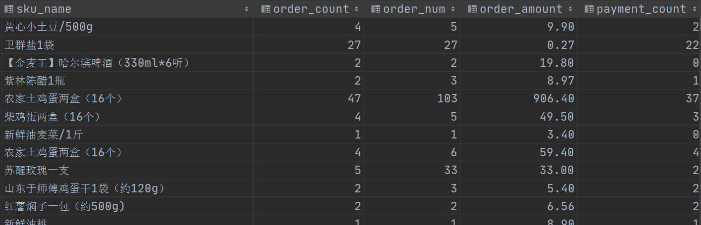

# DM层建设实战

## I. DM层架构

### 目标与需求

- 新零售数仓分层图

  

- DM

  - 名称：数据集市层 Data Market

  - 功能：基于DWS层日统计宽表，==上卷==出周、月、年等统计宽表，即==粗粒度汇总==。

  - 解释

    - 从理论层面来说，数据集市是一个小型的部门或工作组级别的数据仓库。
    - 一些公司早期的数据集市后期可能会演变成为数仓系统。
    - 本项目中在数据集市层面主要进行粗粒度汇总，也可以将这些功能下放至DWS层完成。抛弃DM.

    百科数据集市：https://baike.baidu.com/item/%E6%95%B0%E6%8D%AE%E9%9B%86%E5%B8%82/607135?fr=aladdin

    

- 使用DataGrip在Hive中创建dm层

  > 注意，==**对于建库建表操作，需直接使用Hive**==，因为Presto只是一个数据分析的引擎，其语法不一定支持直接在Hive中建库建表。

  ```sql
  create database if not exists yp_dm;
  ```

### 1. 销售主题统计宽表构建

#### 1.1. 建模

- 概述

  > DM层销售主题宽表，基于DWS层销售主题日统计宽表的值，**上卷统计出年、月、周的数据**。
  >
  > 指标和DWS一致。

- 指标

  ```properties
  销售收入、平台收入、配送成交额、小程序成交额、安卓APP成交额、苹果APP成交额、PC商城成交额、订单量、参评单量、差评单量、配送单量、退款单量、小程序订单量、安卓APP订单量、苹果APP订单量、PC商城订单量
  ```

- 维度

  ```properties
  日期:天(已经统计过), 周,  月, 年
  日期+城市
  日期+商圈
  日期+店铺
  日期+品牌
  日期+大类
  日期+中类
  日期+小类
  ```

- 建表

  > 整个表和DWS层销售主题统计宽表dws_sale_daycount的区别就在于==多了开头的时间粒度字段==。
  >
  > 用于标识后面的指标是哪个时间粒度统计出来的指标。

  ```sql
  CREATE TABLE yp_dm.dm_sale(
     date_time string COMMENT '统计日期,不能用来分组统计',
     time_type string COMMENT '统计时间维度：year、month、week、date(就是天day)',
     year_code string COMMENT '年code',
     year_month string COMMENT '年月',
     month_code string COMMENT '月份编码', 
     day_month_num string COMMENT '一月第几天', 
     dim_date_id string COMMENT '日期',
     year_week_name_cn string COMMENT '年中第几周',
     
     group_type string COMMENT '分组类型：store，trade_area，city，brand，min_class，mid_class，max_class，all',
     city_id string COMMENT '城市id',
     city_name string COMMENT '城市name',
     trade_area_id string COMMENT '商圈id',
     trade_area_name string COMMENT '商圈名称',
     store_id string COMMENT '店铺的id',
     store_name string COMMENT '店铺名称',
     brand_id string COMMENT '品牌id',
     brand_name string COMMENT '品牌名称',
     max_class_id string COMMENT '商品大类id',
     max_class_name string COMMENT '大类名称',
     mid_class_id string COMMENT '中类id', 
     mid_class_name string COMMENT '中类名称',
     min_class_id string COMMENT '小类id', 
     min_class_name string COMMENT '小类名称',
     --   =======统计=======
     --   销售收入
     sale_amt DECIMAL(38,2) COMMENT '销售收入',
     --   平台收入
     plat_amt DECIMAL(38,2) COMMENT '平台收入',
     -- 配送成交额
     deliver_sale_amt DECIMAL(38,2) COMMENT '配送成交额',
     -- 小程序成交额
     mini_app_sale_amt DECIMAL(38,2) COMMENT '小程序成交额',
     -- 安卓APP成交额
     android_sale_amt DECIMAL(38,2) COMMENT '安卓APP成交额',
     --  苹果APP成交额
     ios_sale_amt DECIMAL(38,2) COMMENT '苹果APP成交额',
     -- PC商城成交额
     pcweb_sale_amt DECIMAL(38,2) COMMENT 'PC商城成交额',
     -- 成交单量
     order_cnt BIGINT COMMENT '成交单量',
     -- 参评单量
     eva_order_cnt BIGINT COMMENT '参评单量comment=>cmt',
     -- 差评单量
     bad_eva_order_cnt BIGINT COMMENT '差评单量negtive-comment=>ncmt',
     -- 配送成交单量
     deliver_order_cnt BIGINT COMMENT '配送单量',
     -- 退款单量
     refund_order_cnt BIGINT COMMENT '退款单量',
     -- 小程序成交单量
     miniapp_order_cnt BIGINT COMMENT '小程序成交单量',
     -- 安卓APP订单量
     android_order_cnt BIGINT COMMENT '安卓APP订单量',
     -- 苹果APP订单量
     ios_order_cnt BIGINT COMMENT '苹果APP订单量',
     -- PC商城成交单量
     pcweb_order_cnt BIGINT COMMENT 'PC商城成交单量'
  )
  COMMENT '销售主题宽表' 
  ROW format delimited fields terminated BY '\t' 
  stored AS orc tblproperties ('orc.compress' = 'SNAPPY');
  ```

#### 1.2. 表关系梳理

- 销售主题各种指标的数据支撑

  - ==**dws_sale_daycount**==

  

- 时间粒度的数据支撑

  - ==**dwd.dim_date  时间维表**==

  > 企业中，时间维表数据是怎么维护的呢?
  >
  > 1、维护频率：一次性生成1年或者多年的时间数据。
  >
  > 2、使用java、Python代码实现数据的生成。

  

- 关联条件

  ```sql
  yp_dws.dws_sale_daycount dc
      left join yp_dwd.dim_date d on dc.dt = d.data_code
  ```

#### 1.3. 按年统计

> 在dws层已经统计出天的指标数据了，现在需要在其之上上卷计算出周、月、年的数据。
>
> 这里并不是简单的分组+sum求和即可，需要考虑到分组的类别。

- step1：确定分组字段

  > 年
  >
  > 年 + 城市
  >
  > 年 + 商圈
  >
  > 年 + 店铺
  >
  > 年 + 品牌
  >
  > 年 + 大类
  >
  > 年 + 中类
  >
  > 年 + 小类
  >
  > （对于销售主题 在DM层  分析的维度不变  时间的粒度改变）

  ```sql
  group by
  grouping sets (
      (d.year_code),
      (d.year_code, city_id, city_name),
      (d.year_code, city_id, city_name, trade_area_id, trade_area_name),
      (d.year_code, city_id, city_name, trade_area_id, trade_area_name, store_id, store_name),
      (d.year_code, brand_id, brand_name),
      (d.year_code, max_class_id, max_class_name),
      (d.year_code, max_class_id, max_class_name,mid_class_id, mid_class_name),
      (d.year_code, max_class_id, max_class_name,mid_class_id, mid_class_name,min_class_id, min_class_name))
  ;
  ```

- step2：分组聚合

  ```sql
  -- 统计值
      sum(dc.sale_amt) as sale_amt,
      sum(dc.plat_amt) as plat_amt,
      sum(dc.deliver_sale_amt) as deliver_sale_amt,
      sum(dc.mini_app_sale_amt) as mini_app_sale_amt,
      sum(dc.android_sale_amt) as android_sale_amt,
      sum(dc.ios_sale_amt) as ios_sale_amt,
      sum(dc.pcweb_sale_amt) as pcweb_sale_amt,
      sum(dc.order_cnt) as order_cnt,
      sum(dc.eva_order_cnt) as eva_order_cnt,
      sum(dc.bad_eva_order_cnt) as bad_eva_order_cnt,
      sum(dc.deliver_order_cnt) as deliver_order_cnt,
      sum(dc.refund_order_cnt) as refund_order_cnt,
      sum(dc.miniapp_order_cnt) as miniapp_order_cnt,
      sum(dc.android_order_cnt) as android_order_cnt,
      sum(dc.ios_order_cnt) as ios_order_cnt,
      sum(dc.pcweb_order_cnt) as pcweb_order_cnt
  ```

- step3：返回字段细节处理

  ```sql
      --统计日期，不是分组的日期 所谓统计就是记录你哪天干的这个活
      '2022-03-07' date_time,
      'year' time_type,
       year_code,
  --     year_month,
  --     month_code,
  --     day_month_num,
  --     dim_date_id,
  --     year_week_name_cn,
  
      -- 产品维度类型：store，trade_area，city，brand，min_class，mid_class，max_class，all
     CASE WHEN grouping(dc.city_id, dc.trade_area_id, dc.store_id)=0
           THEN 'store'
           WHEN grouping(dc.city_id, dc.trade_area_id)=0
           THEN 'trade_area'
           WHEN grouping(dc.city_id)=0
           THEN 'city'
           WHEN grouping(dc.brand_id)=0
           THEN 'brand'
           WHEN grouping(dc.max_class_id, dc.mid_class_id, dc.min_class_id)=0
           THEN 'min_class'
           WHEN grouping(dc.max_class_id, dc.mid_class_id)=0
           THEN 'mid_class'
           WHEN grouping(dc.max_class_id)=0
           THEN 'max_class'
           ELSE 'all'
           END as group_type,
  ```

- step4：最终完整sql

  ```sql
  --按年统计，销售主题指标
  select
      --统计日期，不是分组的日期 所谓统计就是记录你哪天干的这个活
      '2022-03-07' date_time,
      'year' time_type,
       year_code,
  --     year_month,
  --     month_code,
  --     day_month_num,
  --     dim_date_id,
  --     year_week_name_cn,
  
      -- 产品维度类型：store，trade_area，city，brand，min_class，mid_class，max_class，all
     CASE WHEN grouping(dc.city_id, dc.trade_area_id, dc.store_id)=0
           THEN 'store'
           WHEN grouping(dc.city_id, dc.trade_area_id)=0
           THEN 'trade_area'
           WHEN grouping(dc.city_id)=0
           THEN 'city'
           WHEN grouping(dc.brand_id)=0
           THEN 'brand'
           WHEN grouping(dc.max_class_id, dc.mid_class_id, dc.min_class_id)=0
           THEN 'min_class'
           WHEN grouping(dc.max_class_id, dc.mid_class_id)=0
           THEN 'mid_class'
           WHEN grouping(dc.max_class_id)=0
           THEN 'max_class'
           ELSE 'all'
           END as group_type,
      city_id,
      city_name,
      trade_area_id,
      trade_area_name,
      store_id,
      store_name,
      brand_id,
      brand_name,
      max_class_id,
      max_class_name,
      mid_class_id,
      mid_class_name,
      min_class_id,
      min_class_name,
      sum(dc.sale_amt) as sale_amt,
      sum(dc.plat_amt) as plat_amt,
      sum(dc.deliver_sale_amt) as deliver_sale_amt,
      sum(dc.mini_app_sale_amt) as mini_app_sale_amt,
      sum(dc.android_sale_amt) as android_sale_amt,
      sum(dc.ios_sale_amt) as ios_sale_amt,
      sum(dc.pcweb_sale_amt) as pcweb_sale_amt,
      sum(dc.order_cnt) as order_cnt,
      sum(dc.eva_order_cnt) as eva_order_cnt,
      sum(dc.bad_eva_order_cnt) as bad_eva_order_cnt,
      sum(dc.deliver_order_cnt) as deliver_order_cnt,
      sum(dc.refund_order_cnt) as refund_order_cnt,
      sum(dc.miniapp_order_cnt) as miniapp_order_cnt,
      sum(dc.android_order_cnt) as android_order_cnt,
      sum(dc.ios_order_cnt) as ios_order_cnt,
      sum(dc.pcweb_order_cnt) as pcweb_order_cnt
  from yp_dws.dws_sale_daycount dc
      left join yp_dwd.dim_date d
      on dc.dt = d.date_code
  group by
  grouping sets (
      (d.year_code),
      (d.year_code, city_id, city_name),
      (d.year_code, city_id, city_name, trade_area_id, trade_area_name),
      (d.year_code, city_id, city_name, trade_area_id, trade_area_name, store_id, store_name),
      (d.year_code, brand_id, brand_name),
      (d.year_code, max_class_id, max_class_name),
      (d.year_code, max_class_id, max_class_name,mid_class_id, mid_class_name),
      (d.year_code, max_class_id, max_class_name,mid_class_id, mid_class_name,min_class_id, min_class_name))
  ;
  ```

#### 1.4. 完整实现

- step0：针对时间维表数据进行查询  CTE引导为临时结果集

  > 原因是：并不是时间维表中的每一个字段在本次查询的时候都有用。

  ```sql
  -- 获取日期数据（周、月的环比/同比日期）
  with dt1 as (
    select
     dim_date_id, date_code
      ,date_id_mom -- 与本月环比的上月日期
      ,date_id_mym -- 与本月同比的上年日期
      ,year_code
      ,month_code
      ,year_month     --年月
      ,day_month_num --几号
      ,week_day_code --周几
      ,year_week_name_cn  --年周
  from yp_dwd.dim_date
  )
  ```

- step1：编写grouping sets

  > 提示：在==grouping sets中养成不管分组字段是一个还是多个，都使用小括号括起来的习惯==。
  >
  > 因为grouping sets认为只要是小括号，就是一个分组条件。

  ```sql
  from yp_dws.dws_sale_daycount dc
     left join dt1 on dc.dt = dt1.date_code
  group by
  grouping sets (
  -- 年
     (dt1.year_code),
     (dt1.year_code, city_id, city_name),
     (dt1.year_code, city_id, city_name, trade_area_id, trade_area_name),
     (dt1.year_code, city_id, city_name, trade_area_id, trade_area_name, store_id, store_name),
      (dt1.year_code, brand_id, brand_name),
      (dt1.year_code, max_class_id, max_class_name),
      (dt1.year_code, max_class_id, max_class_name,mid_class_id, mid_class_name),
      (dt1.year_code, max_class_id, max_class_name,mid_class_id, mid_class_name,min_class_id, min_class_name),
      
  --  月
     (dt1.year_code, dt1.month_code, dt1.year_month),
     (dt1.year_code, dt1.month_code, dt1.year_month, city_id, city_name),
     (dt1.year_code, dt1.month_code, dt1.year_month, city_id, city_name, trade_area_id, trade_area_name),
     (dt1.year_code, dt1.month_code, dt1.year_month, city_id, city_name, trade_area_id, trade_area_name, store_id, store_name),
      (dt1.year_code, dt1.month_code, dt1.year_month, brand_id, brand_name),
      (dt1.year_code, dt1.month_code, dt1.year_month, max_class_id, max_class_name),
      (dt1.year_code, dt1.month_code, dt1.year_month, max_class_id, max_class_name,mid_class_id, mid_class_name),
      (dt1.year_code, dt1.month_code, dt1.year_month, max_class_id, max_class_name,mid_class_id, mid_class_name,min_class_id, min_class_name),
      
  -- 日
     (dt1.year_code, dt1.month_code, dt1.day_month_num, dt1.dim_date_id),
     (dt1.year_code, dt1.month_code, dt1.day_month_num, dt1.dim_date_id, city_id, city_name),
     (dt1.year_code, dt1.month_code, dt1.day_month_num, dt1.dim_date_id, city_id, city_name, trade_area_id, trade_area_name),
     (dt1.year_code, dt1.month_code, dt1.day_month_num, dt1.dim_date_id, city_id, city_name, trade_area_id, trade_area_name, store_id, store_name),
      (dt1.year_code, dt1.month_code, dt1.day_month_num, dt1.dim_date_id, brand_id, brand_name),
      (dt1.year_code, dt1.month_code, dt1.day_month_num, dt1.dim_date_id, max_class_id, max_class_name),
      (dt1.year_code, dt1.month_code, dt1.day_month_num, dt1.dim_date_id, max_class_id, max_class_name,mid_class_id, mid_class_name),
      (dt1.year_code, dt1.month_code, dt1.day_month_num, dt1.dim_date_id, max_class_id, max_class_name,mid_class_id, mid_class_name,min_class_id, min_class_name),
  
  --  周
     (dt1.year_code, dt1.year_week_name_cn),
     (dt1.year_code, dt1.year_week_name_cn, city_id, city_name),
     (dt1.year_code, dt1.year_week_name_cn, city_id, city_name, trade_area_id, trade_area_name),
     (dt1.year_code, dt1.year_week_name_cn, city_id, city_name, trade_area_id, trade_area_name, store_id, store_name),
      (dt1.year_code, dt1.year_week_name_cn, brand_id, brand_name),
      (dt1.year_code, dt1.year_week_name_cn, max_class_id, max_class_name),
      (dt1.year_code, dt1.year_week_name_cn, max_class_id, max_class_name,mid_class_id, mid_class_name),
      (dt1.year_code, dt1.year_week_name_cn, max_class_id, max_class_name,mid_class_id, mid_class_name,min_class_id, min_class_name)
  )
  ;
  ```

- step2：查询返回维度字段的处理

  > 对照目标表，一个一个处理。

  ```sql
  -- 统计日期 你哪天干活的
     '2022-03-07' as date_time,
  -- 时间维度 year、month、date
   case 
   when grouping(dt1.year_code, dt1.month_code, dt1.day_month_num, dt1.dim_date_id) = 0
        then 'date'
   when grouping(dt1.year_code, dt1.year_week_name_cn) = 0
        then 'week'
   when grouping(dt1.year_code, dt1.month_code, dt1.year_month) = 0
        then 'month'
   when grouping(dt1.year_code) = 0
        then 'year'
   end as time_type,
     dt1.year_code,
     dt1.year_month,
     dt1.month_code,
     dt1.day_month_num, --几号
     dt1.dim_date_id,
      dt1.year_week_name_cn,  --第几周
  -- 产品维度类型：store，trade_area，city，brand，min_class，mid_class，max_class，all
     CASE WHEN grouping(dc.city_id, dc.trade_area_id, dc.store_id)=0
           THEN 'store'
           WHEN grouping(dc.city_id, dc.trade_area_id, dc.store_id)=1
           THEN 'trade_area'
           WHEN grouping(dc.city_id, dc.trade_area_id, dc.store_id)=3
           THEN 'city'
           WHEN grouping(dc.brand_id)=0
           THEN 'brand'
           WHEN grouping(dc.max_class_id, dc.mid_class_id, dc.min_class_id)=0
           THEN 'min_class'
           WHEN grouping(dc.max_class_id, dc.mid_class_id)=0
           THEN 'mid_class'
           WHEN grouping(dc.max_class_id)=0
           THEN 'max_class'
           ELSE 'all'
           END as group_type,
     dc.city_id,
     dc.city_name,
     dc.trade_area_id,
     dc.trade_area_name,
     dc.store_id,
     dc.store_name,
     dc.brand_id,
     dc.brand_name,
     dc.max_class_id,
     dc.max_class_name,
     dc.mid_class_id,
     dc.mid_class_name,
     dc.min_class_id,
     dc.min_class_name,
  ```

- step3：指标的聚合

  ```sql
  -- 统计值
     sum(dc.sale_amt) as sale_amt,
     sum(dc.plat_amt) as plat_amt,
     sum(dc.deliver_sale_amt) as deliver_sale_amt,
     sum(dc.mini_app_sale_amt) as mini_app_sale_amt,
     sum(dc.android_sale_amt) as android_sale_amt,
     sum(dc.ios_sale_amt) as ios_sale_amt,
     sum(dc.pcweb_sale_amt) as pcweb_sale_amt,
     sum(dc.order_cnt) as order_cnt,
     sum(dc.eva_order_cnt) as eva_order_cnt,
     sum(dc.bad_eva_order_cnt) as bad_eva_order_cnt,
     sum(dc.deliver_order_cnt) as deliver_order_cnt,
     sum(dc.refund_order_cnt) as refund_order_cnt,
     sum(dc.miniapp_order_cnt) as miniapp_order_cnt,
     sum(dc.android_order_cnt) as android_order_cnt,
     sum(dc.ios_order_cnt) as ios_order_cnt,
     sum(dc.pcweb_order_cnt) as pcweb_order_cnt
  ```

- 最终完整版sql

  ```sql
  insert into yp_dm.dm_sale
  -- 获取日期数据（周、月的环比/同比日期）
  with dt1 as (
    select
     dim_date_id, date_code
      ,date_id_mom -- 与本月环比的上月日期
      ,date_id_mym -- 与本月同比的上年日期
      ,year_code
      ,month_code
      ,year_month     --年月
      ,day_month_num --几号
      ,week_day_code --周几
      ,year_week_name_cn  --年周
  from yp_dwd.dim_date
  )
  select
  -- 统计日期
     '2022-03-07' as date_time,
  -- 时间维度      year、month、date
     case when grouping(dt1.year_code, dt1.month_code, dt1.day_month_num, dt1.dim_date_id) = 0
        then 'date'
         when grouping(dt1.year_code, dt1.year_week_name_cn) = 0
        then 'week'
        when grouping(dt1.year_code, dt1.month_code, dt1.year_month) = 0
        then 'month'
        when grouping(dt1.year_code) = 0
        then 'year'
     end
     as time_type,
     dt1.year_code,
     dt1.year_month,
     dt1.month_code,
     dt1.day_month_num, --几号
     dt1.dim_date_id,
      dt1.year_week_name_cn,  --第几周
  -- 产品维度类型：store，trade_area，city，brand，min_class，mid_class，max_class，all
     CASE WHEN grouping(dc.city_id, dc.trade_area_id, dc.store_id)=0
           THEN 'store'
           WHEN grouping(dc.city_id, dc.trade_area_id)=0
           THEN 'trade_area'
           WHEN grouping(dc.city_id)=0
           THEN 'city'
           WHEN grouping(dc.brand_id)=0
           THEN 'brand'
           WHEN grouping(dc.max_class_id, dc.mid_class_id, dc.min_class_id)=0
           THEN 'min_class'
           WHEN grouping(dc.max_class_id, dc.mid_class_id)=0
           THEN 'mid_class'
           WHEN grouping(dc.max_class_id)=0
           THEN 'max_class'
           ELSE 'all'
           END as group_type,
     dc.city_id,
     dc.city_name,
     dc.trade_area_id,
     dc.trade_area_name,
     dc.store_id,
     dc.store_name,
     dc.brand_id,
     dc.brand_name,
     dc.max_class_id,
     dc.max_class_name,
     dc.mid_class_id,
     dc.mid_class_name,
     dc.min_class_id,
     dc.min_class_name,
  -- 统计值
      sum(dc.sale_amt) as sale_amt,
     sum(dc.plat_amt) as plat_amt,
     sum(dc.deliver_sale_amt) as deliver_sale_amt,
     sum(dc.mini_app_sale_amt) as mini_app_sale_amt,
     sum(dc.android_sale_amt) as android_sale_amt,
     sum(dc.ios_sale_amt) as ios_sale_amt,
     sum(dc.pcweb_sale_amt) as pcweb_sale_amt,
  
     sum(dc.order_cnt) as order_cnt,
     sum(dc.eva_order_cnt) as eva_order_cnt,
     sum(dc.bad_eva_order_cnt) as bad_eva_order_cnt,
     sum(dc.deliver_order_cnt) as deliver_order_cnt,
     sum(dc.refund_order_cnt) as refund_order_cnt,
     sum(dc.miniapp_order_cnt) as miniapp_order_cnt,
     sum(dc.android_order_cnt) as android_order_cnt,
     sum(dc.ios_order_cnt) as ios_order_cnt,
     sum(dc.pcweb_order_cnt) as pcweb_order_cnt
  from yp_dws.dws_sale_daycount dc
     left join dt1 on dc.dt = dt1.date_code
  group by
  grouping sets (
  -- 年，注意养成加小括号的习惯
     (dt1.year_code),
     (dt1.year_code, city_id, city_name),
     (dt1.year_code, city_id, city_name, trade_area_id, trade_area_name),
     (dt1.year_code, city_id, city_name, trade_area_id, trade_area_name, store_id, store_name),
      (dt1.year_code, brand_id, brand_name),
      (dt1.year_code, max_class_id, max_class_name),
      (dt1.year_code, max_class_id, max_class_name,mid_class_id, mid_class_name),
      (dt1.year_code, max_class_id, max_class_name,mid_class_id, mid_class_name,min_class_id, min_class_name),
  --  月
     (dt1.year_code, dt1.month_code, dt1.year_month),
     (dt1.year_code, dt1.month_code, dt1.year_month, city_id, city_name),
     (dt1.year_code, dt1.month_code, dt1.year_month, city_id, city_name, trade_area_id, trade_area_name),
     (dt1.year_code, dt1.month_code, dt1.year_month, city_id, city_name, trade_area_id, trade_area_name, store_id, store_name),
      (dt1.year_code, dt1.month_code, dt1.year_month, brand_id, brand_name),
      (dt1.year_code, dt1.month_code, dt1.year_month, max_class_id, max_class_name),
      (dt1.year_code, dt1.month_code, dt1.year_month, max_class_id, max_class_name,mid_class_id, mid_class_name),
      (dt1.year_code, dt1.month_code, dt1.year_month, max_class_id, max_class_name,mid_class_id, mid_class_name,min_class_id, min_class_name),
  -- 日
     (dt1.year_code, dt1.month_code, dt1.day_month_num, dt1.dim_date_id),
     (dt1.year_code, dt1.month_code, dt1.day_month_num, dt1.dim_date_id, city_id, city_name),
     (dt1.year_code, dt1.month_code, dt1.day_month_num, dt1.dim_date_id, city_id, city_name, trade_area_id, trade_area_name),
     (dt1.year_code, dt1.month_code, dt1.day_month_num, dt1.dim_date_id, city_id, city_name, trade_area_id, trade_area_name, store_id, store_name),
      (dt1.year_code, dt1.month_code, dt1.day_month_num, dt1.dim_date_id, brand_id, brand_name),
      (dt1.year_code, dt1.month_code, dt1.day_month_num, dt1.dim_date_id, max_class_id, max_class_name),
      (dt1.year_code, dt1.month_code, dt1.day_month_num, dt1.dim_date_id, max_class_id, max_class_name,mid_class_id, mid_class_name),
      (dt1.year_code, dt1.month_code, dt1.day_month_num, dt1.dim_date_id, max_class_id, max_class_name,mid_class_id, mid_class_name,min_class_id, min_class_name),
  --  周
     (dt1.year_code, dt1.year_week_name_cn),
     (dt1.year_code, dt1.year_week_name_cn, city_id, city_name),
     (dt1.year_code, dt1.year_week_name_cn, city_id, city_name, trade_area_id, trade_area_name),
     (dt1.year_code, dt1.year_week_name_cn, city_id, city_name, trade_area_id, trade_area_name, store_id, store_name),
      (dt1.year_code, dt1.year_week_name_cn, brand_id, brand_name),
      (dt1.year_code, dt1.year_week_name_cn, max_class_id, max_class_name),
      (dt1.year_code, dt1.year_week_name_cn, max_class_id, max_class_name,mid_class_id, mid_class_name),
      (dt1.year_code, dt1.year_week_name_cn, max_class_id, max_class_name,mid_class_id, mid_class_name,min_class_id, min_class_name)
  )
  -- order by time_type desc
  ;
  ```

#### 1.5. grouping精准识别分组

- ==如何精准的识别该分组中到底有没有包含指定的分组字段，尤其是分组组合很多的时候。==

- 技术：使用强大的grouping方法来精准识别。

- 难点：多位二进制转换十进制的操作 ，可以借助一些工具实现。

  > https://tool.oschina.net/hexconvert/

```sql
--对于销售额来说，分为8个维度  日期我们设定为周这个粒度
	--每周总销售额  	 日期
	--每周每城市销售额  日期+城市
	--每周每商圈销售额  日期+商圈
	--每周每店铺销售额  日期+店铺
	--每周每品牌销售额  日期+品牌
	--每周每大类销售额  日期+大类
	--每周每中类销售额  日期+中类
	--每周每小类销售额  日期+小类
	
--如何判断分组中到底是根据谁分组的呢？重要的是如何实现精准判断呢？

把日期、城市、商圈、店铺、品牌、大类、中类、小类8个字段一起使用grouping进行判断

--这里的难点就是8位二进制的数据如何转换为十进制的数据
	
grouping(dt1.year_code,city_id,trade_area_id,store_id,brand_id,max_class_id,mid_class_id,min_class_id) --店铺 00001111 = 15

grouping(dt1.year_code,city_id,trade_area_id,store_id,brand_id,max_class_id,mid_class_id,min_class_id) --商圈 00011111 = 31

grouping(dt1.year_code,city_id,trade_area_id,store_id,brand_id,max_class_id,mid_class_id,min_class_id) --城市 00111111 = 63
 
grouping(dt1.year_code,city_id,trade_area_id,store_id,brand_id,max_class_id,mid_class_id,min_class_id) --品牌 01110111 =119

grouping(dt1.year_code,city_id,trade_area_id,store_id,brand_id,max_class_id,mid_class_id,min_class_id) --大类 01111011 = 123

grouping(dt1.year_code,city_id,trade_area_id,store_id,brand_id,max_class_id,mid_class_id,min_class_id) --中类 01111001 = 121
 
grouping(dt1.year_code,city_id,trade_area_id,store_id,brand_id,max_class_id,mid_class_id,min_class_id) --小类 01111000 = 120

grouping(dt1.year_code,city_id,trade_area_id,store_id,brand_id,max_class_id,mid_class_id,min_class_id) --日期  01111111 = 127
```

### 2. 商品主题统计宽表构建

#### 2.1. 建模

- 概述

  > 商品SKU主题宽表，需求指标和dws层一致，但不是每日统计数据，而是==总累积值== 和 ==最近30天累积值==

- 建表

  ```sql
  create table yp_dm.dm_sku
  (
      sku_id string comment 'sku_id',
      --下单
      order_last_30d_count bigint comment '最近30日被下单次数',
      order_last_30d_num bigint comment '最近30日被下单件数',
      order_last_30d_amount decimal(38,2)  comment '最近30日被下单金额',
      order_count bigint comment '累积被下单次数',
      order_num bigint comment '累积被下单件数',
      order_amount decimal(38,2) comment '累积被下单金额',
      --支付
      payment_last_30d_count   bigint  comment '最近30日被支付次数',
      payment_last_30d_num bigint comment '最近30日被支付件数',
      payment_last_30d_amount  decimal(38,2) comment '最近30日被支付金额',
      payment_count   bigint  comment '累积被支付次数',
      payment_num bigint comment '累积被支付件数',
      payment_amount  decimal(38,2) comment '累积被支付金额',
     --退款
      refund_last_30d_count bigint comment '最近三十日退款次数',
      refund_last_30d_num bigint comment '最近三十日退款件数',
      refund_last_30d_amount decimal(38,2) comment '最近三十日退款金额',
      refund_count bigint comment '累积退款次数',
      refund_num bigint comment '累积退款件数',
      refund_amount decimal(38,2) comment '累积退款金额',
      --购物车
      cart_last_30d_count bigint comment '最近30日被加入购物车次数',
      cart_last_30d_num bigint comment '最近30日被加入购物车件数',
      cart_count bigint comment '累积被加入购物车次数',
      cart_num bigint comment '累积被加入购物车件数',
      --收藏
      favor_last_30d_count bigint comment '最近30日被收藏次数',
      favor_count bigint comment '累积被收藏次数',
      --好中差评
      evaluation_last_30d_good_count bigint comment '最近30日好评数',
      evaluation_last_30d_mid_count bigint comment '最近30日中评数',
      evaluation_last_30d_bad_count bigint comment '最近30日差评数',
      evaluation_good_count bigint comment '累积好评数',
      evaluation_mid_count bigint comment '累积中评数',
      evaluation_bad_count bigint comment '累积差评数'
  )
  COMMENT '商品主题宽表'
  ROW format delimited fields terminated BY '\t' 
  stored AS orc tblproperties ('orc.compress' = 'SNAPPY');
  ```

- 思路分析

  > 1、首次计算如何操作？
  >
  > 2、循环计算如何操作？间隔的时间与频率如何？1天计算一次还是一月计算一次？

  ```shell
  #在dws层，我们已经计算出每个商品每天的一些指标情况，如下
  dt		sku_id		sku_name	order_count	 order_num	 	order_amount
  day     商品ID       商品名称      被下单次数	   被下单件数	    被下单金额
  
  
  #首次计算，每件商品的总累积值和近30天累积值  这个简单
  	总累积值：把全部的数据根据商品分组，每个组内sum求和   也就是说忽略日期计算即可
  	近30天累积值：控制时间范围后进行分组聚合  (today -30d, today)
  	
  #循环计算  本项目采用的是T+1模式
  	总累积值：  旧的总累积值+新的增值 = 新的总累积值
  			  (当然如果不嫌弃慢，也可以把之前的全部数据再次重新计算一遍也可以得到  "可以没必要")
  	近30天累积值：控制时间范围后进行分组聚合  (today -30d, today)	
      
      
      
  #结论
  当主题需求计算历史累积值时，不推荐每次都采用全量计算。推荐采用历史累积+新增。
  ```

#### 2.2. 首次执行

- step1：准备好DWS层==dws_sku_daycount==的统计数据。

  

- step2：计算总累积值

  ```sql
  select
     sku_id,sku_name,
     sum(order_count) as order_count,
     sum(order_num) as order_num,
     sum(order_amount) as order_amount,
     sum(payment_count) payment_count,
     sum(payment_num) payment_num,
     sum(payment_amount) payment_amount,
     sum(refund_count) refund_count,
     sum(refund_num) refund_num,
     sum(refund_amount) refund_amount,
     sum(cart_count) cart_count,
     sum(cart_num) cart_num,
     sum(favor_count) favor_count,
     sum(evaluation_good_count)   evaluation_good_count,
     sum(evaluation_mid_count)    evaluation_mid_count,
     sum(evaluation_bad_count)    evaluation_bad_count
  from yp_dws.dws_sku_daycount
  group by sku_id,sku_name;
  --如果要严谨、成熟一点的话 在处理数字类型字段的时候使用 coalesce()函数 null转为0
  ```

  

- step3：计算最近30天累积值

  ```sql
  --这里需要注意，项目中测试数据的日期范围不是最新的 范围选取不准可能没结果哦
  select
      sku_id,sku_name,
      sum(order_count) order_last_30d_count,
      sum(order_num) order_last_30d_num,
      sum(order_amount) as order_last_30d_amount,
      sum(payment_count) payment_last_30d_count,
      sum(payment_num) payment_last_30d_num,
      sum(payment_amount) payment_last_30d_amount,
      sum(refund_count) refund_last_30d_count,
      sum(refund_num) refund_last_30d_num,
      sum(refund_amount) refund_last_30d_amount,
      sum(cart_count) cart_last_30d_count,
      sum(cart_num) cart_last_30d_num,
      sum(favor_count) favor_last_30d_count,
      sum(evaluation_good_count) evaluation_last_30d_good_count,
      sum(evaluation_mid_count)  evaluation_last_30d_mid_count,
      sum(evaluation_bad_count)  evaluation_last_30d_bad_count
  from yp_dws.dws_sku_daycount
  where dt>=cast(date_add('day', -30, date '2020-05-08') as varchar)
  group by sku_id,sku_name;
  ```

- step4：最终完整sql

  > 使用CTE将上述查询合并，插入到目标表中。

  ```sql
  insert into yp_dm.dm_sku
  with all_count as (
  select
     sku_id,sku_name,
     sum(order_count) as order_count,
     sum(order_num) as order_num,
     sum(order_amount) as order_amount,
     sum(payment_count) payment_count,
     sum(payment_num) payment_num,
     sum(payment_amount) payment_amount,
     sum(refund_count) refund_count,
     sum(refund_num) refund_num,
     sum(refund_amount) refund_amount,
     sum(cart_count) cart_count,
     sum(cart_num) cart_num,
     sum(favor_count) favor_count,
     sum(evaluation_good_count)   evaluation_good_count,
     sum(evaluation_mid_count)    evaluation_mid_count,
     sum(evaluation_bad_count)    evaluation_bad_count
  from yp_dws.dws_sku_daycount
  group by sku_id,sku_name
  ),
  last_30d as (
  select
      sku_id,sku_name,
      sum(order_count) order_last_30d_count,
      sum(order_num) order_last_30d_num,
      sum(order_amount) as order_last_30d_amount,
      sum(payment_count) payment_last_30d_count,
      sum(payment_num) payment_last_30d_num,
      sum(payment_amount) payment_last_30d_amount,
      sum(refund_count) refund_last_30d_count,
      sum(refund_num) refund_last_30d_num,
      sum(refund_amount) refund_last_30d_amount,
      sum(cart_count) cart_last_30d_count,
      sum(cart_num) cart_last_30d_num,
      sum(favor_count) favor_last_30d_count,
      sum(evaluation_good_count) evaluation_last_30d_good_count,
      sum(evaluation_mid_count)  evaluation_last_30d_mid_count,
      sum(evaluation_bad_count)  evaluation_last_30d_bad_count
  from yp_dws.dws_sku_daycount
  where dt>=cast(date_add('day', -30, date '2020-05-08') as varchar)
  group by sku_id,sku_name
  )
  select
      ac.sku_id,
      l30.order_last_30d_count,
      l30.order_last_30d_num,
      l30.order_last_30d_amount,
      ac.order_count,
      ac.order_num,
      ac.order_amount,
      l30.payment_last_30d_count,
      l30.payment_last_30d_num,
      l30.payment_last_30d_amount,
      ac.payment_count,
      ac.payment_num,
      ac.payment_amount,
      l30.refund_last_30d_count,
      l30.refund_last_30d_num,
      l30.refund_last_30d_amount,
      ac.refund_count,
      ac.refund_num,
      ac.refund_amount,
      l30.cart_last_30d_count,
      l30.cart_last_30d_num,
      ac.cart_count,
      ac.cart_num,
      l30.favor_last_30d_count,
      ac.favor_count,
      l30.evaluation_last_30d_good_count,
      l30.evaluation_last_30d_mid_count,
      l30.evaluation_last_30d_bad_count,
      ac.evaluation_good_count,
      ac.evaluation_mid_count,
      ac.evaluation_bad_count
  from all_count ac
      left join last_30d l30 on ac.sku_id=l30.sku_id;
  ```

#### 2.3. 循环操作

- step1：建一个临时表

  ```sql
  drop table if exists yp_dm.dm_sku_tmp;
  create table yp_dm.dm_sku_tmp
  (
      sku_id string comment 'sku_id',
      order_last_30d_count bigint comment '最近30日被下单次数',
      order_last_30d_num bigint comment '最近30日被下单件数',
      order_last_30d_amount decimal(38,2)  comment '最近30日被下单金额',
      order_count bigint comment '累积被下单次数',
      order_num bigint comment '累积被下单件数',
      order_amount decimal(38,2) comment '累积被下单金额',
      payment_last_30d_count   bigint  comment '最近30日被支付次数',
      payment_last_30d_num bigint comment '最近30日被支付件数',
      payment_last_30d_amount  decimal(38,2) comment '最近30日被支付金额',
      payment_count   bigint  comment '累积被支付次数',
      payment_num bigint comment '累积被支付件数',
      payment_amount  decimal(38,2) comment '累积被支付金额',
      refund_last_30d_count bigint comment '最近三十日退款次数',
      refund_last_30d_num bigint comment '最近三十日退款件数',
      refund_last_30d_amount decimal(38,2) comment '最近三十日退款金额',
      refund_count bigint comment '累积退款次数',
      refund_num bigint comment '累积退款件数',
      refund_amount decimal(38,2) comment '累积退款金额',
      cart_last_30d_count bigint comment '最近30日被加入购物车次数',
      cart_last_30d_num bigint comment '最近30日被加入购物车件数',
      cart_count bigint comment '累积被加入购物车次数',
      cart_num bigint comment '累积被加入购物车件数',
      favor_last_30d_count bigint comment '最近30日被收藏次数',
      favor_count bigint comment '累积被收藏次数',
      evaluation_last_30d_good_count bigint comment '最近30日好评数',
      evaluation_last_30d_mid_count bigint comment '最近30日中评数',
      evaluation_last_30d_bad_count bigint comment '最近30日差评数',
      evaluation_good_count bigint comment '累积好评数',
      evaluation_mid_count bigint comment '累积中评数',
      evaluation_bad_count bigint comment '累积差评数'
  )
  COMMENT '商品主题宽表_临时存储表'
  ROW format delimited fields terminated BY '\t'
  stored AS orc tblproperties ('orc.compress' = 'SNAPPY');
  ```

- step2：查询出新统计的数据

  ```sql
  --注意，上次（首次）计算的的时间范围是
  where dt>=cast(date_add('day', -30, date '2020-05-08') as varchar)
  
  --因此，这次计算的应该是
  where dt>=cast(date_add('day', -30, date '2020-05-09') as varchar)
  
  
  --我们把2020-05-09向前30天的数据查询出来
  	--这30天数据之间sum求和的结果 就是新的最近30天累积值
  	--这30天数据中的最后一天也就是2020-05-09的数据 就是新的一天增加的数据  这个数据要和历史总累积数据进行合并 就是新的总累积值
  
  select
        sku_id,
          sum(if(dt='2020-05-09', order_count,0 )) order_count,
        sum(if(dt='2020-05-09',order_num ,0 ))  order_num,
          sum(if(dt='2020-05-09',order_amount,0 )) order_amount ,
          sum(if(dt='2020-05-09',payment_count,0 )) payment_count,
          sum(if(dt='2020-05-09',payment_num,0 )) payment_num,
          sum(if(dt='2020-05-09',payment_amount,0 )) payment_amount,
          sum(if(dt='2020-05-09',refund_count,0 )) refund_count,
          sum(if(dt='2020-05-09',refund_num,0 )) refund_num,
          sum(if(dt='2020-05-09',refund_amount,0 )) refund_amount,
          sum(if(dt='2020-05-09',cart_count,0 )) cart_count,
          sum(if(dt='2020-05-09',cart_num,0 )) cart_num,
          sum(if(dt='2020-05-09',favor_count,0 )) favor_count,
          sum(if(dt='2020-05-09',evaluation_good_count,0 )) evaluation_good_count,
          sum(if(dt='2020-05-09',evaluation_mid_count,0 ) ) evaluation_mid_count ,
          sum(if(dt='2020-05-09',evaluation_bad_count,0 )) evaluation_bad_count,
          sum(order_count) order_count30 ,
          sum(order_num) order_num30,
          sum(order_amount) order_amount30,
          sum(payment_count) payment_count30,
          sum(payment_num) payment_num30,
          sum(payment_amount) payment_amount30,
          sum(refund_count) refund_count30,
          sum(refund_num) refund_num30,
          sum(refund_amount) refund_amount30,
          sum(cart_count) cart_count30,
          sum(cart_num) cart_num30,
          sum(favor_count) favor_count30,
          sum(evaluation_good_count) evaluation_good_count30,
          sum(evaluation_mid_count) evaluation_mid_count30,
          sum(evaluation_bad_count) evaluation_bad_count30
      from yp_dws.dws_sku_daycount
      where dt >= cast(date_add('day', -30, date '2020-05-09') as varchar)
      group by sku_id
  ```

- step3：合并新旧数据

  ```sql
  --查询出当前yp_dm.dm_sku中保存的旧数据
  
  --新日期统计数据
  
  --新旧合并 full outer join 
  
  --30天数据(永远取新的)
      coalesce(new.order_count30,0) order_last_30d_count,
      coalesce(new.order_num30,0) order_last_30d_num,
      coalesce(new.order_amount30,0) order_last_30d_amount,
  --累积历史数据（旧的+新的）
      coalesce(old.order_count,0) + coalesce(new.order_count,0) order_count,
      coalesce(old.order_num,0) + coalesce(new.order_num,0) order_num,
      coalesce(old.order_amount,0) + coalesce(new.order_amount,0) order_amount,
      .....
  ```

- step4：最终完整sql

  ```sql
    
  - step3：最终完整sql
  
    insert into yp_dm.dm_sku_tmp
    select
        coalesce(new.sku_id,old.sku_id) sku_id,
    --        订单 30天数据
        coalesce(new.order_count30,0) order_last_30d_count,
        coalesce(new.order_num30,0) order_last_30d_num,
        coalesce(new.order_amount30,0) order_last_30d_amount,
    --        订单 累积历史数据
        coalesce(old.order_count,0) + coalesce(new.order_count,0) order_count,
        coalesce(old.order_num,0) + coalesce(new.order_num,0) order_num,
        coalesce(old.order_amount,0) + coalesce(new.order_amount,0) order_amount,
    --        支付单 30天数据
        coalesce(new.payment_count30,0) payment_last_30d_count,
        coalesce(new.payment_num30,0) payment_last_30d_num,
        coalesce(new.payment_amount30,0) payment_last_30d_amount,
    --        支付单 累积历史数据
        coalesce(old.payment_count,0) + coalesce(new.payment_count,0) payment_count,
        coalesce(old.payment_num,0) + coalesce(new.payment_count,0) payment_num,
        coalesce(old.payment_amount,0) + coalesce(new.payment_count,0) payment_amount,
    --        退款单 30天数据
        coalesce(new.refund_count30,0) refund_last_30d_count,
        coalesce(new.refund_num30,0) refund_last_30d_num,
        coalesce(new.refund_amount30,0) refund_last_30d_amount,
    --        退款单 累积历史数据
        coalesce(old.refund_count,0) + coalesce(new.refund_count,0) refund_count,
        coalesce(old.refund_num,0) + coalesce(new.refund_num,0) refund_num,
        coalesce(old.refund_amount,0) + coalesce(new.refund_amount,0) refund_amount,
    --        购物车 30天数据
        coalesce(new.cart_count30,0) cart_last_30d_count,
        coalesce(new.cart_num30,0) cart_last_30d_num,
    --        购物车 累积历史数据
        coalesce(old.cart_count,0) + coalesce(new.cart_count,0) cart_count,
        coalesce(old.cart_num,0) + coalesce(new.cart_num,0) cart_num,
    --        收藏 30天数据
        coalesce(new.favor_count30,0) favor_last_30d_count,
    --        收藏 累积历史数据
        coalesce(old.favor_count,0) + coalesce(new.favor_count,0) favor_count,
    --        评论 30天数据
        coalesce(new.evaluation_good_count30,0) evaluation_last_30d_good_count,
        coalesce(new.evaluation_mid_count30,0) evaluation_last_30d_mid_count,
        coalesce(new.evaluation_bad_count30,0) evaluation_last_30d_bad_count,
    --        评论 累积历史数据
        coalesce(old.evaluation_good_count,0) + coalesce(new.evaluation_good_count,0) evaluation_good_count,
        coalesce(old.evaluation_mid_count,0) + coalesce(new.evaluation_mid_count,0) evaluation_mid_count,
        coalesce(old.evaluation_bad_count,0) + coalesce(new.evaluation_bad_count,0) evaluation_bad_count
    from
    (
    --     dm旧数据
        select
            sku_id,
            order_last_30d_count,
            order_last_30d_num,
            order_last_30d_amount,
            order_count,
            order_num,
            order_amount  ,
            payment_last_30d_count,
            payment_last_30d_num,
            payment_last_30d_amount,
            payment_count,
            payment_num,
            payment_amount,
            refund_last_30d_count,
            refund_last_30d_num,
            refund_last_30d_amount,
            refund_count,
            refund_num,
            refund_amount,
            cart_last_30d_count,
            cart_last_30d_num,
            cart_count,
            cart_num,
            favor_last_30d_count,
            favor_count,
            evaluation_last_30d_good_count,
            evaluation_last_30d_mid_count,
            evaluation_last_30d_bad_count,
            evaluation_good_count,
            evaluation_mid_count,
            evaluation_bad_count
        from yp_dm.dm_sku
    )old
    full outer join
    (
    --     30天 和 昨天 的dws新数据
        select
            sku_id,
            sum(if(dt='2020-05-09', order_count,0 )) order_count,
            sum(if(dt='2020-05-09',order_num ,0 ))  order_num,
            sum(if(dt='2020-05-09',order_amount,0 )) order_amount ,
            sum(if(dt='2020-05-09',payment_count,0 )) payment_count,
            sum(if(dt='2020-05-09',payment_num,0 )) payment_num,
            sum(if(dt='2020-05-09',payment_amount,0 )) payment_amount,
            sum(if(dt='2020-05-09',refund_count,0 )) refund_count,
            sum(if(dt='2020-05-09',refund_num,0 )) refund_num,
            sum(if(dt='2020-05-09',refund_amount,0 )) refund_amount,
            sum(if(dt='2020-05-09',cart_count,0 )) cart_count,
            sum(if(dt='2020-05-09',cart_num,0 )) cart_num,
            sum(if(dt='2020-05-09',favor_count,0 )) favor_count,
            sum(if(dt='2020-05-09',evaluation_good_count,0 )) evaluation_good_count,
            sum(if(dt='2020-05-09',evaluation_mid_count,0 ) ) evaluation_mid_count ,
            sum(if(dt='2020-05-09',evaluation_bad_count,0 )) evaluation_bad_count,
            sum(order_count) order_count30 ,
            sum(order_num) order_num30,
            sum(order_amount) order_amount30,
            sum(payment_count) payment_count30,
            sum(payment_num) payment_num30,
            sum(payment_amount) payment_amount30,
            sum(refund_count) refund_count30,
            sum(refund_num) refund_num30,
            sum(refund_amount) refund_amount30,
            sum(cart_count) cart_count30,
            sum(cart_num) cart_num30,
            sum(favor_count) favor_count30,
            sum(evaluation_good_count) evaluation_good_count30,
            sum(evaluation_mid_count) evaluation_mid_count30,
            sum(evaluation_bad_count) evaluation_bad_count30
        from yp_dws.dws_sku_daycount
        where dt >= cast(date_add('day', -30, date '2020-05-09') as varchar)
        group by sku_id
    )new
    on new.sku_id = old.sku_id;
  ```

- step5：把数据从临时表中查询出来覆盖至最终目标中

  ```sql
  insert into yp_dm.dm_sku
  select * from yp_dm.dm_sku_tmp;
  
  --Presto中不支持insert overwrite语法，只能先delete，然后insert into。
  ```

### 3. 用户主题统计宽表构建

#### 3.1. 建模


#### 3.2. 首次执行, 循环执行


## II. 数据治理

### 1. 元数据管理


### 2. 数据质量管理


