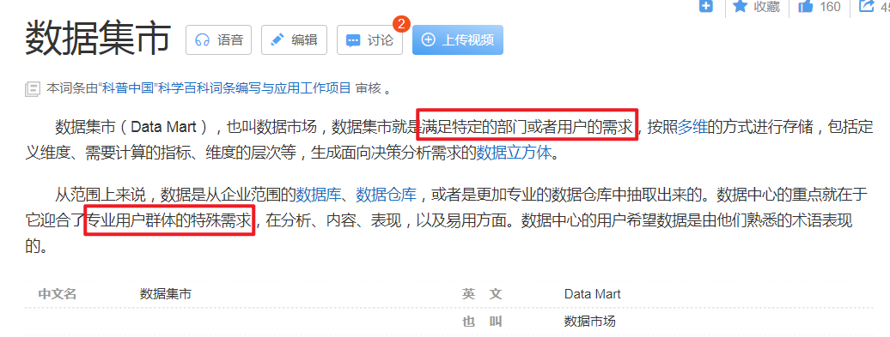
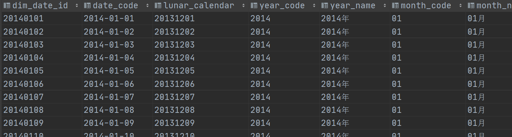

# DM层建设实战

## I. DM层架构

### 目标与需求

- 新零售数仓分层图

  

- DM

  - 名称：数据集市层 Data Market

  - 功能：基于DWS层日统计宽表，==上卷==出周、月、年等统计宽表，即==粗粒度汇总==。

  - 解释

    - 从理论层面来说，数据集市是一个小型的部门或工作组级别的数据仓库。
    - 一些公司早期的数据集市后期可能会演变成为数仓系统。
    - 本项目中在数据集市层面主要进行粗粒度汇总，也可以将这些功能下放至DWS层完成。抛弃DM.

    百科数据集市：https://baike.baidu.com/item/%E6%95%B0%E6%8D%AE%E9%9B%86%E5%B8%82/607135?fr=aladdin

    

- 使用DataGrip在Hive中创建dm层

  > 注意，==**对于建库建表操作，需直接使用Hive**==，因为Presto只是一个数据分析的引擎，其语法不一定支持直接在Hive中建库建表。

  ```sql
  create database if not exists yp_dm;
  ```

### 1. 销售主题统计宽表构建

#### 1.1. 建模

- 概述

  > DM层销售主题宽表，基于DWS层销售主题日统计宽表的值，**上卷统计出年、月、周的数据**。
  >
  > 指标和DWS一致。

- 指标

  ```properties
  销售收入、平台收入、配送成交额、小程序成交额、安卓APP成交额、苹果APP成交额、PC商城成交额、订单量、参评单量、差评单量、配送单量、退款单量、小程序订单量、安卓APP订单量、苹果APP订单量、PC商城订单量
  ```

- 维度

  ```properties
  日期:天(已经统计过), 周,  月, 年
  日期+城市
  日期+商圈
  日期+店铺
  日期+品牌
  日期+大类
  日期+中类
  日期+小类
  ```

- 建表

  > 整个表和DWS层销售主题统计宽表dws_sale_daycount的区别就在于==多了开头的时间粒度字段==。
  >
  > 用于标识后面的指标是哪个时间粒度统计出来的指标。

  ```sql
  CREATE TABLE yp_dm.dm_sale(
     date_time string COMMENT '统计日期,不能用来分组统计',
     time_type string COMMENT '统计时间维度：year、month、week、date(就是天day)',
     year_code string COMMENT '年code',
     year_month string COMMENT '年月',
     month_code string COMMENT '月份编码', 
     day_month_num string COMMENT '一月第几天', 
     dim_date_id string COMMENT '日期',
     year_week_name_cn string COMMENT '年中第几周',
     
     group_type string COMMENT '分组类型：store，trade_area，city，brand，min_class，mid_class，max_class，all',
     city_id string COMMENT '城市id',
     city_name string COMMENT '城市name',
     trade_area_id string COMMENT '商圈id',
     trade_area_name string COMMENT '商圈名称',
     store_id string COMMENT '店铺的id',
     store_name string COMMENT '店铺名称',
     brand_id string COMMENT '品牌id',
     brand_name string COMMENT '品牌名称',
     max_class_id string COMMENT '商品大类id',
     max_class_name string COMMENT '大类名称',
     mid_class_id string COMMENT '中类id', 
     mid_class_name string COMMENT '中类名称',
     min_class_id string COMMENT '小类id', 
     min_class_name string COMMENT '小类名称',
     --   =======统计=======
     --   销售收入
     sale_amt DECIMAL(38,2) COMMENT '销售收入',
     --   平台收入
     plat_amt DECIMAL(38,2) COMMENT '平台收入',
     -- 配送成交额
     deliver_sale_amt DECIMAL(38,2) COMMENT '配送成交额',
     -- 小程序成交额
     mini_app_sale_amt DECIMAL(38,2) COMMENT '小程序成交额',
     -- 安卓APP成交额
     android_sale_amt DECIMAL(38,2) COMMENT '安卓APP成交额',
     --  苹果APP成交额
     ios_sale_amt DECIMAL(38,2) COMMENT '苹果APP成交额',
     -- PC商城成交额
     pcweb_sale_amt DECIMAL(38,2) COMMENT 'PC商城成交额',
     -- 成交单量
     order_cnt BIGINT COMMENT '成交单量',
     -- 参评单量
     eva_order_cnt BIGINT COMMENT '参评单量comment=>cmt',
     -- 差评单量
     bad_eva_order_cnt BIGINT COMMENT '差评单量negtive-comment=>ncmt',
     -- 配送成交单量
     deliver_order_cnt BIGINT COMMENT '配送单量',
     -- 退款单量
     refund_order_cnt BIGINT COMMENT '退款单量',
     -- 小程序成交单量
     miniapp_order_cnt BIGINT COMMENT '小程序成交单量',
     -- 安卓APP订单量
     android_order_cnt BIGINT COMMENT '安卓APP订单量',
     -- 苹果APP订单量
     ios_order_cnt BIGINT COMMENT '苹果APP订单量',
     -- PC商城成交单量
     pcweb_order_cnt BIGINT COMMENT 'PC商城成交单量'
  )
  COMMENT '销售主题宽表' 
  ROW format delimited fields terminated BY '\t' 
  stored AS orc tblproperties ('orc.compress' = 'SNAPPY');
  ```

#### 1.2. 表关系梳理

- 销售主题各种指标的数据支撑

  - ==**dws_sale_daycount**==

  

- 时间粒度的数据支撑

  - ==**dwd.dim_date  时间维表**==

  > 企业中，时间维表数据是怎么维护的呢?
  >
  > 1、维护频率：一次性生成1年或者多年的时间数据。
  >
  > 2、使用java、Python代码实现数据的生成。

  

- 关联条件

  ```sql
  yp_dws.dws_sale_daycount dc
      left join yp_dwd.dim_date d on dc.dt = d.data_code
  ```

#### 1.3. 按年统计

> 在dws层已经统计出天的指标数据了，现在需要在其之上上卷计算出周、月、年的数据。
>
> 这里并不是简单的分组+sum求和即可，需要考虑到分组的类别。

- step1：确定分组字段

  > 年
  >
  > 年 + 城市
  >
  > 年 + 商圈
  >
  > 年 + 店铺
  >
  > 年 + 品牌
  >
  > 年 + 大类
  >
  > 年 + 中类
  >
  > 年 + 小类
  >
  > （对于销售主题 在DM层  分析的维度不变  时间的粒度改变）

  ```sql
  group by
  grouping sets (
      (d.year_code),
      (d.year_code, city_id, city_name),
      (d.year_code, city_id, city_name, trade_area_id, trade_area_name),
      (d.year_code, city_id, city_name, trade_area_id, trade_area_name, store_id, store_name),
      (d.year_code, brand_id, brand_name),
      (d.year_code, max_class_id, max_class_name),
      (d.year_code, max_class_id, max_class_name,mid_class_id, mid_class_name),
      (d.year_code, max_class_id, max_class_name,mid_class_id, mid_class_name,min_class_id, min_class_name))
  ;
  ```

- step2：分组聚合

  ```sql
  -- 统计值
      sum(dc.sale_amt) as sale_amt,
      sum(dc.plat_amt) as plat_amt,
      sum(dc.deliver_sale_amt) as deliver_sale_amt,
      sum(dc.mini_app_sale_amt) as mini_app_sale_amt,
      sum(dc.android_sale_amt) as android_sale_amt,
      sum(dc.ios_sale_amt) as ios_sale_amt,
      sum(dc.pcweb_sale_amt) as pcweb_sale_amt,
      sum(dc.order_cnt) as order_cnt,
      sum(dc.eva_order_cnt) as eva_order_cnt,
      sum(dc.bad_eva_order_cnt) as bad_eva_order_cnt,
      sum(dc.deliver_order_cnt) as deliver_order_cnt,
      sum(dc.refund_order_cnt) as refund_order_cnt,
      sum(dc.miniapp_order_cnt) as miniapp_order_cnt,
      sum(dc.android_order_cnt) as android_order_cnt,
      sum(dc.ios_order_cnt) as ios_order_cnt,
      sum(dc.pcweb_order_cnt) as pcweb_order_cnt
  ```

- step3：返回字段细节处理

  ```sql
      --统计日期，不是分组的日期 所谓统计就是记录你哪天干的这个活
      '2022-03-07' date_time,
      'year' time_type,
       year_code,
  --     year_month,
  --     month_code,
  --     day_month_num,
  --     dim_date_id,
  --     year_week_name_cn,
  
      -- 产品维度类型：store，trade_area，city，brand，min_class，mid_class，max_class，all
     CASE WHEN grouping(dc.city_id, dc.trade_area_id, dc.store_id)=0
           THEN 'store'
           WHEN grouping(dc.city_id, dc.trade_area_id)=0
           THEN 'trade_area'
           WHEN grouping(dc.city_id)=0
           THEN 'city'
           WHEN grouping(dc.brand_id)=0
           THEN 'brand'
           WHEN grouping(dc.max_class_id, dc.mid_class_id, dc.min_class_id)=0
           THEN 'min_class'
           WHEN grouping(dc.max_class_id, dc.mid_class_id)=0
           THEN 'mid_class'
           WHEN grouping(dc.max_class_id)=0
           THEN 'max_class'
           ELSE 'all'
           END as group_type,
  ```

- step4：最终完整sql

  ```sql
  --按年统计，销售主题指标
  select
      --统计日期，不是分组的日期 所谓统计就是记录你哪天干的这个活
      '2022-03-07' date_time,
      'year' time_type,
       year_code,
  --     year_month,
  --     month_code,
  --     day_month_num,
  --     dim_date_id,
  --     year_week_name_cn,
  
      -- 产品维度类型：store，trade_area，city，brand，min_class，mid_class，max_class，all
     CASE WHEN grouping(dc.city_id, dc.trade_area_id, dc.store_id)=0
           THEN 'store'
           WHEN grouping(dc.city_id, dc.trade_area_id)=0
           THEN 'trade_area'
           WHEN grouping(dc.city_id)=0
           THEN 'city'
           WHEN grouping(dc.brand_id)=0
           THEN 'brand'
           WHEN grouping(dc.max_class_id, dc.mid_class_id, dc.min_class_id)=0
           THEN 'min_class'
           WHEN grouping(dc.max_class_id, dc.mid_class_id)=0
           THEN 'mid_class'
           WHEN grouping(dc.max_class_id)=0
           THEN 'max_class'
           ELSE 'all'
           END as group_type,
      city_id,
      city_name,
      trade_area_id,
      trade_area_name,
      store_id,
      store_name,
      brand_id,
      brand_name,
      max_class_id,
      max_class_name,
      mid_class_id,
      mid_class_name,
      min_class_id,
      min_class_name,
      sum(dc.sale_amt) as sale_amt,
      sum(dc.plat_amt) as plat_amt,
      sum(dc.deliver_sale_amt) as deliver_sale_amt,
      sum(dc.mini_app_sale_amt) as mini_app_sale_amt,
      sum(dc.android_sale_amt) as android_sale_amt,
      sum(dc.ios_sale_amt) as ios_sale_amt,
      sum(dc.pcweb_sale_amt) as pcweb_sale_amt,
      sum(dc.order_cnt) as order_cnt,
      sum(dc.eva_order_cnt) as eva_order_cnt,
      sum(dc.bad_eva_order_cnt) as bad_eva_order_cnt,
      sum(dc.deliver_order_cnt) as deliver_order_cnt,
      sum(dc.refund_order_cnt) as refund_order_cnt,
      sum(dc.miniapp_order_cnt) as miniapp_order_cnt,
      sum(dc.android_order_cnt) as android_order_cnt,
      sum(dc.ios_order_cnt) as ios_order_cnt,
      sum(dc.pcweb_order_cnt) as pcweb_order_cnt
  from yp_dws.dws_sale_daycount dc
      left join yp_dwd.dim_date d
      on dc.dt = d.date_code
  group by
  grouping sets (
      (d.year_code),
      (d.year_code, city_id, city_name),
      (d.year_code, city_id, city_name, trade_area_id, trade_area_name),
      (d.year_code, city_id, city_name, trade_area_id, trade_area_name, store_id, store_name),
      (d.year_code, brand_id, brand_name),
      (d.year_code, max_class_id, max_class_name),
      (d.year_code, max_class_id, max_class_name,mid_class_id, mid_class_name),
      (d.year_code, max_class_id, max_class_name,mid_class_id, mid_class_name,min_class_id, min_class_name))
  ;
  ```

#### 1.4. 完整实现

- step0：针对时间维表数据进行查询  CTE引导为临时结果集

  > 原因是：并不是时间维表中的每一个字段在本次查询的时候都有用。

  ```sql
  -- 获取日期数据（周、月的环比/同比日期）
  with dt1 as (
    select
     dim_date_id, date_code
      ,date_id_mom -- 与本月环比的上月日期
      ,date_id_mym -- 与本月同比的上年日期
      ,year_code
      ,month_code
      ,year_month     --年月
      ,day_month_num --几号
      ,week_day_code --周几
      ,year_week_name_cn  --年周
  from yp_dwd.dim_date
  )
  ```

- step1：编写grouping sets

  > 提示：在==grouping sets中养成不管分组字段是一个还是多个，都使用小括号括起来的习惯==。
  >
  > 因为grouping sets认为只要是小括号，就是一个分组条件。

  ```sql
  from yp_dws.dws_sale_daycount dc
     left join dt1 on dc.dt = dt1.date_code
  group by
  grouping sets (
  -- 年
     (dt1.year_code),
     (dt1.year_code, city_id, city_name),
     (dt1.year_code, city_id, city_name, trade_area_id, trade_area_name),
     (dt1.year_code, city_id, city_name, trade_area_id, trade_area_name, store_id, store_name),
      (dt1.year_code, brand_id, brand_name),
      (dt1.year_code, max_class_id, max_class_name),
      (dt1.year_code, max_class_id, max_class_name,mid_class_id, mid_class_name),
      (dt1.year_code, max_class_id, max_class_name,mid_class_id, mid_class_name,min_class_id, min_class_name),
      
  --  月
     (dt1.year_code, dt1.month_code, dt1.year_month),
     (dt1.year_code, dt1.month_code, dt1.year_month, city_id, city_name),
     (dt1.year_code, dt1.month_code, dt1.year_month, city_id, city_name, trade_area_id, trade_area_name),
     (dt1.year_code, dt1.month_code, dt1.year_month, city_id, city_name, trade_area_id, trade_area_name, store_id, store_name),
      (dt1.year_code, dt1.month_code, dt1.year_month, brand_id, brand_name),
      (dt1.year_code, dt1.month_code, dt1.year_month, max_class_id, max_class_name),
      (dt1.year_code, dt1.month_code, dt1.year_month, max_class_id, max_class_name,mid_class_id, mid_class_name),
      (dt1.year_code, dt1.month_code, dt1.year_month, max_class_id, max_class_name,mid_class_id, mid_class_name,min_class_id, min_class_name),
      
  -- 日
     (dt1.year_code, dt1.month_code, dt1.day_month_num, dt1.dim_date_id),
     (dt1.year_code, dt1.month_code, dt1.day_month_num, dt1.dim_date_id, city_id, city_name),
     (dt1.year_code, dt1.month_code, dt1.day_month_num, dt1.dim_date_id, city_id, city_name, trade_area_id, trade_area_name),
     (dt1.year_code, dt1.month_code, dt1.day_month_num, dt1.dim_date_id, city_id, city_name, trade_area_id, trade_area_name, store_id, store_name),
      (dt1.year_code, dt1.month_code, dt1.day_month_num, dt1.dim_date_id, brand_id, brand_name),
      (dt1.year_code, dt1.month_code, dt1.day_month_num, dt1.dim_date_id, max_class_id, max_class_name),
      (dt1.year_code, dt1.month_code, dt1.day_month_num, dt1.dim_date_id, max_class_id, max_class_name,mid_class_id, mid_class_name),
      (dt1.year_code, dt1.month_code, dt1.day_month_num, dt1.dim_date_id, max_class_id, max_class_name,mid_class_id, mid_class_name,min_class_id, min_class_name),
  
  --  周
     (dt1.year_code, dt1.year_week_name_cn),
     (dt1.year_code, dt1.year_week_name_cn, city_id, city_name),
     (dt1.year_code, dt1.year_week_name_cn, city_id, city_name, trade_area_id, trade_area_name),
     (dt1.year_code, dt1.year_week_name_cn, city_id, city_name, trade_area_id, trade_area_name, store_id, store_name),
      (dt1.year_code, dt1.year_week_name_cn, brand_id, brand_name),
      (dt1.year_code, dt1.year_week_name_cn, max_class_id, max_class_name),
      (dt1.year_code, dt1.year_week_name_cn, max_class_id, max_class_name,mid_class_id, mid_class_name),
      (dt1.year_code, dt1.year_week_name_cn, max_class_id, max_class_name,mid_class_id, mid_class_name,min_class_id, min_class_name)
  )
  ;
  ```

- step2：查询返回维度字段的处理

  > 对照目标表，一个一个处理。

  ```sql
  -- 统计日期 你哪天干活的
     '2022-03-07' as date_time,
  -- 时间维度 year、month、date
   case 
   when grouping(dt1.year_code, dt1.month_code, dt1.day_month_num, dt1.dim_date_id) = 0
        then 'date'
   when grouping(dt1.year_code, dt1.year_week_name_cn) = 0
        then 'week'
   when grouping(dt1.year_code, dt1.month_code, dt1.year_month) = 0
        then 'month'
   when grouping(dt1.year_code) = 0
        then 'year'
   end as time_type,
     dt1.year_code,
     dt1.year_month,
     dt1.month_code,
     dt1.day_month_num, --几号
     dt1.dim_date_id,
      dt1.year_week_name_cn,  --第几周
  -- 产品维度类型：store，trade_area，city，brand，min_class，mid_class，max_class，all
     CASE WHEN grouping(dc.city_id, dc.trade_area_id, dc.store_id)=0
           THEN 'store'
           WHEN grouping(dc.city_id, dc.trade_area_id, dc.store_id)=1
           THEN 'trade_area'
           WHEN grouping(dc.city_id, dc.trade_area_id, dc.store_id)=3
           THEN 'city'
           WHEN grouping(dc.brand_id)=0
           THEN 'brand'
           WHEN grouping(dc.max_class_id, dc.mid_class_id, dc.min_class_id)=0
           THEN 'min_class'
           WHEN grouping(dc.max_class_id, dc.mid_class_id)=0
           THEN 'mid_class'
           WHEN grouping(dc.max_class_id)=0
           THEN 'max_class'
           ELSE 'all'
           END as group_type,
     dc.city_id,
     dc.city_name,
     dc.trade_area_id,
     dc.trade_area_name,
     dc.store_id,
     dc.store_name,
     dc.brand_id,
     dc.brand_name,
     dc.max_class_id,
     dc.max_class_name,
     dc.mid_class_id,
     dc.mid_class_name,
     dc.min_class_id,
     dc.min_class_name,
  ```

- step3：指标的聚合

  ```sql
  -- 统计值
     sum(dc.sale_amt) as sale_amt,
     sum(dc.plat_amt) as plat_amt,
     sum(dc.deliver_sale_amt) as deliver_sale_amt,
     sum(dc.mini_app_sale_amt) as mini_app_sale_amt,
     sum(dc.android_sale_amt) as android_sale_amt,
     sum(dc.ios_sale_amt) as ios_sale_amt,
     sum(dc.pcweb_sale_amt) as pcweb_sale_amt,
     sum(dc.order_cnt) as order_cnt,
     sum(dc.eva_order_cnt) as eva_order_cnt,
     sum(dc.bad_eva_order_cnt) as bad_eva_order_cnt,
     sum(dc.deliver_order_cnt) as deliver_order_cnt,
     sum(dc.refund_order_cnt) as refund_order_cnt,
     sum(dc.miniapp_order_cnt) as miniapp_order_cnt,
     sum(dc.android_order_cnt) as android_order_cnt,
     sum(dc.ios_order_cnt) as ios_order_cnt,
     sum(dc.pcweb_order_cnt) as pcweb_order_cnt
  ```

- 最终完整版sql

  ```sql
  insert into yp_dm.dm_sale
  -- 获取日期数据（周、月的环比/同比日期）
  with dt1 as (
    select
     dim_date_id, date_code
      ,date_id_mom -- 与本月环比的上月日期
      ,date_id_mym -- 与本月同比的上年日期
      ,year_code
      ,month_code
      ,year_month     --年月
      ,day_month_num --几号
      ,week_day_code --周几
      ,year_week_name_cn  --年周
  from yp_dwd.dim_date
  )
  select
  -- 统计日期
     '2022-03-07' as date_time,
  -- 时间维度      year、month、date
     case when grouping(dt1.year_code, dt1.month_code, dt1.day_month_num, dt1.dim_date_id) = 0
        then 'date'
         when grouping(dt1.year_code, dt1.year_week_name_cn) = 0
        then 'week'
        when grouping(dt1.year_code, dt1.month_code, dt1.year_month) = 0
        then 'month'
        when grouping(dt1.year_code) = 0
        then 'year'
     end
     as time_type,
     dt1.year_code,
     dt1.year_month,
     dt1.month_code,
     dt1.day_month_num, --几号
     dt1.dim_date_id,
      dt1.year_week_name_cn,  --第几周
  -- 产品维度类型：store，trade_area，city，brand，min_class，mid_class，max_class，all
     CASE WHEN grouping(dc.city_id, dc.trade_area_id, dc.store_id)=0
           THEN 'store'
           WHEN grouping(dc.city_id, dc.trade_area_id)=0
           THEN 'trade_area'
           WHEN grouping(dc.city_id)=0
           THEN 'city'
           WHEN grouping(dc.brand_id)=0
           THEN 'brand'
           WHEN grouping(dc.max_class_id, dc.mid_class_id, dc.min_class_id)=0
           THEN 'min_class'
           WHEN grouping(dc.max_class_id, dc.mid_class_id)=0
           THEN 'mid_class'
           WHEN grouping(dc.max_class_id)=0
           THEN 'max_class'
           ELSE 'all'
           END as group_type,
     dc.city_id,
     dc.city_name,
     dc.trade_area_id,
     dc.trade_area_name,
     dc.store_id,
     dc.store_name,
     dc.brand_id,
     dc.brand_name,
     dc.max_class_id,
     dc.max_class_name,
     dc.mid_class_id,
     dc.mid_class_name,
     dc.min_class_id,
     dc.min_class_name,
  -- 统计值
      sum(dc.sale_amt) as sale_amt,
     sum(dc.plat_amt) as plat_amt,
     sum(dc.deliver_sale_amt) as deliver_sale_amt,
     sum(dc.mini_app_sale_amt) as mini_app_sale_amt,
     sum(dc.android_sale_amt) as android_sale_amt,
     sum(dc.ios_sale_amt) as ios_sale_amt,
     sum(dc.pcweb_sale_amt) as pcweb_sale_amt,
  
     sum(dc.order_cnt) as order_cnt,
     sum(dc.eva_order_cnt) as eva_order_cnt,
     sum(dc.bad_eva_order_cnt) as bad_eva_order_cnt,
     sum(dc.deliver_order_cnt) as deliver_order_cnt,
     sum(dc.refund_order_cnt) as refund_order_cnt,
     sum(dc.miniapp_order_cnt) as miniapp_order_cnt,
     sum(dc.android_order_cnt) as android_order_cnt,
     sum(dc.ios_order_cnt) as ios_order_cnt,
     sum(dc.pcweb_order_cnt) as pcweb_order_cnt
  from yp_dws.dws_sale_daycount dc
     left join dt1 on dc.dt = dt1.date_code
  group by
  grouping sets (
  -- 年，注意养成加小括号的习惯
     (dt1.year_code),
     (dt1.year_code, city_id, city_name),
     (dt1.year_code, city_id, city_name, trade_area_id, trade_area_name),
     (dt1.year_code, city_id, city_name, trade_area_id, trade_area_name, store_id, store_name),
      (dt1.year_code, brand_id, brand_name),
      (dt1.year_code, max_class_id, max_class_name),
      (dt1.year_code, max_class_id, max_class_name,mid_class_id, mid_class_name),
      (dt1.year_code, max_class_id, max_class_name,mid_class_id, mid_class_name,min_class_id, min_class_name),
  --  月
     (dt1.year_code, dt1.month_code, dt1.year_month),
     (dt1.year_code, dt1.month_code, dt1.year_month, city_id, city_name),
     (dt1.year_code, dt1.month_code, dt1.year_month, city_id, city_name, trade_area_id, trade_area_name),
     (dt1.year_code, dt1.month_code, dt1.year_month, city_id, city_name, trade_area_id, trade_area_name, store_id, store_name),
      (dt1.year_code, dt1.month_code, dt1.year_month, brand_id, brand_name),
      (dt1.year_code, dt1.month_code, dt1.year_month, max_class_id, max_class_name),
      (dt1.year_code, dt1.month_code, dt1.year_month, max_class_id, max_class_name,mid_class_id, mid_class_name),
      (dt1.year_code, dt1.month_code, dt1.year_month, max_class_id, max_class_name,mid_class_id, mid_class_name,min_class_id, min_class_name),
  -- 日
     (dt1.year_code, dt1.month_code, dt1.day_month_num, dt1.dim_date_id),
     (dt1.year_code, dt1.month_code, dt1.day_month_num, dt1.dim_date_id, city_id, city_name),
     (dt1.year_code, dt1.month_code, dt1.day_month_num, dt1.dim_date_id, city_id, city_name, trade_area_id, trade_area_name),
     (dt1.year_code, dt1.month_code, dt1.day_month_num, dt1.dim_date_id, city_id, city_name, trade_area_id, trade_area_name, store_id, store_name),
      (dt1.year_code, dt1.month_code, dt1.day_month_num, dt1.dim_date_id, brand_id, brand_name),
      (dt1.year_code, dt1.month_code, dt1.day_month_num, dt1.dim_date_id, max_class_id, max_class_name),
      (dt1.year_code, dt1.month_code, dt1.day_month_num, dt1.dim_date_id, max_class_id, max_class_name,mid_class_id, mid_class_name),
      (dt1.year_code, dt1.month_code, dt1.day_month_num, dt1.dim_date_id, max_class_id, max_class_name,mid_class_id, mid_class_name,min_class_id, min_class_name),
  --  周
     (dt1.year_code, dt1.year_week_name_cn),
     (dt1.year_code, dt1.year_week_name_cn, city_id, city_name),
     (dt1.year_code, dt1.year_week_name_cn, city_id, city_name, trade_area_id, trade_area_name),
     (dt1.year_code, dt1.year_week_name_cn, city_id, city_name, trade_area_id, trade_area_name, store_id, store_name),
      (dt1.year_code, dt1.year_week_name_cn, brand_id, brand_name),
      (dt1.year_code, dt1.year_week_name_cn, max_class_id, max_class_name),
      (dt1.year_code, dt1.year_week_name_cn, max_class_id, max_class_name,mid_class_id, mid_class_name),
      (dt1.year_code, dt1.year_week_name_cn, max_class_id, max_class_name,mid_class_id, mid_class_name,min_class_id, min_class_name)
  )
  -- order by time_type desc
  ;
  ```

#### 1.5. grouping精准识别分组

- 

#### 2.1. 建模


#### 2.2. 首次执行


#### 2.3. 循环操作


### 3. 用户主题统计宽表构建

#### 3.1. 建模


#### 3.2. 首次执行, 循环执行


## II. 数据治理

### 1. 元数据管理


### 2. 数据质量管理


