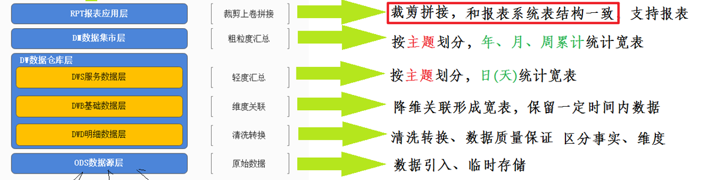
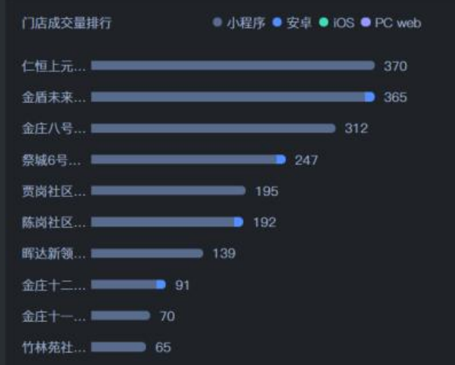
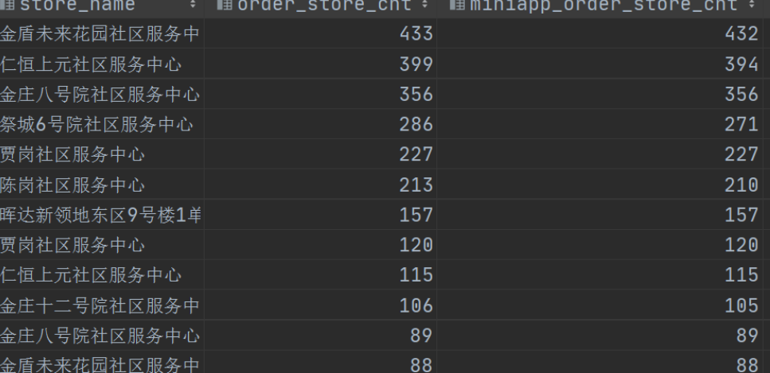
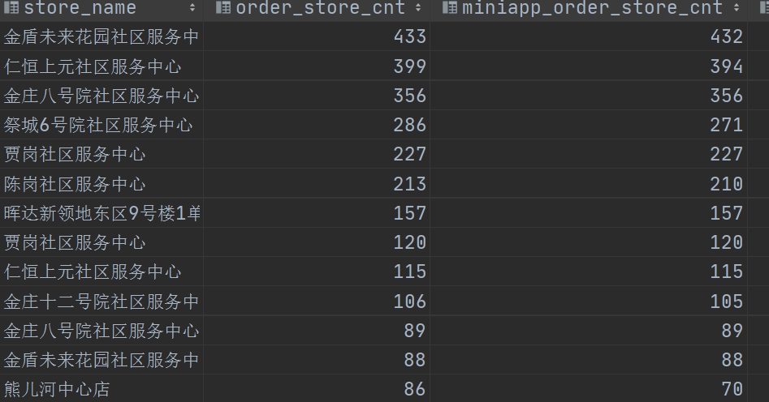
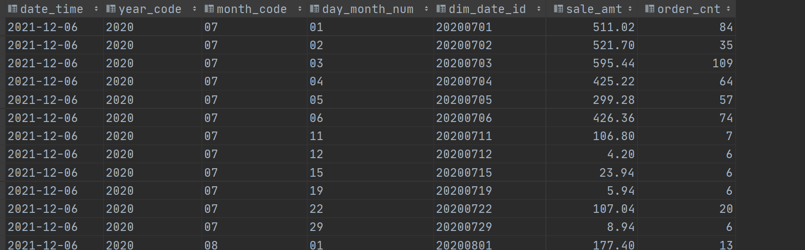

# RPT层建设实战, 自动化调度, 可视化

## I. RPT层构建

### 1. 目标与需求

- 新零售数仓分层图

  

- RPT

  - 名称：数据报表层（Report），其实就是我们所讲的数据应用层DA、APP。

  - 功能：==根据报表、专题分析的需求而计算生成的个性化数据==。表结构与报表系统保持一致。

  - 解释

    > 这一层存在的意义在于，如果报表系统需要一些及时高效的展示分析。我们可以在RPT层根据其需求提前把相关的字段、计算、统计做好，支撑报表系统的高效、便捷使用。

- 栗子

  - 比如报表需要展示：门店销售量Top10，展示如下效果

    

  - 对于其依赖的数据有两种实现方式

    - 方式1：使用专业的BI报表软件直接读取数据仓库或数据集市的数据，然后自己根据需要展示的效果进行数据抽、转换、拼接动作，
    - 方式2：==大数据开发工程师针对前端Top10展示的需求，提前把数据拼接好，返回前端直接页面渲染展示。==

    

- 使用DataGrip在Hive中创建RPT层

  > 注意，==**对于建库建表操作，需直接使用Hive**==，因为Presto只是一个数据分析的引擎，其语法不一定支持直接在Hive中建库建表。

  ```sql
  create database if not exists yp_rpt;
  ```

### 2. 销售主题报表

- 需求一：门店月销售单量排行

  > 按月统计，==各个门店==的==月销售单量==。

  - 建表

    ```sql
    CREATE TABLE yp_rpt.rpt_sale_store_cnt_month(
       date_time string COMMENT '统计日期,不能用来分组统计',
       year_code string COMMENT '年code',
       year_month string COMMENT '年月',
       
       city_id string COMMENT '城市id',
       city_name string COMMENT '城市name',
       trade_area_id string COMMENT '商圈id',
       trade_area_name string COMMENT '商圈名称',
       store_id string COMMENT '店铺的id',
       store_name string COMMENT '店铺名称',
       
       order_store_cnt BIGINT COMMENT '店铺成交单量',
       miniapp_order_store_cnt BIGINT COMMENT '小程序端店铺成交单量',
       android_order_store_cnt BIGINT COMMENT '安卓端店铺成交单量',
       ios_order_store_cnt BIGINT COMMENT 'ios端店铺成交单量',
       pcweb_order_store_cnt BIGINT COMMENT 'pc页面端店铺成交单量'
    )
    COMMENT '门店月销售单量排行' 
    ROW format delimited fields terminated BY '\t' 
    stored AS orc tblproperties ('orc.compress' = 'SNAPPY');
    ```

  - 实现

    > 从销售主题统计宽表中，找出分组为store，并且时间粒度为month的进行排序即可。

    ```sql
    --门店月销售单量排行
    insert into yp_rpt.rpt_sale_store_cnt_month
    select 
       date_time,
       year_code,
       year_month,
       city_id,
       city_name,
       trade_area_id,
       trade_area_name,
       store_id,
       store_name,
       order_cnt,
       miniapp_order_cnt,
       android_order_cnt,
       ios_order_cnt,
       pcweb_order_cnt
    from yp_dm.dm_sale 
    where time_type ='month' and group_type='store' and store_id is not null 
    order by order_cnt desc;
    ```



- 需求二：日销售曲线

  > 按==天==统计，==总销售金额==和==销售单量==。

  - 建表

    ```sql
    --日销售曲线
    DROP TABLE IF EXISTS yp_rpt.rpt_sale_day;
    CREATE TABLE yp_rpt.rpt_sale_day(
       date_time string COMMENT '统计日期,不能用来分组统计',
       year_code string COMMENT '年code',
       month_code string COMMENT '月份编码', 
       day_month_num string COMMENT '一月第几天', 
       dim_date_id string COMMENT '日期',
    
       sale_amt DECIMAL(38,2) COMMENT '销售收入',
       order_cnt BIGINT COMMENT '成交单量'
    )
    COMMENT '日销售曲线' 
    ROW format delimited fields terminated BY '\t' 
    stored AS orc tblproperties ('orc.compress' = 'SNAPPY');
    ```

  - 实现

    ```sql
    --日销售曲线
    insert into yp_rpt.rpt_sale_day
    select 
       date_time,
       year_code,
       month_code,
       day_month_num,
       dim_date_id,
       sale_amt,
       order_cnt
    from yp_dm.dm_sale 
    where time_type ='date' and group_type='all'
    --按照日期排序显示曲线
    order by dim_date_id;
    ```

  

- 需求三：渠道销售占比

  > 比如每天不同渠道的==订单量占比==。
  >
  > 也可以延伸为每周、每月、每个城市、每个品牌等等等。

  - 处理思路

    ```sql
    --在dm层的dm_sale表中
    	order_cnt 表示总订单量
    		miniapp_order_cnt 表示小程序订单量
    		android_order_cnt 安卓
    		ios_order_cnt ios订单量
    		pcweb_order_cnt  网站订单量
    --所谓的占比就是
    	每个占order_cnt总订单量的比例 也就是进行除法运算
    	
    --最后需要注意的是
    	上述这几个订单量的字段  存储类型是bigint类型。
    	如果想要得出90.25这样的占比率  需要使用cast函数将bigInt转换成为decimal类型。
    ```

  - 建表

    ```sql
    --渠道销量占比
    DROP TABLE IF EXISTS yp_rpt.rpt_sale_fromtype_ratio;
    CREATE TABLE yp_rpt.rpt_sale_fromtype_ratio(
       date_time string COMMENT '统计日期,不能用来分组统计',
       time_type string COMMENT '统计时间维度：year、month、day',
       year_code string COMMENT '年code',
       year_month string COMMENT '年月',
       dim_date_id string COMMENT '日期',
       
       order_cnt BIGINT COMMENT '成交单量',
       miniapp_order_cnt BIGINT COMMENT '小程序成交单量',
       miniapp_order_ratio DECIMAL(5,2) COMMENT '小程序成交量占比',
       android_order_cnt BIGINT COMMENT '安卓APP订单量',
       android_order_ratio DECIMAL(5,2) COMMENT '安卓APP订单量占比',
       ios_order_cnt BIGINT COMMENT '苹果APP订单量',
       ios_order_ratio DECIMAL(5,2) COMMENT '苹果APP订单量占比',
       pcweb_order_cnt BIGINT COMMENT 'PC商城成交单量',
       pcweb_order_ratio DECIMAL(5,2) COMMENT 'PC商城成交单量占比'
    )
    COMMENT '渠道销量占比' 
    ROW format delimited fields terminated BY '\t' 
    stored AS orc tblproperties ('orc.compress' = 'SNAPPY');
    ```

  - 实现

    ```sql
    --渠道销量占比
    insert into yp_rpt.rpt_sale_fromtype_ratio
    select 
       date_time,
       time_type,
       year_code,
       year_month,
       dim_date_id,
       
       order_cnt,
       miniapp_order_cnt,
       cast(
          cast(miniapp_order_cnt as DECIMAL(38,4)) / cast(order_cnt as DECIMAL(38,4))
          * 100
          as DECIMAL(5,2)
       ) miniapp_order_ratio,
       android_order_cnt,
       cast(
          cast(android_order_cnt as DECIMAL(38,4)) / cast(order_cnt as DECIMAL(38,4))
          * 100
          as DECIMAL(5,2)
       ) android_order_ratio,
       ios_order_cnt,
       cast(
          cast(ios_order_cnt as DECIMAL(38,4)) / cast(order_cnt as DECIMAL(38,4))
          * 100
          as DECIMAL(5,2)
       ) ios_order_ratio,
       pcweb_order_cnt,
       cast(
          cast(pcweb_order_cnt as DECIMAL(38,4)) / cast(order_cnt as DECIMAL(38,4))
          * 100
          as DECIMAL(5,2)
       ) pcweb_order_ratio
    from yp_dm.dm_sale
    where group_type = 'all';
    ```

  

### 3. 商品主题报表

- 需求一：商品销量==topN==

  > 统计出某天销量最多的top10商品

- 需求二：商品收藏==topN==

  > 统计出某天收藏量最多的top10商品

- 需求三：商品加入购物车==topN==

  > 统计出某天，购物车最多的top10商品

- 建表

  ```sql
  --商品销量TOPN
  drop table if exists yp_rpt.rpt_goods_sale_topN;
  create table yp_rpt.rpt_goods_sale_topN(
      `dt` string COMMENT '统计日期',
      `sku_id` string COMMENT '商品ID',
      `payment_num` bigint COMMENT '销量'
  ) COMMENT '商品销量TopN'
  ROW format delimited fields terminated BY '\t'
  stored AS orc tblproperties ('orc.compress' = 'SNAPPY');
  
  --商品收藏TOPN
  drop table if exists yp_rpt.rpt_goods_favor_topN;
  create table yp_rpt.rpt_goods_favor_topN(
      `dt` string COMMENT '统计日期',
      `sku_id` string COMMENT '商品ID',
      `favor_count` bigint COMMENT '收藏量'
  ) COMMENT '商品收藏TopN'
  ROW format delimited fields terminated BY '\t' 
  stored AS orc tblproperties ('orc.compress' = 'SNAPPY');
  
  --商品加入购物车TOPN
  drop table if exists yp_rpt.rpt_goods_cart_topN;
  create table yp_rpt.rpt_goods_cart_topN(
      `dt` string COMMENT '统计日期',
      `sku_id` string COMMENT '商品ID',
      `cart_num` bigint COMMENT '加入购物车数量'
  ) COMMENT '商品加入购物车TopN'
  ROW format delimited fields terminated BY '\t' 
  stored AS orc tblproperties ('orc.compress' = 'SNAPPY');
  
  --商品退款率TOPN
  drop table if exists yp_rpt.rpt_goods_refund_topN;
  create table yp_rpt.rpt_goods_refund_topN(
      `dt` string COMMENT '统计日期',
      `sku_id` string COMMENT '商品ID',
      `refund_ratio` decimal(10,2) COMMENT '退款率'
  ) COMMENT '商品退款率TopN'
  ROW format delimited fields terminated BY '\t' 
  stored AS orc tblproperties ('orc.compress' = 'SNAPPY');
  ```

  ```sql
  --统计出某天销量最多的top10商品
  
  --方式1 ：简单方式
  select sku_id,order_count from yp_dm.dm_sku
  order by order_count desc limit 10;
  
  --方式2  ：复杂方式
  --需求：找出销量最多的前10个  重复的算并列 但是总数只要10个。
  with tmp as (select
      sku_id,order_count,
      rank() over(order by order_count desc) rn1,
      dense_rank() over(order by order_count desc) rn2,
      row_number() over(order by order_count desc) rn3
  from yp_dm.dm_sku)
  
  select * from tmp where rn <11;
  ```

- sql实现

  > 注意，==这里为了最终展示效果，保证有数据，特意在时间dt上做了特殊处理==。
  >
  > 本来是需要通过dt指定某一天数据的，这里忽略dt过滤 ，直接使用全部数据。
  >
  > ```
  > select * from yp_dws.dws_sku_daycount order by order_count desc;
  > 
  > 
  > select * from yp_dws.dws_sku_daycount where dt ='2021-08-31' order by order_count desc;
  > ```

  ```sql
  --商品销量TOPN
  insert into yp_rpt.rpt_goods_sale_topN
  select
      '2020-08-09' dt,
      sku_id,
      payment_count
  from
      yp_dws.dws_sku_daycount
  -- where
  --     dt='2020-08-09'
  order by payment_count desc
  limit 10;
  
  
  --商品收藏TOPN
  insert into yp_rpt.rpt_goods_favor_topN
  select
      '2020-08-09' dt,
      sku_id,
      favor_count
  from
      yp_dws.dws_sku_daycount 
  -- where
  --     dt='2020-08-09'
  order by favor_count desc
  limit 10;
  
  
  --商品加入购物车TOPN
  insert into yp_rpt.rpt_goods_cart_topN
  select
      '2020-08-09' dt,
      sku_id,
      cart_num
  from
      yp_dws.dws_sku_daycount
  -- where
  --     dt='2021-08-31'
  order by cart_num desc
  limit 10;
  
  --商品退款率TOPN
  insert into yp_rpt.rpt_goods_refund_topN
  select
      '2020-08-09',
      sku_id,
      cast(
        cast(refund_last_30d_count as DECIMAL(38,4)) / cast(payment_last_30d_count as DECIMAL(38,4))
        * 100
        as DECIMAL(5,2)
     ) refund_ratio
  from yp_dm.dm_sku 
  where payment_last_30d_count!=0
  order by refund_ratio desc
  limit 10;
  ```

### 4. 用户主题报表


## II. Presto数据导出

### 1. RPT层数据至MySQL


## III. 自动化调度方案

### 1. 工作流调度与Oozie


### 2. shell基本知识回顾


### 3. 脚本实现, 调度实现

## IV. 数据报表可视化 Data Visualization

### 1. 数据报表/可视化


### 2. Java后端, Vue前端(了解)


### 3. FineBI(理解)