1. 以下程序输出为:

    ```python
    info = {'name':'班长', 'id':100, 'sex':'f', 'address':'北京'}
    age = info.get('age')
    print(age)
    age=info.get('age',18)
    print(age)
    ```

    正确答案: None 18

    错误解析: 

    ```python
    # get方法语法:
    dict.get(key, default = None)
    # 如果指定的键不存在则返回default指定的默认值, 第4行get中传入第二个参数指定默认值为18, 则返回18
    ```

2. 执行以下程序, 输出结果为:

    ```python
    a = [['1','2'] for i in range(2)]
    
    b = [['1','2']] * 2
    
    a[0][1] = '3'
    
    b[0][0] = '4'
    
    print(a,b) 
    ```

    正确答案: [['1', '3'], ['1', '2']] [['4', '2'], ['4', '2']]

    错误解析:

    ```python
    a = [['1','2'] for i in range(2)]	# 深复制
    
    b = [['1','2']] * 2	# id(b[0]) == id(b[1]), 嵌套列表乘法得到的每个项都是引用
    ```

3. 对于以下代码, 描述正确的是:

    ```python
    list = ['1', '2', '3', '4', '5']
    print list[10:]
    ```

    正确答案: 输出[]

    错误解析:

    切片不受内建类型的限制

4. 执行以下程序, 输出结果为

    ```python
    def outer(fn):
        print('outer')
        def inner():
            print('inner')
            return fn
        return inner
    
    
    @outer
    def fun():
        print('fun')
    ```

    正确答案: outer

    错误解析: 装饰器会在被装饰的函数定义之后立即执行

5. Mysql中表student_table(id,name,birth,sex)，插入如下记录：

    ```mysql
    ('1003' , '' , '2000-01-01' , '男');
    ('1004' , '张三' , '2000-08-06' , '男');
    ('1005' , NULL , '2001-12-01' , '女');
    ('1006' , '张三' , '2000-08-06' , '女');
    ('1007' , ‘王五’ , '2001-12-01' , '男');
    ('1008' , '李四' , NULL, '女');
    ('1009' , '李四' , NULL, '男');
    ('1010' , '李四' , '2001-12-01', '女');
    ```

    执行

    ```mysql
    select t1.*,t2.*
    from (
    select * from student_table where sex = '男' ) t1 
    inner  join 
    (select * from student_table where sex = '女')t2 
    on t1.birth = t2.birth and t1.name = t2.name ; 
    ```

    的结果行数是:

    正确答案: 1

    错误解析: 在SQL中, NULL与任何值比较永不为真

6. 

    解析: fromkeys(seq=a, value=b)方法以a中元素做字典的键, b做所有键对应的初始值

7. 

    错误解析: upper()方法先将strs中所有字符转为大写'ABCD12EFG', 然后title()方法再将strs中每个单词首字母转为大写, 其余字母转为小写, 得'Abcd12Efg'

8. 

    错误解析: python中主要存在4中命名方式

     1. object: 公用方法

     2. _object: 半保护

        被看作是“protect”，只有类对象和子类对象自己能访问到这些变量, 在模块或类外不可以使用，不能用’from module import *’导入。

        \#_\_object 是为了避免与子类的方法名称冲突， 对于该标识符描述的方法，父类的方法不能轻易地被子类的方法覆盖，他们的名字实际上是\_classname\_\_methodname。

     3. __object: 全私有, 全保护, 只有类对象自己能访问, 子类对象也不能访问, 需要用类方法获取和修改

     4. `__object__`: 内建方法, 用户不要这样定义

9. 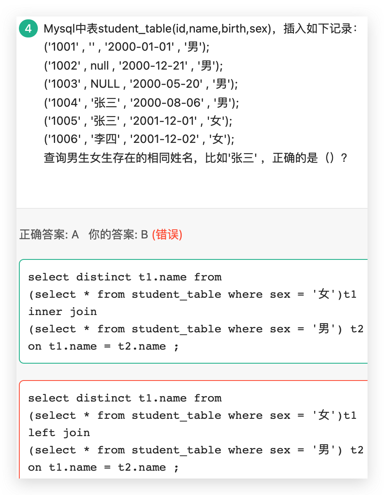

    错误解析: left join即使没有匹配, 左表t1的内容也会被查询出来, 故结果为[张三, 李四], 此题应用inner join

10. 

  错误解析: 对于可变数据类型list, 作为函数形参赋默认值时, 每次只在第一次执行赋值,

  对于不可变数据类型tuple, 作为函数形参赋默认值的时候, 每次函数调用都会执行, 相当于每次都清空

11. 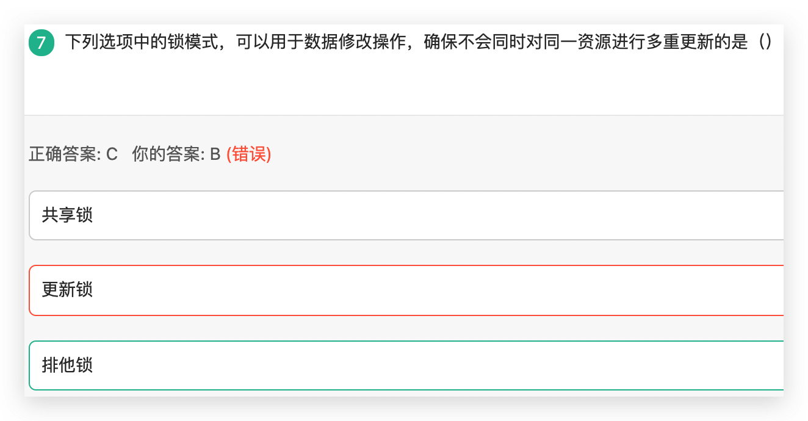

     错误解析:

     - 共享锁(S锁): 又称为读锁, 若事务T对数据对象A上S锁, 则事务T只能读A; 其他事务只能再对A加S锁, 而不能加X锁(排他锁), 直到事务T释放A上的S锁. 确保了其他事务在T释放A上的S锁之前只能读A而不能修改A.
     - 排他锁(X锁): 又称为写锁, 独占锁, 若事务T对数据对象A加X锁, 则只允许T读取和修改A, 其他任何事务都不能再对A加任何类型的锁(体现排他性), 直到T释放A上的锁. 确保了其他事务在T释放A上的锁之前不能再读取和修改A.
     - 更新锁: 为了解决死锁, 引入更新锁, 更新锁的意思是: "我现在只想读, 你们别人也可以读, 但我将来可能会做更新操作, 我已经获取了从共享锁(读锁)到排他锁的资格". 一个事务只能有一个更新锁获此资格.
     - 死锁: 死锁是一种现象, 即进程A等待B释放资源, B也在等待A释放资源, 互相等待造成两个进程都无法继续下去.
     - 架构锁: 不存在这种东西!

12. 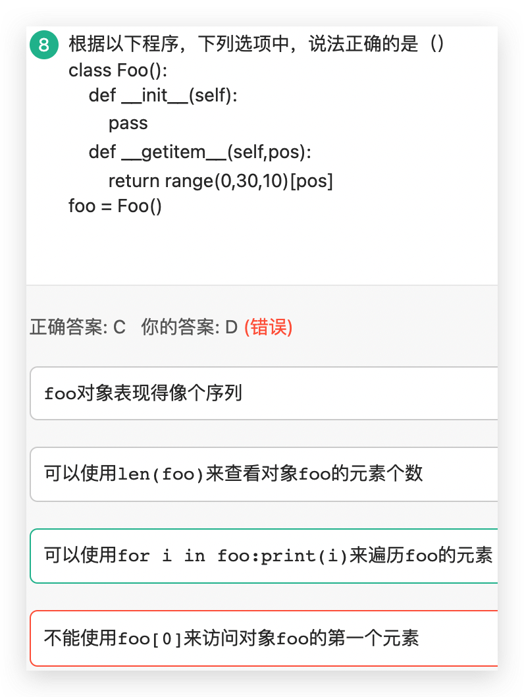

     - ##### 错误解析: 当实例对象做P[key]运算时, 就会调用类中的`__getitem__()`方法

13. 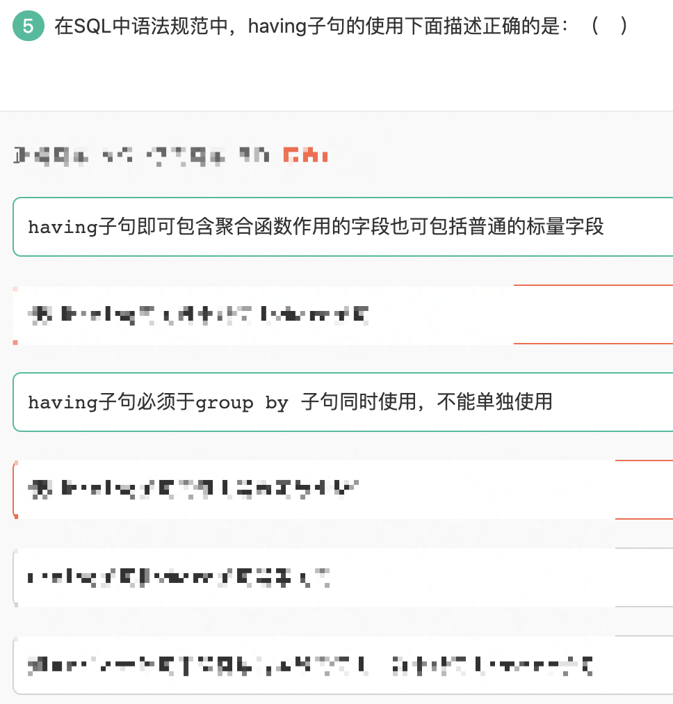

     错误解析:

     HAVING是在分组后对数据进行过滤, WHERE是在分组前对数据进行过滤

     HAVING后可以使用聚合函数, WHERE后不可使用聚合函数

     所以, HAVING子句必须与GROUP BY子句同时使用, 不能单独使用

14. 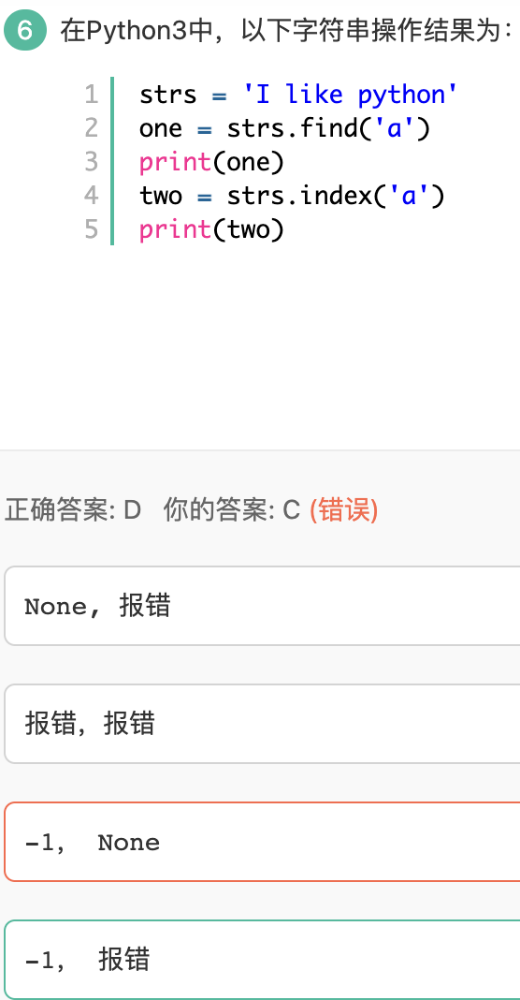

     错误解析: find()返回第一个找到的位置索引, 找不到则返回-1, index()返回第一个找到的位置索引, 找不到则报错

15. 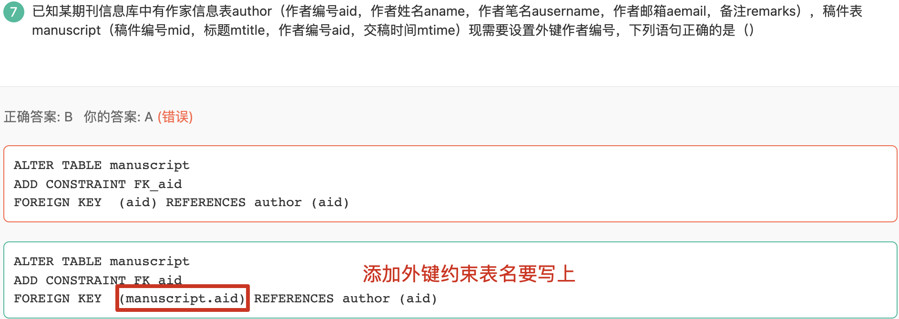

16. 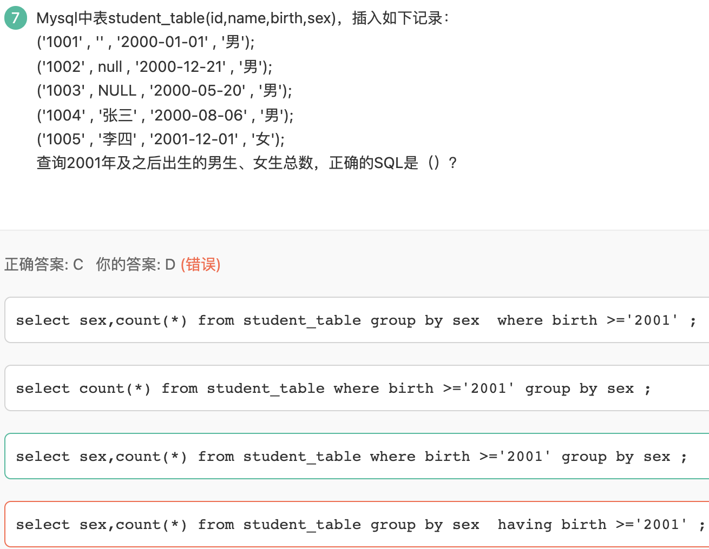

     错误解析: GROUP BY A HAVING B中, B必须为聚合函数或包含在GROUP BY指定列中.

17. 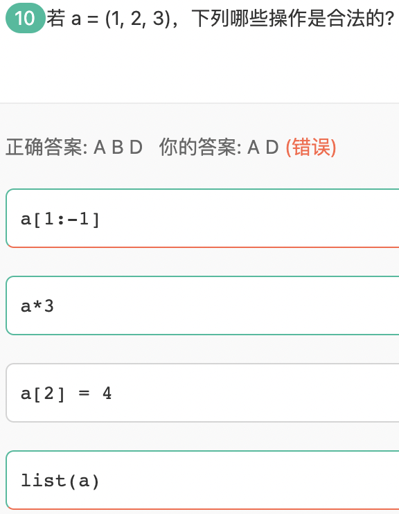

     错误解析: a * 3 等价于 b = a * 3 ==> (1, 2, 3, 1, 2, 3, 1, 2, 3), 分配新的内存空间.

18. 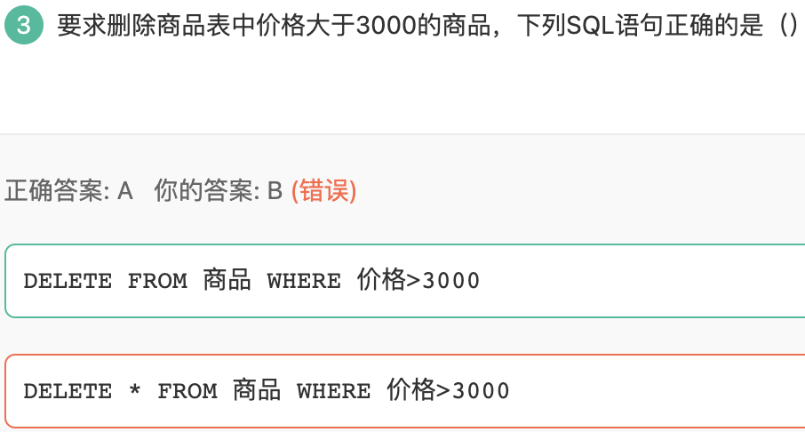

     错误解析: 

     以下是SQL DELETE语句从MySQL数据表中删除数据的通用语法:

     > ### `DELETE FROM table_name [WHERE Clause]`

19. 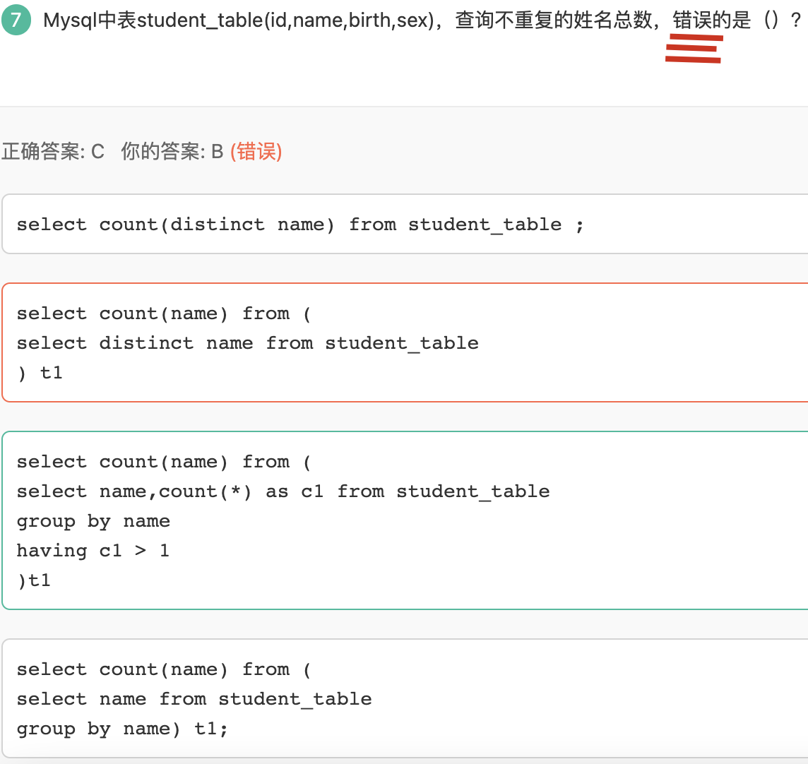

     错误解析: 认真审题, "错误的是"

20. 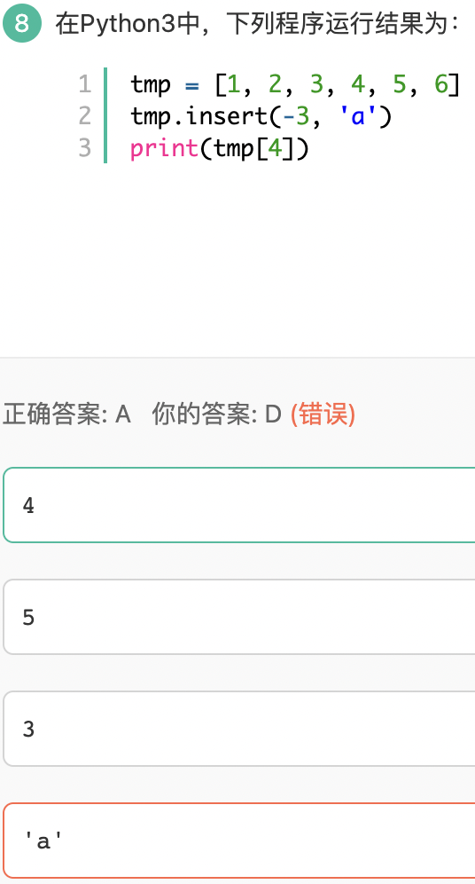

     错误解析: insert方法为在所需索引位置之前插入, 故插入后为[1, 2, 3, a, 4, 5, 6], 选4

21. 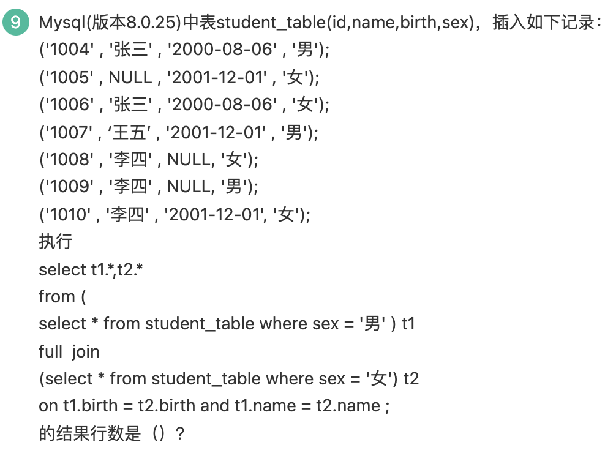

     错误解析: MySQL不支持full join

22. 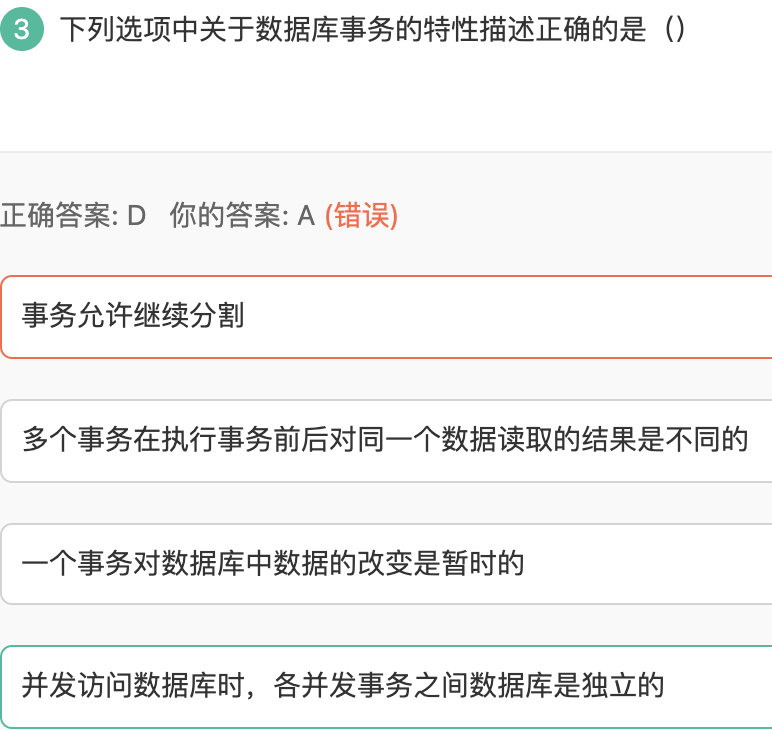

     错误解析: 一个事务是一个完整的业务逻辑单元, 不可再分, **A错误**

     事务隔离性存在隔离级别。理论存在4个级别。读未提交，读已提交。可重复读。序列化（串行化）。

     读未提交：会导致脏读、不可重复读取、幻读问题。脏读（即一个事务读取了另一个事务未提交的数据）。不可重复读（一个事务还未提交。读取了另一个事务使用update和delete语句后。提交的数据。产生了不同的结果集，这种现象称为。不可以重复读取。）。幻读（同一个查询还未提交。读取了另一个事务使用insert语句后。且提交后。产生了不同的结果集。这种现象称为。幻读）。

     读已提交：会导致 不可重复读和幻读问题。解决了脏读。

     可重复读取：解决了上述，三个问题不加锁。msyql innodb(默认第三种隔离级别)

     序列化：也解决了上述，三个问题。但是使用了锁的方式。

     **所以B错误**

     一旦事务提交。就不可以回滚。所以**C错误**。

     **隔离级别的存在。就是为了保证。在当前事务操作的时候数据库中的数据，数据一致的问题。D对。**

23. 

     错误解析: 

     ​	解题思路: 子查询表结构 —> 连接 —> 连接条件 —> 计算连接 —> 查询条件

     1. 子表查询结构

         student_table 男生表为t1 , 3行，其中1行birth 为NULL.

         student _table 女生表为t2,  4行，其中1行birth 为NULL,1行name为NULL.

     2. 连接为: **右连接**

     3. **连接条件**: t1、t2的两个表的birth和name相同

     4. 计算连接: 结果为**4行**, 其中只有一行是重合的

     5. 查询条件:

         ​	**select count(t1.birth)，对t1.birth计数，所以返回1行, 选B**

         ​	**如果select count(t2.birth)，对t2.birth计数，返回2行(因NULL不计）**

     > #### 陷阱在于count(t1.birth), 请读清楚题目!

24. 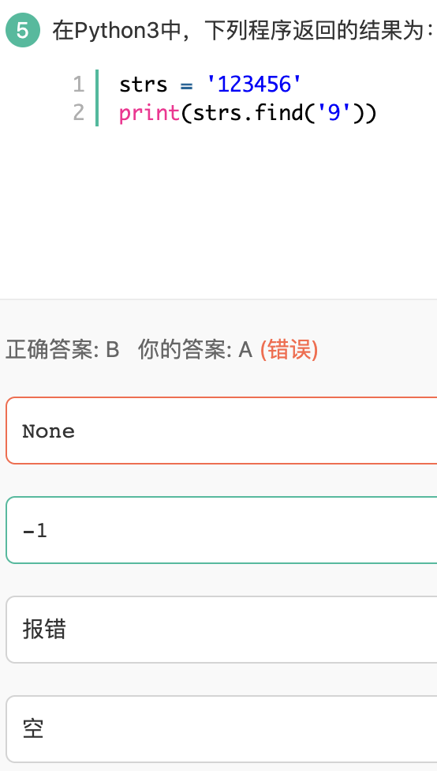

     错误解析: find()找不到返回-1, index()找不到报错

25. 

     错误解析: 

     1. @property表示可以使用@property装饰器来创建只读属性, 故只需要通过rectangle.area来访问area属性, 不需要加括号

     2. python中没有严格的私有属性, 可以通过`rectangle_Rectangle__width`访问width属性, 可以通过`rectangle_Rectangle__height`访问height属性

         或者定义`get()`或`set()`方法访问私有属性

     


