1. 以下程序输出为:

    ```python
    info = {'name':'班长', 'id':100, 'sex':'f', 'address':'北京'}
    age = info.get('age')
    print(age)
    age=info.get('age',18)
    print(age)
    ```

    正确答案: None 18

    错误解析: 

    ```python
    # get方法语法:
    dict.get(key, default = None)
    # 如果指定的键不存在则返回default指定的默认值, 第4行get中传入第二个参数指定默认值为18, 则返回18
    ```

2. 执行以下程序, 输出结果为:

    ```python
    a = [['1','2'] for i in range(2)]
    
    b = [['1','2']] * 2
    
    a[0][1] = '3'
    
    b[0][0] = '4'
    
    print(a,b) 
    ```

    正确答案: [['1', '3'], ['1', '2']] [['4', '2'], ['4', '2']]

    错误解析:

    ```python
    a = [['1','2'] for i in range(2)]	# 深复制
    
    b = [['1','2']] * 2	# id(b[0]) == id(b[1]), 嵌套列表乘法得到的每个项都是引用
    ```

3. 对于以下代码, 描述正确的是:

    ```python
    list = ['1', '2', '3', '4', '5']
    print list[10:]
    ```

    正确答案: 输出[]

    错误解析:

    切片不受内建类型的限制

4. 执行以下程序, 输出结果为

    ```python
    def outer(fn):
        print('outer')
        def inner():
            print('inner')
            return fn
        return inner
    
    
    @outer
    def fun():
        print('fun')
    ```

    正确答案: outer

    错误解析: 装饰器会在被装饰的函数定义之后立即执行

5. Mysql中表student_table(id,name,birth,sex)，插入如下记录：

    ```mysql
    ('1003' , '' , '2000-01-01' , '男');
    ('1004' , '张三' , '2000-08-06' , '男');
    ('1005' , NULL , '2001-12-01' , '女');
    ('1006' , '张三' , '2000-08-06' , '女');
    ('1007' , ‘王五’ , '2001-12-01' , '男');
    ('1008' , '李四' , NULL, '女');
    ('1009' , '李四' , NULL, '男');
    ('1010' , '李四' , '2001-12-01', '女');
    ```

    执行

    ```mysql
    select t1.*,t2.*
    from (
    select * from student_table where sex = '男' ) t1 
    inner  join 
    (select * from student_table where sex = '女')t2 
    on t1.birth = t2.birth and t1.name = t2.name ; 
    ```

    的结果行数是:

    正确答案: 1

    错误解析: 在SQL中, NULL与任何值比较永不为真

6. 

    解析: fromkeys(seq=a, value=b)方法以a中元素做字典的键, b做所有键对应的初始值

7. 

    错误解析: upper()方法先将strs中所有字符转为大写'ABCD12EFG', 然后title()方法再将strs中每个单词首字母转为大写, 其余字母转为小写, 得'Abcd12Efg'

8. 

    错误解析: python中主要存在4中命名方式

     1. object: 公用方法

     2. _object: 半保护

        被看作是“protect”，只有类对象和子类对象自己能访问到这些变量, 在模块或类外不可以使用，不能用’from module import *’导入。

        \#_\_object 是为了避免与子类的方法名称冲突， 对于该标识符描述的方法，父类的方法不能轻易地被子类的方法覆盖，他们的名字实际上是\_classname\_\_methodname。

     3. __object: 全私有, 全保护, 只有类对象自己能访问, 子类对象也不能访问, 需要用类方法获取和修改

     4. `__object__`: 内建方法, 用户不要这样定义

9. 

    错误解析: left join即使没有匹配, 左表t1的内容也会被查询出来, 故结果为[张三, 李四], 此题应用inner join

10. 

  错误解析: 对于可变数据类型list, 作为函数形参赋默认值时, 每次只在第一次执行赋值,

  对于不可变数据类型tuple, 作为函数形参赋默认值的时候, 每次函数调用都会执行, 相当于每次都清空

11. 

     错误解析:

     - 共享锁(S锁): 又称为读锁, 若事务T对数据对象A上S锁, 则事务T只能读A; 其他事务只能再对A加S锁, 而不能加X锁(排他锁), 直到事务T释放A上的S锁. 确保了其他事务在T释放A上的S锁之前只能读A而不能修改A.
     - 排他锁(X锁): 又称为写锁, 独占锁, 若事务T对数据对象A加X锁, 则只允许T读取和修改A, 其他任何事务都不能再对A加任何类型的锁(体现排他性), 直到T释放A上的锁. 确保了其他事务在T释放A上的锁之前不能再读取和修改A.
     - 更新锁: 为了解决死锁, 引入更新锁, 更新锁的意思是: "我现在只想读, 你们别人也可以读, 但我将来可能会做更新操作, 我已经获取了从共享锁(读锁)到排他锁的资格". 一个事务只能有一个更新锁获此资格.
     - 死锁: 死锁是一种现象, 即进程A等待B释放资源, B也在等待A释放资源, 互相等待造成两个进程都无法继续下去.
     - 架构锁: 不存在这种东西!

12. 

     - ##### 错误解析: 当实例对象做P[key]运算时, 就会调用类中的`__getitem__()`方法

13. 

     错误解析:

     HAVING是在分组后对数据进行过滤, WHERE是在分组前对数据进行过滤

     HAVING后可以使用聚合函数, WHERE后不可使用聚合函数

     所以, HAVING子句必须与GROUP BY子句同时使用, 不能单独使用

14. 

     错误解析: find()返回第一个找到的位置索引, 找不到则返回-1, index()返回第一个找到的位置索引, 找不到则报错

15. 

16. 

     错误解析: GROUP BY A HAVING B中, B必须为聚合函数或包含在GROUP BY指定列中.

17. 

     错误解析: a * 3 等价于 b = a * 3 ==> (1, 2, 3, 1, 2, 3, 1, 2, 3), 分配新的内存空间.

18. 

     错误解析: 

     以下是SQL DELETE语句从MySQL数据表中删除数据的通用语法:

     > ### `DELETE FROM table_name [WHERE Clause]`

19. 

     错误解析: 认真审题, "错误的是"

20. 

     错误解析: insert方法为在所需索引位置之前插入, 故插入后为[1, 2, 3, a, 4, 5, 6], 选4

21. 

     错误解析: MySQL不支持full join

22. 

     错误解析: 一个事务是一个完整的业务逻辑单元, 不可再分, **A错误**

     事务隔离性存在隔离级别。理论存在4个级别。读未提交，读已提交。可重复读。序列化（串行化）。

     读未提交：会导致脏读、不可重复读取、幻读问题。脏读（即一个事务读取了另一个事务未提交的数据）。不可重复读（一个事务还未提交。读取了另一个事务使用update和delete语句后。提交的数据。产生了不同的结果集，这种现象称为。不可以重复读取。）。幻读（同一个查询还未提交。读取了另一个事务使用insert语句后。且提交后。产生了不同的结果集。这种现象称为。幻读）。

     读已提交：会导致 不可重复读和幻读问题。解决了脏读。

     可重复读取：解决了上述，三个问题不加锁。msyql innodb(默认第三种隔离级别)

     序列化：也解决了上述，三个问题。但是使用了锁的方式。

     **所以B错误**

     一旦事务提交。就不可以回滚。所以**C错误**。

     **隔离级别的存在。就是为了保证。在当前事务操作的时候数据库中的数据，数据一致的问题。D对。**

23. 

     错误解析: 

     ​	解题思路: 子查询表结构 —> 连接 —> 连接条件 —> 计算连接 —> 查询条件

     1. 子表查询结构

         student_table 男生表为t1 , 3行，其中1行birth 为NULL.

         student _table 女生表为t2,  4行，其中1行birth 为NULL,1行name为NULL.

     2. 连接为: **右连接**

     3. **连接条件**: t1、t2的两个表的birth和name相同

     4. 计算连接: 结果为**4行**, 其中只有一行是重合的

     5. 查询条件:

         ​	**select count(t1.birth)，对t1.birth计数，所以返回1行, 选B**

         ​	**如果select count(t2.birth)，对t2.birth计数，返回2行(因NULL不计）**

     > #### 陷阱在于count(t1.birth), 请读清楚题目!

24. 

     错误解析: find()找不到返回-1, index()找不到报错

25. 

     错误解析: 

     1. @property表示可以使用@property装饰器来创建只读属性, 故只需要通过rectangle.area来访问area属性, 不需要加括号

     2. python中没有严格的私有属性, 可以通过`rectangle_Rectangle__width`访问width属性, 可以通过`rectangle_Rectangle__height`访问height属性

         或者定义`get()`或`set()`方法访问私有属性

26. 

27. 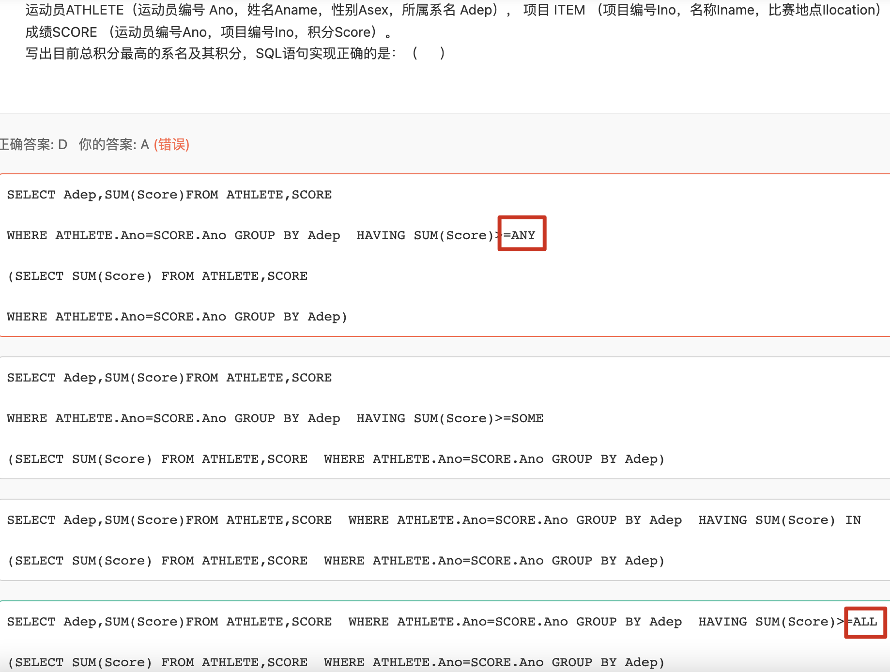

     错误解析: ANY代表有一个成立即成立, ALL代表全部成立才成立.

28. 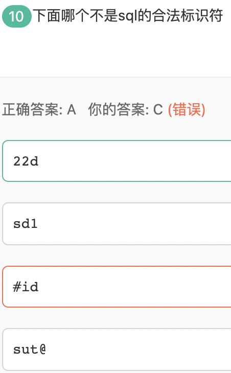

     错误解析: *SQL合法标识符* 第一个字必须是 字母 、下划线 、@和#开头，而选项A为数字开头，错误

29. 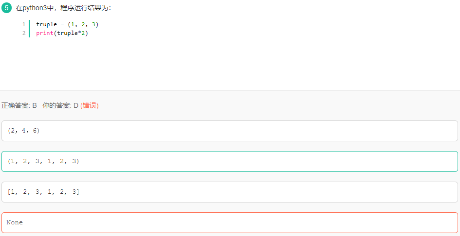

    错误解析：元组不可更改，对元组使用乘法时返回新的元组

30. 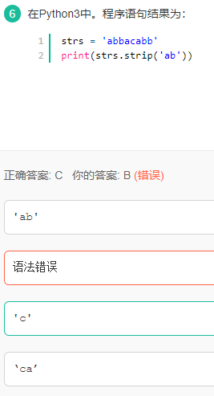

    错误解析：strs.strip('ab')

    'ab'表示的是一种集合，这里是指：[ab,ba,aa,bb,aaa,bbb,abb,baa]等;

    strs两端，只要是包含了上述集合中的任何一个，都删除。

31. 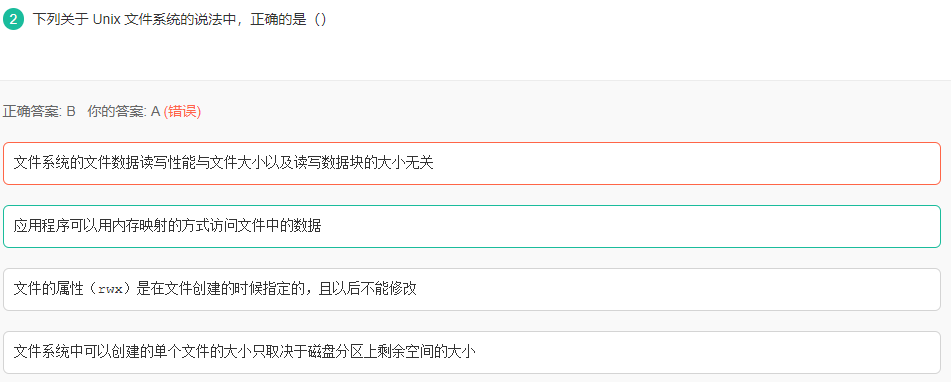

     错误解析：

    内存映射，就是建立一种一一对应关系，在这里主要是指硬盘上文件的位置与进程逻辑地址空间中一块大小相同的区域之间的一一对应。这种对应关系纯属是逻辑上的概念，物理上是不存在的，原因是进程的逻辑地址空间本身就是不存在的。在内存映射的过程中，并没有实际的数据拷贝，文件没有被载入内存，只是逻辑上被放入了内存，具体到代码，就是建立并初始化了相关的数据结构 （struct address_space），这个过程有系统调用mmap()实现，所以建立内存映射的效率很高。

32. 

    错误解析：

    delete删除数据：

    delete from <表名> [where条件] 

33. 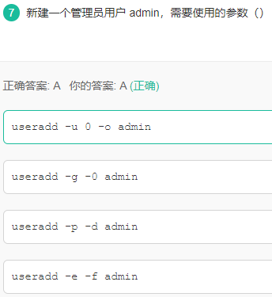

    解析：-u 用户号 指定用户的用户号；因为系统用户的用户号为0，故指定用户号为0 如果同时有-o选项，则可以重复使用其他用户的标识号；因为系统本身存在用户号为0的系统用户，故应该使用该参数。

    u表示创建用户.g表示创建用户组 -e指定账号的有效期限，缺省表示永久有效。
    -f指定在密码过期后多少天即关闭该账号。-p表示创建密码

34. 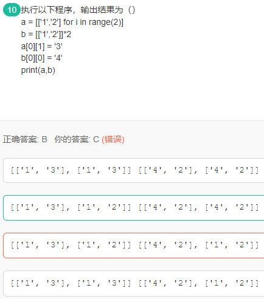

    错误解析：b列表的索引指向的是同一片空间，所以改变了其中一个，其他也会改变。

    ```python
    id(b[0]) == id(b[1])	# True
    # [[xx]] * n : 嵌套列表乘法得到的每个值都是引用
    ```

35. 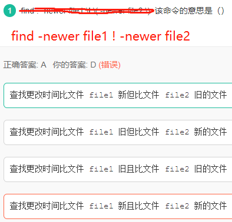

36. 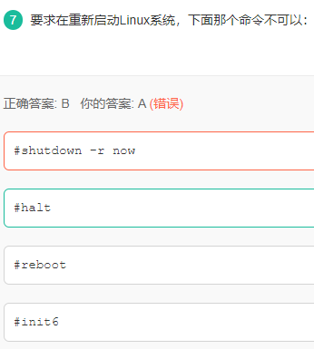

    错误解析：

    在linux命令中reboot是重新启动，**shutdown -r now是立即停止然后重新启动，都说他们两个是一样的，其实是有一定的区别的**。

    **shutdown**命令可以**安全地关闭**或重启Linux系统，它在系统关闭之前给系统上的所有登录用户提示一条警告信息。该命令还允许用户指定一个时间参数，可以是一个精确的时间，也可以是从现在开始的一个时间段。

    精确时间的格式是hh:mm，表示小时和分钟，时间段由+ 和分钟数表示。系统执行该命令后会自动进行数据同步的工作。

    该命令的一般格式: shutdown [选项] [时间] [警告信息]

    命令中各选项的含义为:

    \- k 并不真正关机而只是发出警告信息给所有用户

    \- r 关机后立即重新启动

    \- h 关机后不重新启动

    \- f 快速关机重启动时跳过fsck

    \- n 快速关机不经过init 程序

    \- c 取消一个已经运行的shutdown

    需要特别说明的是该命令只能由超级用户使用。

    例1，系统在十分钟后关机并且马上重新启动: # shutdown –r +10

    例2，系统马上关机并且不重新启动:# shutdown –h now

    **halt**是最简单的关机命令，其**实际上是调用shutdown -h命令**。halt执行时，杀死应用进程，文件系统写操作完成后就会停止内核。

    halt命令的部分参数如下：

    [-f] 没有调用shutdown而强制关机或重启

    [-i] 关机或重新启动之前，关掉所有的网络接口

    [-p] 关机时调用poweroff，此选项为缺省选项


    **reboot**的工作过程与halt类似，其作用是重新启动，而halt是关机。其参数也与halt类似。reboot命令重启动系统时是删除所有的进程，而不是平稳地终止它们。因此，**使用reboot命令可以快速地关闭系统，但如果还有其它用户在该系统上工作时，就会引起数据的丢失。所以使用reboot命令的场合主要是在单用户模式**。

    **init**是所有进程的祖先，其进程号始终为1。init用于切换系统的运行级别，切换的工作是立即完成的。**init 0命令用于立即将系统运行级别切换为0，即关机；init 6命令用于将系统运行级别切换为6，即重新启动**

37. 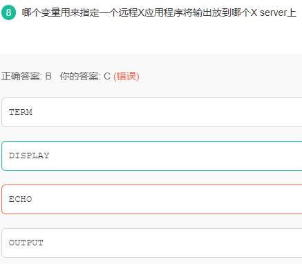

    错误解析：Linux X Window System中X是一个开放的协议规范，当前版本为11，俗称X11。X Window System由客户端和服务端组成，服务端X Server负责图形显示，而客户端库X Client根据系统设置的DISPLAY环境变量，将图形显示请求发送给相应的X Server。

38. 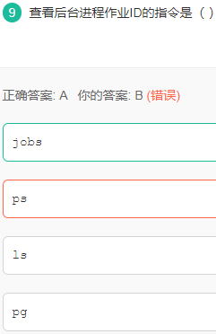

    错误解析：

    ps命令用来列出系统中当前运行的那些进程

    ls显示当前目录中的文件名字

    pg提供了一次性的查看进程结果,但所提供的查看结果不是动态连续的

    jobs 查看后台进程作业

39. 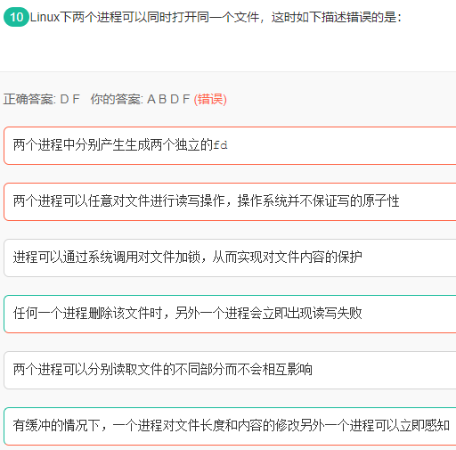

    错误解析：

    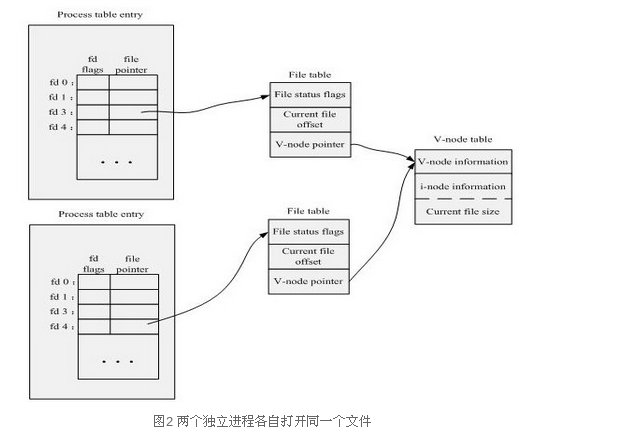

40. 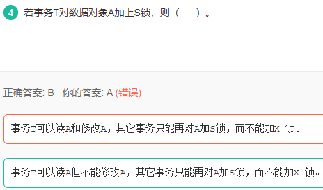

    错误解析:

    **共享锁【S锁】**
    又称读锁，若事务T对数据对象A加上S锁，则事务T可以读A但不能修改A，其他事务只能再对A加S锁，而不能加X锁，直到T释放A上的S锁。这保证了其他事务可以读A，但在T释放A上的S 锁之前不能对A做任何修改。

    **排他锁【X锁】**
    又称写锁。若事务T对数据对象A加上X锁，事务T可以读A也可以修改A，其他事务不能再对A加任何锁，直到T释放A上的锁。这保证了其他事务在T释放A上的锁之前不能再读取和修改A。

41. 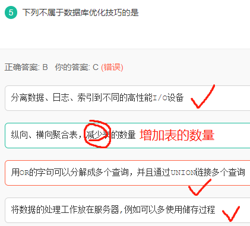

    错误解析: 优化自然是将每个表的功能细化，是增加表的数量，而不是减少表的数量

42. 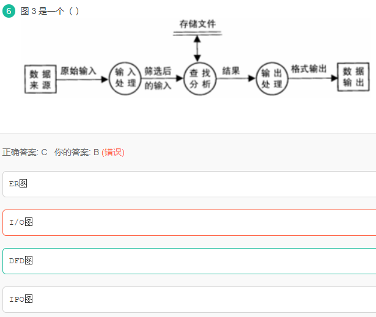

    错误解析: 

    [DFD](https://baike.baidu.com/item/DFD/65845)图即为数据流图（Data Flow Diagram），它从数据传递和加工角度，以图形方式来表达系统的逻辑功能、数据在系统内部的逻辑流向和逻辑变换过程，是[结构化系统分析方法](https://baike.baidu.com/item/%E7%BB%93%E6%9E%84%E5%8C%96%E7%B3%BB%E7%BB%9F%E5%88%86%E6%9E%90%E6%96%B9%E6%B3%95)的主要表达工具及用于表示软件模型的一种图示方法。

    E-R是实体联系图 里面有方形圆形和菱形

    I/O图是输入输出图

    IPO图是输入加工输出图

43. 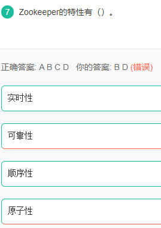

    错误解析: 

    **实时性**: 保证客户端在一个时间间隔范围内获得服务器的更新信息或者服务器失败的信息

    **可靠性**: 如果消息被集群中一台服务器接受那么将被所有的服务器接受

    **顺序性**: 

    ​	全局有序: 对于全局的server服务器来说, 如果一台服务器上消息a在消息b之前发布, 则在所有的server上a消息都在b消息前被发布

    ​	全局偏序: 对于发布者来说, 指如果一个消息b在消息a后被同一个发送者发布, a必将排在b前面

    **原子性**: 一次数据更新要么成功(半数以上节点成功), 要么失败, 不存在中间状态

44. 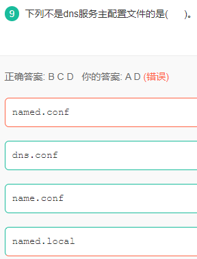

    错误解析: DNS服务器主配置文件: `/etc/named.conf`

45. 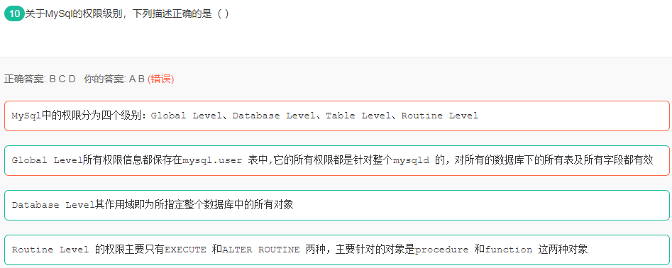

    错误解析: 

    > MySql中的权限分为五个级别：Global Level、Database Level、Table Level、Column Level、Routine Level

    参考链接: [MySQL权限级别](https://blog.csdn.net/fullstack/article/details/30031463)

46. 

    

    

    

    

    


